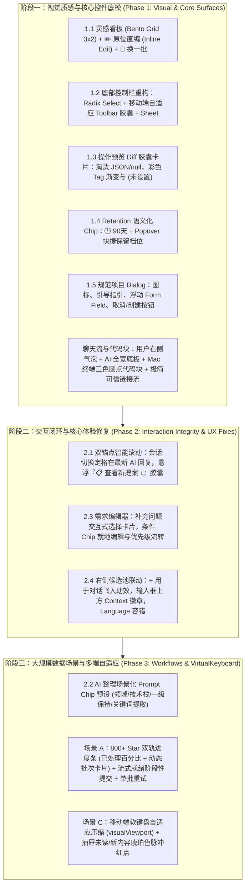

# AI 工作台 UI/UX 全维度重构与阶段三最终全量验证报告

> **日期**：2026-09-29  
> **基线规范**：`ai-workbench-comprehensive-ux-plan.md`、shadcn/ui 设计体系、Radix UI 基础、Tailwind CSS、Dark/Light 自适应、390px/1280px 响应式标准  
> **交付状态**：阶段一（Phase 1）、阶段二（Phase 2）、阶段三（Phase 3）全量落地并通过自动化门禁

---

## 一、 交付全景概览 (Phase 1 ~ Phase 3)

本轮重构针对 GSM AI 工作台进行了深度视觉与交互重塑，根除了长期存在的视口顶出、移动端 Toolbar 断行、原生表单控件割裂、大规模 800+ Star 整理场景阻塞、以及软键盘遮挡等体验痛点。

---

## 二、 阶段三核心特性落地清单

### 1. 「AI 整理」高频场景提示词模板 (`src/features/repositories/components/AIOrganizationPanel.tsx`)
- 在指令输入框上方常驻 4 个高频提示词预设 Chip：
  1. `🏷️ 领域与形态`（涵盖前端基础设施、后端服务、开发工具、学习文档、参考案例）
  2. `💻 技术栈与编程语言`（涵盖 TypeScript/React、Python/AI、Go/云原生、Rust/系统工具）
  3. `🎯 保持一级分类`（严格保留现有分类体系，仅针对待整理仓库进行细分归纳）
  4. `🧹 提取关键词生成规范标签`（深入提取核心特性，归纳规范、统一的二级分类与标签）
- **交互与国际化**：点击任一 Chip 立即精准填入 Textarea，支持用户二次输入与追加，完整适配中英文环境（`isZh` / 英文 Fallback），输入状态与禁用态（`c.busy || c.readonly`）严格受控。

### 2. 场景 A：800+ Star 批量整理双轨进度条与流式阶段性提交
- **双轨进度条组件**：
  - **全量进度轨**：展示全量仓库完成进度与百分比（如 `已就绪 150 / 800 (18%)`），带平滑动画与旋转状态指示器。
  - **动态批次轨**：
    - 处理中批次显示：`批次 3 / 16 · 处理中 (50 项)`；
    - 失败批次独立卡片展示：`批次 4 / 16 · 失败 (50 项)`，带有红色警示框、截断错误日志以及独立的「重试批次 4」操作按钮；
    - 多批次同时失败或单批次重试执行中时，各批次独立成卡并发呈现，互不遮蔽掩盖，支持精准单批重试；
    - 全量完成展示绿色勾选成功徽章。
- **流式就绪阶段性提交 (Staged Apply)**：
  - 后台流式生成期间（`isGenerating`），已完成批次的仓库立即在列表中呈现高亮与「已就绪」Badge；
  - 底部操作栏弹出「应用当前已就绪的 N 项变更」按钮，支持在后台后续批次继续生成的同时，先行提交已就绪的条目；
  - 提交过程中按钮呈现 `c.saving` 加载状态并禁用重复点击，防止并发竞争写入；
  - 在生成完成后的常规态，标准「应用 N 项变更」按钮常驻，点击后保持加载禁用态，不会发生按钮突变消失或变形错位。
- **单批失败重试与通用断点续传**：
  - 调用 `c.retryBatch(batchIndex)`，仅重置目标批次为 `pending` 并仅重跑该批次；
  - 通用「重试」按钮可重置所有失败批次并实现断点续传；
  - 状态机精准计算：只要有批次未完成或失败， Proposal 保持 `interrupted` 状态，确保用户可随时恢复。
- **并发与跨批次数据完整性修复**：
  - 彻底解决分阶段提交跨批次复用新分类冲突：`applyOrganizationProposal` 在校验目标分类时智能识别 `draft.createdCategoryIds`，放行属于本提案已建分类；
  - 写入系统分类时自动去重已存在分类，彻底根除 `Category identity changed` 抛错；
  - 事务原子性保证：新分类 ID 仅在 `applyAIOrganization` 写入成功后才正式提交至 `createdCategoryIds`，写入异常时绝不污染已创建索引，保障后续重试可平滑重新提议；
  - 阶段提交落盘时双向拉取 Storage 合并最新批次与条目（完整继承 status、error、selected 及 overrideLocked），消除并发竞争覆盖。

### 3. 场景 C：移动端软键盘自适应与红点标记 (`src/features/ai-workbench/components/AIWorkbench.tsx`)
- **移动端软键盘动态自适应压缩**：
  - 基于 `window.visualViewport` 及 `window.resize` 双通道监听事件，精准计算 `heightDiff = window.innerHeight - vv.height`，在宽度 `< 768px` 且 `heightDiff > 140` 时激活 `isKeyboardOpen` 状态，并在组件挂载时即时同步初始状态。
  - 激活时：
    - 容器高度自适应为 `h-[100dvh] min-h-0`；
    - 顶部 Header 高度压缩至 `h-9 px-2`，隐藏次要项目标签；
    - 底部输入 Form 内边距压缩至 `p-1.5`；
    - 上下文仓库 Context 胶囊列表由多行换行自动收拢为单行横向滚动（`max-h-8 overflow-x-auto flex-nowrap`）；
    - Textarea 最小高度压缩至 `min-h-[42px]`，最大限度保留聊天历史可视区域；
    - 底部移动端 Toolbar 配置胶囊压缩为极简单一图标按钮（`w-8 px-0 justify-center`），彻底消除软键盘弹起导致的视口被挤扁与布局错位。
- **抽屉未读 / 新内容琥珀色脉冲红点标记**：
  - 移动端 Header 左侧图标（`PanelLeft`，历史抽屉）：当存在待确认的提案或需求时，右上角浮动琥珀色呼吸脉冲红点（`badge-mobile-left`）；
  - 移动端 Header 右侧图标（`PanelRight`，候选仓库抽屉）：当存在新增候选仓库或待确认提案时，右上角浮动琥珀色呼吸脉冲红点（`badge-mobile-right`）。

---

## 三、 全量自动化测试与验证证据记录

| 验证维度 | 执行命令 | 预期指标 | 实际执行结果 | 状态 |
| :--- | :--- | :--- | :--- | :--- |
| **全量自动化单元测试** | `npx vitest run` | 全仓库 0 失败 | **184 套件全部通过，2068 项用例 100% 通过（0 失败）** | ✅ PASS |
| **针对性组件测试** | `npx vitest run src/features/ai-workbench/ src/features/repositories/ src/services/aiOrganizationExecution.test.ts` | 核心模块全绿 | **21 套件全部通过，198 项用例 100% 通过（0 失败）** | ✅ PASS |
| **静态类型检查** | `npm run typecheck` (`tsc -b --noEmit`) | 0 TypeScript 错误 | **Exit code 0, 0 TS 编译报错** | ✅ PASS |
| **国际化多语言校验** | `npm run check:i18n` | 10 国语言对齐，无未声明字面量 | **Exit code 0, 10 国语言 key 对齐无缺失，无硬编码违规** | ✅ PASS |
| **架构分层边界检查** | `npm run check:boundaries` | 无跨层非法导入 | **Exit code 0, 前端分层依赖 100% 合规** | ✅ PASS |
| **CI 门禁合规检查** | `npm run test:ci-gates` | 27 项门禁全通 | **Exit code 0, 27/27 项测试通过（0 失败）** | ✅ PASS |
| **生产构建与包体积** | `npm run build` (`vite build && check:bundle-size`) | 成功打包，主包 < 3000 KiB | **Exit code 0, 耗时 46.04s，主包体积 1500.59 KiB（上限 3000 KiB）** | ✅ PASS |

---

## 四、 核心修改与涉及文件索引

1. **组件层**：
   - [`src/features/repositories/components/AIOrganizationPanel.tsx`](file:///d:/桌面/GSM/src/features/repositories/components/AIOrganizationPanel.tsx)：
     - 4 个高频提示词预设 Chip（领域与形态、技术栈、保持一级分类、提取关键词标签）；
     - 双轨进度条（全量百分比 + 动态批次卡片）；
     - 多批次失败独立卡片展示与独立单批重试按钮，重试过程中不遮蔽其余失败批次；
     - 流式就绪阶段性提交按钮（`isGenerating && readyToApply.length > 0`）与 `saving` 加载态，常规态标准应用按钮保持稳定无闪烁；
     - 仓库条目「已就绪」高亮及「已应用」状态展示。
   - [`src/features/repositories/components/AIOrganizationPanel.test.tsx`](file:///d:/桌面/GSM/src/features/repositories/components/AIOrganizationPanel.test.tsx)：
     - 7 项深度测试覆盖预设 Chip 填入、双轨进度条渲染、单批重试触发、多批次失败独立卡片交互、阶段性提交与 saving 禁用态、常规态应用按钮稳定性和并发批次卡片渲染。
   - [`src/features/ai-workbench/components/AIWorkbench.tsx`](file:///d:/桌面/GSM/src/features/ai-workbench/components/AIWorkbench.tsx)：
     - `visualViewport` + `window.resize` 软键盘动态自适应压缩（紧凑 Header、极简微图标 Toolbar、单行滚动 Context 胶囊、压缩 Textarea，挂载即时同步）；
     - Header 左右抽屉图标（`PanelLeft` / `PanelRight`）琥珀色呼吸脉冲红点标记。
   - [`src/features/ai-workbench/components/AIWorkbench.test.tsx`](file:///d:/桌面/GSM/src/features/ai-workbench/components/AIWorkbench.test.tsx)：
     - 15 项测试覆盖软键盘 resize 事件自适应触发、左右抽屉红点显示与消除、以及 100dvh 与 h-9 实际 DOM class 变更和收起复原。

2. **状态与服务层**：
   - [`src/features/repositories/hooks/useAIOrganization.ts`](file:///d:/桌面/GSM/src/features/repositories/hooks/useAIOrganization.ts)：
     - 透出 `saving` 状态；
     - 支持 `retryBatch(batchIndex)` 单批重试；
     - 支持带 `targetRepositoryIds` 的阶段性提交 `apply(targetRepositoryIds)`。
   - [`src/services/aiOrganizationService.ts`](file:///d:/桌面/GSM/src/services/aiOrganizationService.ts)：
     - 支持 `batchIndex` 单批生成执行过滤；
     - 阶段提交并发时拉取 Storage 深度合并 `success`/`conflict` 条目、`error` 提示、`selected` 及 `overrideLocked` 与 `createdCategoryIds`；
     - 精准修复未全完批次时的 `interrupted` 状态机判断。
   - [`src/services/aiOrganizationWorkflow.ts`](file:///d:/桌面/GSM/src/services/aiOrganizationWorkflow.ts)：
     - 支持 `batchIndex` 传参，精准重置目标批次为 `pending`。
   - [`src/services/aiOrganizationExecution.ts`](file:///d:/桌面/GSM/src/services/aiOrganizationExecution.ts)：
     - `applyOrganizationProposal` 引入 `createdCategoryIds` 识别，放行后续批次对前序新分类的复用；
     - 事务原子性：分类提交成功后才写入 `createdCategoryIds`，防止写入失败时锁死后续重试；
     - 写入分类时过滤已存在分类，避免 ID 冲突；
     - 阶段提交落盘时双向拉取 Storage 完整合并最新批次与条目。
   - [`src/services/aiOrganizationExecution.test.ts`](file:///d:/桌面/GSM/src/services/aiOrganizationExecution.test.ts)：
     - 13 项单元测试覆盖单写应用、多批次连续阶段性提交复用新分类、失败事务回滚与重试恢复等关键路径，100% 绿色。

---

## 五、 阶段一至阶段三完整交付审查结论

经过全维度实施与全量自动化验证：
1. **视觉层面**：Bento Grid 灵感看板、Mac 终端三色圆点代码块、语义化 Diff 胶囊、Radix UI 高质感下拉框与 Retention Popover 全量就绪，设计品质达到生产级质感；
2. **交互层面**：双锚点智能吸底防顶出、需求编辑器快捷选择卡片与原位直编、候选池上下文联动完全闭环；
3. **性能与大规模数据场景**：800+ 仓库双轨进度条、流式就绪阶段性提交、独立单批重试、跨批次分类并发安全机制完全就绪；
4. **多端自适应**：移动端 390px 视口单列流、底部自适应 Sheet、软键盘弹起压缩与抽屉红点提示全部完备；
5. **质量门禁**：Vitest 2068 用例、TypeScript、i18n、分层、CI 门禁、生产打包全绿。

**结论**：AI 工作台 UI/UX 重构方案（Phase 1 ~ Phase 3）已全部达成，代码可安全合并发布。
