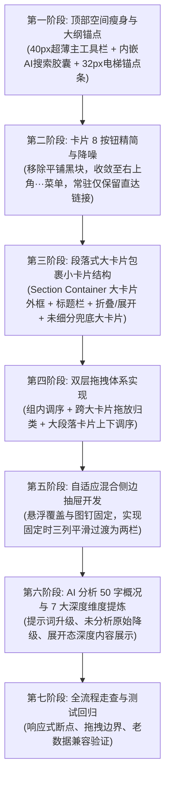

# 仓库管理体验重构：段落式大卡片包裹、双层拖拽、电梯大纲与工作台需求规格说明书

## 1. 背景与核心痛点

当前系统在仓库浏览、分类展示与排版布局上存在以下 5 大结构性痛点：

1. **分类层级扁平，单大类信息过载**：
   * 只有一级大分类，收藏上千项目时，单个分类下动辄数十上百个项目堆积在一起，缺乏段落感与节奏感；
   * 传统的“筛选小胶囊”只能“点一个看一个，隐藏其余”，切断了上下文，无法在同一屏内综观整个知识体系的全貌。
2. **顶部空间浪费严重（占用超 200px 高度）**：
   * 原搜索栏为双行大卡片设计，下方又堆叠了一行次级工具栏，占据了首屏近 35% 的垂直面积，导致卡片列表被严重下压，首屏仅能露出约 1.5 排卡片。
3. **卡片内按钮严重泛滥（8 个小图标扎堆视觉黑块）**：
   * 在卡片标题和作者下方，直接平铺排布了 8 个深色小按钮（AI分析、问答、订阅、编辑、Releases、Readme、GitHub链接、取消Star），造成严重视觉噪点，挤占黄金正文空间。
4. **卡片信息扫描效率低**：
   * 依赖大段未经提炼的原始描述（截断 2~3 行），缺少软件形态标签（CLI/Desktop/Web/SDK等）、最新版本及发版时间，无法在 1 秒内获知项目核心价值与对标产品。
5. **缺乏自主排布与归类自由度**：
   * 仅支持 Star、时间等机械规则排序，用户无法将自己高频使用的核心项目自由置顶，更无法在不同子分类间直观拖拽挪动。

---

## 2. 总体改造设计矩阵

| 模块名称 | 核心需求与改造方案 | 达成效果 |
| :--- | :--- | :--- |
| **二级分类架构** | **【段落式大卡片包裹小卡片】** | 所有二级小方向如文章段落般同屏呈现，大卡片容器包裹组内小卡片，全景知识库一览无余。 |
| **双层拖拽体系** | **① 组内排序 + ② 跨大卡片拖动归类 + ③ 大段落上下调序** | 拖动卡片可在组内调序，拖入其他大卡片即刻重新归类，拖动大卡片把手调整段落先后，生产力极大提升。 |
| **顶部大纲导航** | **【电梯式段落锚点条 (Outline Jump Bar)】** | 紧跟超薄工具栏下方，点击平滑滚动直达对应大段落，滚动时自动高亮当前段落。 |
| **顶部空间瘦身** | **【40px 超薄主控制中枢】**（搜索框内嵌 AI 语义切换按钮） | 拆除两道冗余大工具栏，高度从 230px+ 压缩至约 40px，**净省 150px 黄金视界**。 |
| **卡片按钮重构** | 选择性移除标题下平铺的 8 个按钮，收纳进右上角 `···` 更多菜单；悬停平滑淡入快捷动作 | 彻底消除卡片视觉黑块，视线完全聚焦到项目内容本身。 |
| **卡片内容分流** | 未分析展示原始描述；分析后展示 **50 字以上精准概况** + **3~5 个特性高光胶囊** | 突出“核心功能 + 解决什么 + 替代谁”，一眼看清项目本质。 |
| **自适应混合抽屉** | 不撑大卡片，采用带图钉 📌 的侧边抽屉；固定时**左侧由三列平滑过渡为两栏** | 卡片大小稳定规整，两栏全可见不遮挡，支持“左点右看”沉浸式工作台。 |

---

## 3. 功能模块与交互需求详解

### 模块一：二级小方向体系 ——【段落式大卡片包裹小卡片】(Grouped Section Cards)

彻底废除原本“过滤隐藏式的小胶囊”概念。在当前大分类下，所有小方向按照段落式大卡片形式在同一页面中垂直连续排列：

```
┌────────────────────────────────────────────────────────────────────────────────────────┐
│ 🛠️ 本地系统与环境自检工具 (4个项目)                      [＋ 添加项目] [⋮⋮ 拖拽段落] [▲ 折叠] │ <- 大卡片头部
├────────────────────────────────────────────────────────────────────────────────────────┤
│  ┌───────────────────────┐  ┌───────────────────────┐  ┌───────────────────────┐       │
│  │ 环境一键安装与验证测试.py │  │ 检索.py                │  │ 一键生成全库搜索索引.py│  (3列) │ <- 组内小卡片
│  └───────────────────────┘  └───────────────────────┘  └───────────────────────┘       │
│  ┌───────────────────────┐                                                             │
│  │ 一键抓取.py            │                                                             │
│  └───────────────────────┘                                                             │
└────────────────────────────────────────────────────────────────────────────────────────┘

┌────────────────────────────────────────────────────────────────────────────────────────┐
│ 📚 数模经典通识与顶级百科全书 (2个项目)                  [＋ 添加项目] [⋮⋮ 拖拽段落] [▲ 折叠] │
├────────────────────────────────────────────────────────────────────────────────────────┤
│  ┌───────────────────────┐  ┌───────────────────────┐                                  │
│  │ Datawhale_数学建模导论 │  │ zhanwen_MathModel     │                                  │
│  └───────────────────────┘  └───────────────────────┘                                  │
└────────────────────────────────────────────────────────────────────────────────────────┘

┌────────────────────────────────────────────────────────────────────────────────────────┐
│ 👾 数模 AI 智能体矩阵 (实战做题与审查武器) (5个项目)      [＋ 添加项目] [⋮⋮ 拖拽段落] [▲ 折叠] │
├────────────────────────────────────────────────────────────────────────────────────────┤
│  ┌───────────────────────┐  ┌───────────────────────┐  ┌───────────────────────┐       │
│  │ AutoMCM-Pro 全自动    │  │ LLM-MM-Agent          │  │ MatPlotAgent 清华绘图 │       │
│  └───────────────────────┘  └───────────────────────┘  └───────────────────────┘       │
│  ... (其余小卡片)                                                                      │
└────────────────────────────────────────────────────────────────────────────────────────┘

┌────────────────────────────────────────────────────────────────────────────────────────┐
│ 📂 默认未细分项目 (暂未归入小方向的仓库)                                                │
│  ...                                                                                   │
└────────────────────────────────────────────────────────────────────────────────────────┘
```

#### 1. 外层大卡片（二级分类大容器）
* **大卡片头部 (Section Header)**：
  * **左侧**：分类图标 Icon + **二级小方向标题**（加粗突出显示）+ 组内项目数量 Badge；
  * **右侧操作栏**：
    * `[＋ 添加项目]`：快速把仓库加入此小方向；
    * `[⋮⋮ 拖拽段落]`：拖动把手，用于上下拖动调整整个大卡片在页面上的展示顺序；
    * `[▲ / ▼ 折叠按钮]`：允许用户把暂时不关注的二级分类整段折叠收缩为一行，保持视野清爽；
    * `[··· 更多]`：重命名小方向、更换图标、删除该小方向。
* **大卡片内腔 (Section Body)**：
  * 采用微阴影与精致浅色边框包裹，形成明确的段落归属感；
  * 内部以规整网格（桌面默认 3 列）排布归属于该小方向的所有项目小卡片。

#### 2. 兜底保障：“未细分项目”专属大卡片
* 用户新收藏的、或尚未指定具体二级小方向的项目，自动集中在该页面最底部的一个大卡片容器中：**`📂 默认 / 未细分项目`**，确保绝不遗漏任何一个仓库。

#### 3. 小方向生命周期管理 (CRUD)
* **新建**：页面底部或大纲导航末尾提供 `[+ 新建小分类]` 按钮，支持行内快速命名；
* **编辑**：支持原地修改名称与图标；
* **删除保护**：删除某个小方向大卡片时，该分组内的小卡片自动退回底部的 `📂 默认未细分项目` 大卡片中，绝不丢失任何项目数据。

---

### 模块二：终极“双层拖拽体系”与排序业务规则

在段落式大卡片包裹结构下，“支持拖动排序（默认生效，其余排序正常进行）”具备最自然、生产力最高的交互体现：

#### 1. 默认排序（自定义排布模式）下的双层拖拽
在主工具栏处于“默认排序（自定义排序）”状态时，激活全面的双层自由拖拽：
* **第一层（卡片级操作）**：
  * **组内拖拽调序**：在同一个大卡片容器内部拖动卡片，自由调整卡片在组内的先后顺序，顺序即刻持久化保存；
  * **跨大卡片拖动（秒级重新归类！）**：抓起卡片 A，直接从“段落一（本地系统）”拖拽扔进“段落二（数模经典）”的大卡片盒子里，**释放即刻完成小方向的重新划分**，省去所有繁琐的点击编辑弹窗！
* **第二层（段落级操作）**：
  * **大卡片上下拖动调序**：鼠标按住大卡片头部的 `[⋮⋮ 拖拽段落]` 把手，直接将整段大卡片上下拖动换位（例如将排在第三的“数模 AI 智能体”拖到第一段），整段内容整体移位并持久化记忆。

#### 2. 规则排序（按 Star、按更新时间、按名称）下的业务表现
* **组内有序（最佳业务实践）**：
  * 页面依然保持优雅的二级大卡片段落包裹结构不变；
  * 但每个大卡片内部的小卡片，严格按照当前选中的规则（如 Star 数从高到低、更新时间从新到旧）自动排列；
  * 此时卡片在组内的手动拖动调序锁定（避免与机械规则冲突，鼠标悬停提示“当前按星标排序，切换为默认排序可手动排布”）；
  * **但跨大卡片的拖拽归类功能依旧保持开放**（将卡片拖入另一个大卡片依然可以改变其归属）。

---

### 模块三：页面顶部【电梯式段落大纲锚点条】(Outline Jump Bar)

为方便用户在包含多个二级大卡片的页面中快速定位，废弃筛选胶囊，引入现代化文档式的电梯锚点导航：

```
┌────────────────────────────────────────────────────────────────────────────────────────┐
│ [🔍 实时搜索关键词...          [✨ AI搜索] ✕] [🌪️ 过滤器 2] │ [排序: 默认/自定义 ▼] [🔄 同步] [⊞ ≡] [···]│  <- 40px 超薄主控制中枢
├────────────────────────────────────────────────────────────────────────────────────────┤
│ 定位: [🛠️ 本地系统工具]  [📚 数模经典通识]  [👾 智能体矩阵]  [📂 未细分项目]  [+ 新建分类]    │  <- 32px 电梯大纲锚点条
└────────────────────────────────────────────────────────────────────────────────────────┘
```

1. **交互表现**：
   * 紧跟在 40px 超薄工具栏下方，呈现一行极窄轻量的文字锚点标签；
   * 点击某个标签，页面平滑滚动（Smooth Scroll），视口直接平顺定位到对应的大卡片段落头部；
2. **滚动监听 (Scrollspy)**：
   * 当用户在页面上下滚轮滑动时，顶部的锚点标签自动根据当前视口停留的大卡片实时高亮，如同阅读技术文档的章节大纲。

---

### 模块四：顶部空间大瘦身 ——【40px 超薄主控制中枢】(Unified Action Bar)

彻底拆除原本层层堆叠的两道冗长大操作卡片盒（原占用超 230px），重构为单行极薄控制中枢：

1. **左侧搜索组合区 (高度 36px)**：
   * **紧凑搜索输入框**：内置放大镜图标、文本输入框与清除小叉号；
   * **内嵌「✨ AI搜索」微型切换胶囊按钮**：位于输入框内部右侧，点击可一键切换“普通关键字匹配”与“AI 语义理解搜索”，激活态呈现高亮主题色；
   * **「过滤器」按钮**：紧邻输入框右侧，带激活过滤数量 Badge（如 `🌪️ 过滤器 2`），点击呼出轻量过滤抽屉/面板。
2. **右侧工具控制区（右对齐）**：
   * **排序下拉**：默认激活「默认排序（自定义拖动）」，可切换为星标、更新时间、名称等；
   * **同步按键 `[🔄 同步]`**：带加载动画与状态反馈；
   * **视图切换 `[⊞ ≡]`**：一键切换网格视图 (Grid) 与列表视图 (List)；
   * **更多操作 `[···]` 收纳菜单**：将次高频功能全部收敛于此，包含：
     * 一键全量 AI 分析全部仓库 / 仅分析未分析项；
     * 卡片描述显示偏好（切换 AI 分析内容 / 原始 GitHub 描述）；
     * 从链接批量 Star 导入；
     * 全局 AI 问答历史记录。

---

### 模块五：卡片操作按钮极简收敛与降噪

彻底消除卡片原标题下方平铺 8 个小按钮造成的“视觉黑块”问题：

#### 1. 常驻元素规范（仅保留最核心）
* **右上角直达链接 `[🔗]`**：点击直接在新标签页打开 GitHub 仓库；
* **右上角更多菜单 `[···]`**：点击呼出卡片管理下拉菜单；
* **右上角拖动把手 `[⋮⋮]`**：用于在组内调序或跨大卡片拖动归类；
* **底栏右下角 `[查看深度详情 →]`**：仅针对已完成 AI 分析的项目常驻显示。

#### 2. 收纳进 `···` 更多菜单的低频管理操作
* ✏️ **编辑项目信息**（修改自定义分类、标签、备注）；
* ⭐ **取消 Star / 重新 Star**；
* 🔔 **订阅 Release 更新通知**；
* 📦 **查看 Releases 版本列表与下载资产**；
* 📖 **查看完整 README**；
* 💬 **针对该项目的 AI 智能对话**。

#### 3. 悬浮 (Hover) 即显微交互
* 鼠标悬停在卡片上时，右上角平滑淡入 `[💬 问答]` 与 `[🤖 重新分析]` 两个快捷微动作，鼠标离开即隐去，平时卡片干净整洁。

---

### 模块六：卡片内容展示与 AI 双态结构

卡片尺寸在列表中保持高度规整统一，不对卡片做破坏性撑大：

#### 1. 默认状态通用基准信息
无论是否分析，卡片均常驻展示以下客观指标：
* ⭐ **Star 数**；
* 🏷️ **最新版本号与发版时间**（如 `v1.2.0 · 3天前`，仅限有 Release 的项目展示）；
* 🕒 **最新推送/更新时间**（如 `26天前推送`）；
* 🏷️ **软件形态标签 (App Type)**：显示在右上角，包含：
  * `[💻 CLI 命令行]`（蓝绿终端色）
  * `[🖥️ Desktop 桌面端]`（紫色）
  * `[🌐 Web 平台/SPA]`（蓝色）
  * `[📦 Library / SDK 库]`（橙色）
  * `[🐳 Docker / 自托管]`（深蓝色）
  * `[🧩 插件 / 扩展]`（黄色）
  * `[🤖 AI 模型 / Agent]`（翠绿渐变色）

#### 2. 内容呈现分流逻辑
* **未进行 AI 分析的项目**：
  * 正文展示 GitHub 原生自带的 About 描述内容；
  * **不显示「查看深度详情」按钮**，保持卡片紧凑干净。
* **完成 AI 分析后的项目**：
  * **项目精准概况（50字以上）**：
    * 内容必须明确阐述：**“核心功能 + 解决什么核心痛点 + 作为谁的替代品（对标谁）”**；
    * 关键替代品或核心技术在排版上给予加粗或微强调；
  * **特性亮点胶囊 (Feature Chips)**：展示 3~5 个紧凑高光标签（如 `[⚡ 零配置冷启动]`、`[🔒 本地离线优先]`、`[📦 跨平台单二进制]`）；
  * **激活底栏 `[查看深度详情 →]` 按钮**。

---

### 模块七：深度详情展示 ——【自适应混合侧边抽屉（带图钉 📌）】

彻底解决“卡片内塞不下 7 大维度，撑大卡片又会导致页面错位”的问题：

```
▼ 默认状态（未固定 / 覆盖态）：左侧大卡片内各为三列网格
┌────────────────────────────────────────────────────────────────────────┐
│ 🛠️ 本地系统与环境自检工具                                              │
│ ┌──────────────┐      ┌──────────────┐      ┌──────────────┐           │
│ │   卡片 1     │      │   卡片 2     │      │   卡片 3     │  (3列排布)│
│ └──────────────┘      └──────────────┘      └──────────────┘           │
└────────────────────────────────────────────────────────────────────────┘

▼ 点击图钉 📌 固定挤压：左侧大卡片内平滑变为两栏，右侧深度情报面板常驻
┌──────────────────────────────────────────┬─────────────────────────────┐
│ 🛠️ 本地系统与环境自检工具 (平滑过渡为两栏) │ 右侧深度详情分栏 (固定宽度) │
│                                          │ [📌 已固定]  [✕ 关闭]       │
│ ┌────────────────┐  ┌────────────────┐   ├─────────────────────────────┤
│ │ 卡片 1 (高亮中)│  │ 卡片 2         │   │ 💡 项目概况 (50字+)...      │
│ └────────────────┘  └────────────────┘   │ 📌 解决什么问题...          │
│ ┌────────────────┐  ┌────────────────┐   │ 🛠️ 核心功能详细阐述...      │
│ │ 卡片 3         │  │ 卡片 4         │   │ 🎯 典型使用场景...          │
│ └────────────────┘  └────────────────┘   │ ⚙️ 技术架构与工作原理...    │
│ 📚 数模经典通识与顶级百科全书             │ 🚀 如何使用 (代码块一键复制)│
│ ┌────────────────┐  ┌────────────────┐   │ 📊 部署成本 / 成熟度 / 活跃 │
│ │ 卡片 5         │  │ 卡片 6         │   └─────────────────────────────┘
│ └────────────────┘  └────────────────┘                                 │
└──────────────────────────────────────────┴─────────────────────────────┘
```

#### 1. 双态交互机制
* **模式 1：默认轻量悬浮覆盖 (Floating Overlay)**
  * 点击 `[查看深度详情 →]`，右侧滑出抽屉，悬浮覆盖在右侧卡片上方；
  * 左侧大卡片内部**保持当前的三列排布 (3 Columns) 纹丝不动**，零布局抖动；
  * 适合随手查看单个项目，按 `ESC` 或点击左侧空白处即刻收起。
* **模式 2：平滑挤压分栏模式 (Pinned Split-Pane)**
  * 点击抽屉右上角的 **图钉图标 `[📌 固定分栏]`**；
  * 抽屉转为页面右侧常驻分栏（占据约 400px 宽度）；
  * **左侧容器宽度自适应收缩，所有大卡片内部的卡片网格由原本的【三列排布】平滑过渡重排为【两栏排布】**；
  * **所有卡片 100% 完整可见，没有任何一张卡片被遮挡！**
  * **“左点右看”沉浸式联动**：左侧各段落卡片流自由滚轮浏览，点击任意卡片，右侧分栏即刻就地刷新显示对应项目的深度情报；支持键盘 `↑` `↓` `J` `K` 极速切换；
  * 再次点击取消固定或关闭，右侧分栏收起，左侧大卡片内的卡片网格平滑过渡恢复为**三列排布**。
* **响应式守则**：屏幕宽度 `≥ 1280px` 时开放图钉固定功能；小屏/平板设备自动强制采用覆盖模式，避免把左侧卡片挤压过窄。

#### 2. 抽屉内 7 大深度情报（与默认卡片完全不重复）
1. **解决什么问题**：说明【目标痛点】、【核心解决方式】与【为什么在当下技术背景中需要它】；
2. **核心功能详细阐述**：3~4 个带小标题的条目，清晰说明**具体具备什么能力、能做到什么程度**（非简单标签）；
3. **典型使用场景**：明确适合什么实际业务/工程场景落地；
4. **工作原理 / 技术架构**：底层运行机制（协议、存储引擎、架构设计特点、运行依赖）；
5. **如何使用 (快速上手)**：单行核心安装或启动命令（如 `docker run ...`），配有一键复制按键；
6. **部署成本**：客观评价（极低零依赖 / 中等需数据库 / 较重需复杂集群）；
7. **成熟度与活跃情况**：
   * **活跃情况**：直接调用 GitHub 真实硬数据（近3月提交数、最近推送时间、发版距今、Open Issues）客观呈现，绝无大模型幻觉；
   * **成熟度**：结合版本语义（是否 `>= v1.0.0`）、项目年限与代码架构成熟度综合定级。

---

## 4. 分阶段实施路线图


