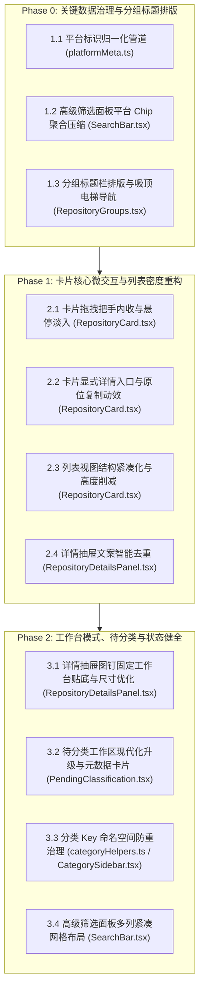

# 仓库页面 UI/UX 深度体验优化实施方案

本文档基于对当前 GSM 仓库页面的全量视觉与交互排查，结合实机截图、真实数据库（64个真实仓库）数据特征，以及通过交互决策确定的 4 大核心方向，制定的分阶段工程实施计划。

---

## 一、用户决策确认基准

1. **平台与高级筛选治理 (P0)**：
   - 前端建立 `normalizePlatform(rawPlatform)` 映射管道，将 AI 提取的 130+ 种杂乱版本号字符串（如 `Windows 10 19042+`、`macOS (Apple 芯片 M 系列)`、`Ubuntu 22.04`、`Web 浏览器`、`Node.js 24.16+`）自动归一化为 7 个标准大类（`windows`、`macos`、`linux`、`web`、`android`、`ios`、`docker`）。
   - 卡片上展示官方品牌图标与标准化大类名称，彻底消灭“全员显示器 🖥️ 图标”的降级乱象；
   - 高级筛选面板仅呈现这 7 个标准 Chip（附带仓库匹配数量计数），原精确版本号仅在详情抽屉中原样保留。
2. **段落分组与布局风格 (P0)**：
   - 采纳**极简扁平流式风格**：不添加外部大卡片外边框，避免多层卡片嵌套造成的视觉压迫感；
   - 重点打磨标题栏字阶、对齐与低饱和度分割线，优化电梯大纲吸顶交互与当前分组高亮联动；稀疏分类保持轻盈自然的流式网格。
3. **卡片微交互与引导线索 (P1)**：
   - 拖拽把手（Grip Handle）内收在卡片内侧左上角，hover 时平滑淡入（`opacity-0 group-hover:opacity-100`），彻底根除 `absolute -left-2` 刺入外侧间隙的碰撞溢出问题；
   - 卡片底部时间戳右侧显式展示轻量 `详情 →` 次级按钮（整卡点击仍可打开抽屉），消除操作盲区；
   - 列表视图取消割裂式 56px 独立 Footer，将高度压缩至 ~130px，首屏展示量翻倍；
   - 复制操作提供本地原位 Check 绿色动效反馈。
4. **详情抽屉、固定工作台与待分类工作区 (P1/P2)**：
   - 详情面板智能去重：当 `problem_solved` 与概览文本高度相似或完全重复时，智能隐藏重复块，凸显核心功能与架构亮点；
   - 固定工作台（Pinned Mode）：弹性定宽（`w-[440px] xl:w-[480px]`），高度贴合视口底边，外链增加标准 Button 容器与 Tooltip；
   - 待分类工作区：全面升级为现代下拉选择组件，补齐作者头像、Star 数量、语言圆点与直达外链；
   - 分类 Key 碰撞治理：自定义分类 ID 增加统一命名空间，彻底根除 React Key 冲突报警。

---

## 二、分阶段实施路线图 (P0 → P1 → P2)

---

## 三、各阶段详细任务清单与技术规范

### Phase 0: 关键数据治理与分组标题排版 (P0)

#### 1.1 平台标识归一化管道 (`src/components/platformMeta.ts`)
- **实现规则**：
  编写 `normalizePlatformKey(raw: string): string`：
  - Windows: `/windows|win10|win11|win32|win64|powershell|cmd/i` $\to$ `'windows'`
  - macOS: `/macos|mac os|apple silicon|m系列|darwin/i` $\to$ `'macos'`
  - Linux: `/linux|ubuntu|debian|arch|fedora|centos|wsl|posix|glibc/i` $\to$ `'linux'`
  - Web: `/web|browser|浏览器|chrome|firefox|edge|safari|html|cloudflare pages/i` $\to$ `'web'`
  - Android: `/android/i` $\to$ `'android'`
  - iOS: `/ios|ipad/i` $\to$ `'ios'`
  - Docker: `/docker|container|k8s|kubernetes/i` $\to$ `'docker'`
  - CLI: `/cli|terminal|命令行|bash|zsh/i` $\to$ `'cli'`
  - 其余环境（如 Node.js, Python, CUDA 等）：归为技术栈/运行时标签，不在卡片主要平台位与筛选器核心平台位造成干扰。
- **导出方法**：
  - `getCanonicalPlatforms(rawPlatforms?: string[]): string[]`：去重并返回标准平台列表。
  - 保留并拓展 `PLATFORM_ICON_MAP`，确保标准大类均对应正确的官方 SVG 图标。

#### 1.2 高级筛选面板平台 Chip 聚合 (`src/components/SearchBar.tsx`)
- `availablePlatforms` 统一通过 `getCanonicalPlatforms` 聚合，并在 Chip 上展示聚合后的匹配数量 `(n)`；
- 点击某个标准平台（如 `Windows`）时，筛选条件匹配所有归属于该大类的仓库。

#### 1.3 分组标题栏排版与吸顶大纲 (`src/features/repositories/components/RepositoryGroups.tsx`)
- 按照极简扁平流式风格，保持通透背景；
- 优化标题行设计：提升字体层级（`text-base font-semibold tracking-tight`），分组计数采用精致的徽章样式（`ml-2 px-1.5 py-0.5 text-xs rounded-full bg-muted text-muted-foreground`）；
- 大纲锚点条升级为吸顶并支持平滑滚动高亮。

---

### Phase 1: 卡片核心微交互与列表密度重构 (P1)

#### 2.1 卡片拖拽把手内收与微交互 (`src/components/RepositoryCard.tsx`)
- 将把手定位从 `absolute -left-2 top-3` 改为 `absolute left-2.5 top-2.5 z-10`；
- 样式配置为平滑过渡：`opacity-0 group-hover:opacity-100 transition-opacity duration-150`；
- 在卡片标题区留出适当的安全 padding，避免与仓库图标重叠。

#### 2.2 显式详情入口与复制动效 (`src/components/RepositoryCard.tsx`)
- 在卡片底部 Footer 右侧增加微型次级操作按钮：
  `<button onClick={onOpenDetails} className="inline-flex items-center gap-1 text-xs text-muted-foreground hover:text-primary transition-colors">详情 <ArrowRight className="w-3 h-3" /></button>`；
- 为复制 Git URL / 安装命令增加本地状态 `copied: boolean`，点击后显示 `<Check className="w-3.5 h-3.5 text-emerald-500 animate-in zoom-in-50" />` 并在 1.5 秒后复原。

#### 2.3 列表视图高度削减与紧凑重构 (`src/components/RepositoryCard.tsx`)
- 在 `viewMode === 'list'` 下：
  - 移除原 `h-14 mt-4 border-t` 的独立 Footer 容器；
  - 将多选 Checkbox 和作者头像左侧组合，仓库名、语言、Star、平台图标和更新时间排在同一内容流或双行网格中；
  - 卡片高度压缩至 120~135px 之间。

#### 2.4 详情抽屉文案智能去重 (`src/components/RepositoryDetailsPanel.tsx`)
- 对比 `ai_details?.problem_solved` 与 `repository.ai_summary` / `repository.description` 的相似度或文本包含关系；
- 当内容重复时，自动隐藏“解决的问题”小节，直接展示“核心能力”与“快速上手”，避免复读现象。

---

### Phase 2: 工作台模式、待分类与状态健全 (P2)

#### 3.1 详情抽屉图钉固定工作台优化 (`src/components/RepositoryDetailsPanel.tsx`)
- Pinned 模式宽度由固定的 `w-[400px]` 优化为自适应 `w-[440px] xl:w-[480px]`；
- 高度修正为 `h-[calc(100vh-4rem)]`，贴紧视口底部，消除悬空留白；
- 顶部 GitHub 外链图标包装为标准 `<Button variant="ghost" size="icon" className="h-8 w-8">` 并添加 `title="在 GitHub 中打开"`。

#### 3.2 待分类工作区升级 (`src/features/repositories/components/PendingClassification.tsx`)
- 替换原生 `<select>` 为规范的组件；
- 列表项增加仓库 Owner Avatar、Star 统计小标、语言色块指示器；
- 提供点击仓库名称或图标快速唤起详情抽屉的能力。

#### 3.3 分类 Key 碰撞治理 (`src/store/helpers/categoryHelpers.ts` / `src/components/CategorySidebar.tsx`)
- 自定义分类添加命名空间前缀（`custom_${category.id}`）或在 React 组件渲染 key 中使用组合标识：
  `key={`${category.is_custom ? 'custom' : 'builtin'}-${category.id}`}`，防止控制台警告与切换异常。

#### 3.4 高级筛选面板紧凑布局 (`src/components/SearchBar.tsx`)
- 将筛选器改用响应式多列布局（`grid grid-cols-1 md:grid-cols-2 lg:grid-cols-3 gap-6`）；
- 默认展示高频项，附带“清空当前筛选”的全局操作。

---

## 四、验证与回归测试策略
1. **自动化类型与单元测试**：
   - 运行 `npm run typecheck` 保证无任何类型错误；
   - 运行现有测试套件 `npm run test:run`。
2. **实机截图对比验证**：
   - 截取对应场景的新截图，对比修复前后的视觉效果：
     - 网格模式卡片 hover（把手内收与详情按钮）；
     - 列表模式高度对比（220px $\to$ 130px）；
     - 高级筛选面板平台 Chip 数量（130+ $\to$ 7 大类）；
     - 详情抽屉 Overview 文本去重与固定模式；
     - 待分类工作区组件。
