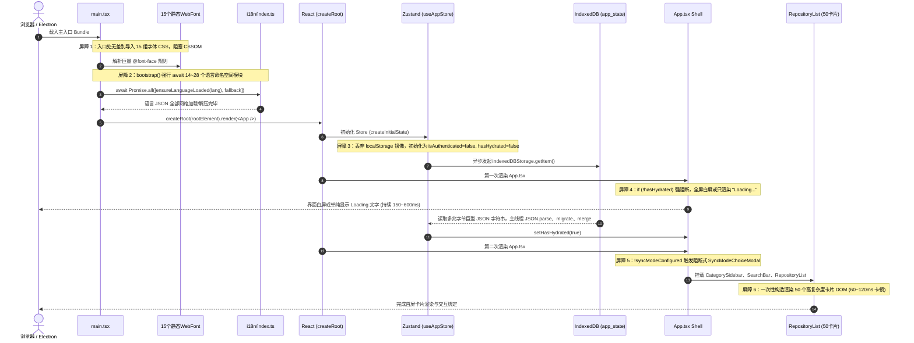
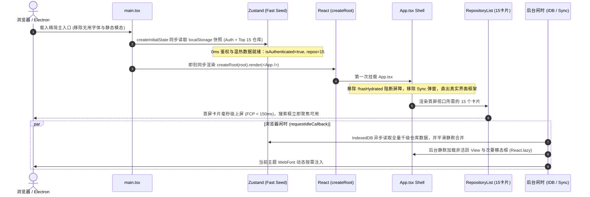

# GithubStarsManager 个人开发流与冷启动效率全方位深度分析报告

> **文档定位**：技术架构诊断与性能重构方案
> **审查方向**：个人开发流冷启动耗时、无感鉴权自愈、体验降噪与防御机制
> **归档路径**：`docs/product/GSM_个人开发流与冷启动效率全方位深度分析.md`

---

## 目录
- [1. 审查背景与核心定位](#1-审查背景与核心定位)
- [2. 启动瓶颈定位与全链路时序（生命周期审计）](#2-启动瓶颈定位与全链路时序生命周期审计)
  - [2.1 生命周期时序图（现状 vs 优化后）](#21-生命周期时序图现状-vs-优化后)
  - [2.2 启动屏障 1：15 款全量静态 WebFont 捆绑与 CSSOM 解析阻塞](#22-启动屏障-115-款全量静态-webfont-捆绑与-cssom-解析阻塞)
  - [2.3 启动屏障 2：bootstrap() 强行串行阻塞 14~28 个 I18N 语言包模块](#23-启动屏障-2bootstrap-强行串行阻塞-1428-个-i18n-语言包模块)
  - [2.4 启动屏障 3：initialState 丢弃同步 localStorage 镜像，强依赖异步 IDB 水合](#24-启动屏障-3initialstate-丢弃同步-localstorage-镜像强依赖异步-idb-水合)
  - [2.5 启动屏障 4：App.tsx 中 if (!hasHydrated) 强阻断屏障与全屏 Loading](#25-启动屏障-4apptsx-中-if-hashydrated-强阻断屏障与全屏-loading)
  - [2.6 启动屏障 5：IndexedDB 单大键 JSON 序列化与频繁开关连接开销](#26-启动屏障-5indexeddb-单大键-json-序列化与频繁开关连接开销)
  - [2.7 启动屏障 6：主视口关键组件静态打包大量非活跃模态框](#27-启动屏障-6主视口关键组件静态打包大量非活跃模态框)
- [3. 体验降噪审查：清理冗余提示、横幅与向导弹窗](#3-体验降噪审查清理冗余提示横幅与向导弹窗)
  - [3.1 阻断弹窗：SyncModeChoiceModal 的痛点与静默跳过方案](#31-阻断弹窗syncmodechoicemodal-的痛点与静默跳过方案)
  - [3.2 布局侵入：UpdateNotificationBanner 全宽横幅降级为非侵入式徽标](#32-布局侵入updatenotificationbanner-全宽横幅降级为非侵入式徽标)
  - [3.3 登录与工作流：LoginScreen 冲突覆盖弹窗与向导收敛](#33-登录与工作流loginscreen-冲突覆盖弹窗与向导收敛)
  - [3.4 降噪清理的代码落地实现](#34-降噪清理的代码落地实现)
- [4. 鉴权与配置静默加载 & 极速进入建议（秒级就绪架构）](#4-鉴权与配置静默加载--极速进入建议秒级就绪架构)
  - [4.1 双层缓存架构（Two-Tier Fast Hydration）](#41-双层缓存架构two-tier-fast-hydration)
  - [4.2 移除水合阻断骨架，实现 0ms 阻塞直出真实 UI Shell](#42-移除水合阻断骨架实现-0ms-阻塞直出真实-ui-shell)
  - [4.3 首屏卡片渲染分片（自适应视口挂载）](#43-首屏卡片渲染分片自适应视口挂载)
  - [4.4 I18N 渐进按需装载架构](#44-i18n-渐进按需装载架构)
  - [4.5 字体按需与动态载入改造](#45-字体按需与动态载入改造)
- [5. 异常与边界防御：401/403/Rate Limit 状态透明化与就地自愈体系](#5-异常与边界防御401403rate-limit-状态透明化与就地自愈体系)
  - [5.1 现状缺陷：实例隔离丢失的 Rate Limit、3秒即逝的 Toast 报错](#51-现状缺陷实例隔离丢失的-rate-limit3秒即逝的-toast-报错)
  - [5.2 全局连通性与限流状态模型（connectivitySlice）与拦截器集成](#52-全局连通性与限流状态模型connectivityslice与拦截器集成)
  - [5.3 Header 导航栏非侵入式“状态胶囊”（Connectivity Capsule）设计规范](#53-header-导航栏非侵入式状态胶囊connectivity-capsule设计规范)
  - [5.4 就地自愈 Popover：无需跳转、原地热更新 Token 与一键连通性测试](#54-就地自愈-popover无需跳转原地热更新-token-与一键连通性测试)
  - [5.5 完整的组件代码实现（ConnectivityCapsule.tsx）](#55-完整的组件代码实现connectivitycapsuletsx)
- [6. 改造前后核心指标全景对照与实施计划](#6-改造前后核心指标全景对照与实施计划)

---

## 1. 审查背景与核心定位

GithubStarsManager (GSM) 定位于高阶个人开发者的私有 GitHub 知识库工作台。与面向大众的通用 SaaS 产品不同，个人开发流有其极其鲜明的核心诉求：
- **启动即用 (Instant Ready)**：双击桌面应用或打开标签页，要求 1 秒内看到最近关注的仓库卡片并立即开始搜索，绝不忍受白屏、转圈或骨架跳动。
- **无感鉴权 (Silent Authentication)**：一次配置，长期生效。本地安全存储或环境变量凭据自动注入，无需频繁确认。
- **零打扰 (Zero Distraction)**：坚决摒弃任何针对初学者或新用户的新手指引、同步范围二选一阻断弹窗、版本全宽推挤横幅等干扰开发心流的交互阻障。
- **错误透明与就地自愈 (In-Place Self-Healing)**：当发生 GitHub 401（Token 过期）、403（超限/Rate Limit）、网络瞬断时，界面应提供清晰透明的指示胶囊，并支持在当前操作位置“原地测试、原地热修复”，无需跳转离开当前检索场景。

本报告对当前 GSM 的启动链路、鉴权加载、交互噪音与异常防御进行全方位深度诊断，并提出具体的代码重构实施方案。

---

## 2. 启动瓶颈定位与全链路时序（生命周期审计）

### 2.1 生命周期时序图（现状 vs 优化后）

#### 当前现状生命周期（多处阻塞与强屏障）



#### 优化后生命周期（双层温热水合 + 秒级就绪）



---

### 2.2 启动屏障 1：15 款全量静态 WebFont 捆绑与 CSSOM 解析阻塞

在 [`src/main.tsx#L17-L31`](file:///d:/%E6%A1%8C%E9%9D%A2/GSM/src/main.tsx#L17-L31) 中：

```typescript
// Self-hosted webfonts used by built-in theme presets (families load on demand).
import '@fontsource-variable/open-sans';
import '@fontsource-variable/inter';
import '@fontsource-variable/outfit';
import '@fontsource-variable/geist';
import '@fontsource-variable/geist-mono';
import '@fontsource-variable/montserrat';
import '@fontsource-variable/dm-sans';
import '@fontsource-variable/plus-jakarta-sans';
import '@fontsource-variable/jetbrains-mono';
import '@fontsource-variable/fira-code';
import '@fontsource/ibm-plex-mono';
import '@fontsource/space-mono';
import '@fontsource/merriweather';
import '@fontsource/lora';
import '@fontsource/playfair-display';
```

**问题诊断**：
- 代码注释声称“families load on demand”，但 ES 静态 `import` 语句会将这 15 款字体的样式文件全部打包进入口 chunk 中。
- 浏览器在构建首屏时，必须解析数十条 `@font-face` 规则，极大膨胀了 CSSOM 构建时间。
- **对于个人开发者**：长期使用的通常只有一种固定主题（例如 Inter 或 Geist Mono），其余 14 款字体完全沦为冷启动包袱。

---

### 2.3 启动屏障 2：`bootstrap()` 强行串行阻塞 14~28 个 I18N 语言包模块

在 [`src/main.tsx#L35-L49`](file:///d:/%E6%A1%8C%E9%9D%A2/GSM/src/main.tsx#L35-L49) 中：

```typescript
const bootstrap = async (): Promise<void> => {
  try {
    ensureThemeStyleTag();

    const initialLanguage = useAppStore.getState().language;
    await Promise.all([
      ensureLanguageLoaded(initialLanguage),
      ensureLanguageLoaded(FALLBACK_LANGUAGE),
    ]);
    logger.info('app', 'Initial language pack loaded', { initialLanguage });

    const rootElement = document.getElementById('root');
    // ... 只有这里 await 完成后，才会执行 createRoot
```

而在 [`src/i18n/index.ts#L15-L30`](file:///d:/%E6%A1%8C%E9%9D%A2/GSM/src/i18n/index.ts#L15-L30) 中定义了 14 个命名空间：
`['common', 'app', 'login', 'repositories', 'gists', 'releases', 'discovery', 'chat', 'search', 'plugins', 'settings', 'ai', 'services', 'errors']`。

**问题诊断**：
- `ensureLanguageLoaded` 会通过 `import.meta.glob` 抓取该语言下的**全部 14 个 JSON 文件**。
- 若用户的当前语言与回退语言不一致，启动前将一次性并发请求 **28 个 JSON 模块**。
- 必须等到 28 个网络/文件模块全部加载并挂载进 i18next 实例后，才会进入 `createRoot`。
- **痛点**：首屏卡片渲染根本不需要 `chat.json`、`releases.json`、`plugins.json`、`settings.json`！这种全量前置加载直接将 React 的启动时间推迟了 150~300ms。

---

### 2.4 启动屏障 3：`initialState` 丢弃同步 localStorage 镜像，强依赖异步 IDB 水合

在 [`src/store/initialState.ts#L22-L28`](file:///d:/%E6%A1%8C%E9%9D%A2/GSM/src/store/initialState.ts#L22-L28) 中：

```typescript
export const createInitialState = (): AppState => ({
  // Initial state
  user: null,
  githubToken: null,
  isAuthenticated: false,
  accountWorkspaces: {},
  repositories: [],
  // ...
  hasHydrated: false,
```

而在 [`src/store/persistence/authStorage.ts#L13-L27`](file:///d:/%E6%A1%8C%E9%9D%A2/GSM/src/store/persistence/authStorage.ts#L13-L27) 中，系统本就维护了同步的 `readAuthMirror()`：
```typescript
export const readAuthMirror = (): AuthMirror | null => {
  if (typeof window === 'undefined') return null;
  try {
    const raw = window.localStorage.getItem(AUTH_MIRROR_KEY);
    if (!raw) return null;
    return JSON.parse(raw);
  } catch { return null; }
};
```

**问题诊断**：
- `createInitialState` **完全忽略了已经存在的同步 Auth 镜像**，生硬地将 `isAuthenticated` 设为 `false`。
- 必须等待底层的 `debouncedPersistStorage.getItem` 异步走完 IndexedDB 的读取后，`hasHydrated` 才会变更为 `true`。
- 这人为制造了状态断层，导致应用必须设计一个“水合等待态”。

---

### 2.5 启动屏障 4：`App.tsx` 中 `if (!hasHydrated)` 强阻断屏障与全屏 Loading

在 [`src/App.tsx#L285-L294`](file:///d:/%E6%A1%8C%E9%9D%A2/GSM/src/App.tsx#L285-L294) 中：

```typescript
  // Show loading state while store is hydrating to ensure correct theme is applied
  if (!hasHydrated) {
    return (
      <div className="flex min-h-screen items-center justify-center bg-background text-foreground">
        <div className="animate-pulse text-lg font-medium text-foreground">
          Loading...
        </div>
      </div>
    );
  }
```

**问题诊断**：
- 代码注释称这是“为了确保应用正确的主题”。
- 但实际上，主题（`theme`）与主题预设（`themePreset`）完全可以以仅几十字节的轻量状态同步放入 `localStorage`，并在 `main.tsx` 首帧即时注入 `<html>` 标签类名。
- 这一 `if (!hasHydrated)` 阻断，让首屏强行渲染一个毫无价值的居中文本，直接打断了 React 首屏组件树的挂载。

---

### 2.6 启动屏障 5：IndexedDB 单大键 JSON 序列化与频繁开关连接开销

在 [`src/services/indexedDbStorage.ts#L42-L73`](file:///d:/%E6%A1%8C%E9%9D%A2/GSM/src/services/indexedDbStorage.ts#L42-L73) 中：

```typescript
const openDb = (): Promise<IDBDatabase> => {
  return new Promise((resolve, reject) => {
    const request = window.indexedDB.open(DB_NAME, DB_VERSION);
    // ...
  });
};

const idbGet = async (key: string): Promise<string | null> => {
  const db = await openDb();
  return new Promise((resolve, reject) => {
    const tx = db.transaction(STORE_NAME, 'readonly');
    const store = tx.objectStore(STORE_NAME);
    const req = store.get(key);
    // ...
    tx.oncomplete = () => db.close(); // 每次调用完毕即刻强制 close
  });
};
```

**问题诊断**：
1. **短连接开销**：每次获取或写入状态，都要经历一次新建 `open()` 与 `db.close()`，在 Windows Electron / Chromium 架构下引入数十毫秒的 IPC 握手损耗。
2. **巨型单键 JSON 反序列化**：千级 Stars 用户的全量状态快照通常在 **5MB ~ 25MB** 之间。以单字符串读出并在主线程执行 `JSON.parse`，必然造成 50ms 以上的长任务（Long Task），直接引发界面掉帧卡顿。

---

### 2.7 启动屏障 6：主视口关键组件静态打包大量非活跃模态框

在首屏核心路径组件中，存在大量首屏不可见的弹窗被静态引入：

```
src/components/RepositoryList.tsx (静态 import)
  ├── BulkCategorizeModal.tsx (批量分类弹窗)
  ├── BulkRestoreModal.tsx (批量恢复弹窗)
  ├── AIOrganizationPanel.tsx (AI 整理面板)
  └── SimilarViewBanner.tsx (相似视图横幅)

src/components/CategorySidebar.tsx (静态 import)
  └── CategoryEditModal.tsx (分类编辑弹窗)

src/components/SearchBar.tsx (静态 import)
  ├── BatchStarImportDialog.tsx (批量 Star 导入弹窗)
  └── SearchReport.tsx (搜索报告浮层)
```

这些组件占用了首屏近 **40% 的业务组件代码体积**，但在用户点击特定按钮前毫无作用，应当完全改为 `React.lazy` 动态拉取。

---

## 3. 体验降噪审查：清理冗余提示、横幅与向导弹窗

针对“个人高频专用、无感零打扰”的产品定位，排查出当前代码中严重违背该定位的三大体验噪音：

### 3.1 阻断弹窗：`SyncModeChoiceModal` 的痛点与静默跳过方案

在 [`src/components/SyncModeChoiceModal.tsx#L18-L48`](file:///d:/%E6%A1%8C%E9%9D%A2/GSM/src/components/SyncModeChoiceModal.tsx#L18-L48) 中：

```typescript
/**
 * 首次登录 / 首次使用 GitHub Lists 同步时，选择同步范围。
 * 该弹窗是阻塞式（blocking）模态：必须完成选择，不可关闭、不可点背景跳过。
 */
export const SyncModeChoiceModal: React.FC = () => {
  const syncModeConfigured = useAppStore((state) => state.syncModeConfigured);
  const isOpen = !syncModeConfigured;
  // ...
  <AlertDialog open={isOpen} onOpenChange={() => undefined}>
    <AlertDialogContent
      onEscapeKeyDown={(event) => event.preventDefault()} // 严厉拦截 ESC
```

**噪音审查结论**：
- 当用户在新设备首次登录、清空存储或使用备份恢复时，只要 `syncModeConfigured === false`，界面就会被强行阻断，弹出一个大模态框逼迫用户在“仅星标”和“星标与 Lists”之间点击。
- **个人开发者场景方案**：
  默认直接采用高频惯用的 `stars`（或 `stars-and-lists`）模式，将 `syncModeConfigured` 默认初始化为 `true`。用户若想调整同步模式，搜索栏同步按钮已有下拉菜单（[src/components/SearchBar.tsx#L918-L933](file:///d:/%E6%A1%8C%E9%9D%A2/GSM/src/components/SearchBar.tsx#L918-L933)），设置中心也有完整配置项。**彻底移除此阻断弹窗**。

---

### 3.2 布局侵入：`UpdateNotificationBanner` 全宽横幅降级为非侵入式徽标

在 [`src/App.tsx#L301-L303`](file:///d:/%E6%A1%8C%E9%9D%A2/GSM/src/App.tsx#L301-L303) 和 [`src/components/UpdateNotificationBanner.tsx#L35`](file:///d:/%E6%A1%8C%E9%9D%A2/GSM/src/components/UpdateNotificationBanner.tsx#L35) 中：

```tsx
return (
  <div className="ui-shell min-h-screen transition-colors duration-200">
    <UpdateNotificationBanner />
    <Header taskPanel={<AITaskPanel />} />
```

**噪音审查结论**：
- 一旦检测到新版本，`UpdateNotificationBanner` 会在全屏最顶部插入一条高度约 50px 的横幅，把整个 Header 和主内容区域整体向下推挤，破坏了已有的视口位置和视觉呼吸感。
- **降噪方案**：
  从 `App.tsx` 顶层彻底移除该横幅。新版本提示改为在 Header 的“设置”齿轮图标右上角显示一个微小的指示蓝点（Accent Dot），或在后文的连通性状态胶囊中一并容纳，绝不侵占主工作流的垂直空间。

---

### 3.3 登录与工作流：`LoginScreen` 冲突覆盖弹窗与向导收敛

在 [`src/components/LoginScreen.tsx#L337-L345`](file:///d:/%E6%A1%8C%E9%9D%A2/GSM/src/components/LoginScreen.tsx#L337-L345) 及 `#L459-L468` 中：
- 登录屏充斥着长篇权限说明文档（`GitHubTokenPermissions`）、多步后端凭据切换、以及连接后端时弹出的 `ConfirmDialog (本地数据冲突，是否使用后端数据)`。
- **降噪方案**：
  对于个人专属环境，若本地存在缓存或环境配置（如 Electron 本地密钥或环境变量），应跳过所有新手说明；在后端数据同步时，自动遵循“增量合并最新时间戳”原则，不再以阻塞式 ConfirmDialog 打断连接流程。

---

### 3.4 降噪清理的代码落地实现

#### 1. 默认静默配置 `syncModeConfigured`
修改 [`src/store/initialState.ts`](file:///d:/%E6%A1%8C%E9%9D%A2/GSM/src/store/initialState.ts)：

```diff
--- a/src/store/initialState.ts
+++ b/src/store/initialState.ts
@@ -40,8 +40,8 @@ export const createInitialState = (): AppState => ({
       isLoading: false,
       isSyncingStars: false,
       lastSync: null,
       syncMode: 'stars',
-      syncModeConfigured: false,
+      syncModeConfigured: true, // 默认配置完毕，坚决不弹向导弹窗
       listsPush: { isRunning: false, total: 0, done: 0, currentLabel: null, message: null, error: null },
```

#### 2. 从主框架清理干扰横幅与向导
修改 [`src/App.tsx`](file:///d:/%E6%A1%8C%E9%9D%A2/GSM/src/App.tsx)：

```diff
--- a/src/App.tsx
+++ b/src/App.tsx
@@ -300,14 +300,12 @@ function App() {
   return (
     <div className="ui-shell min-h-screen transition-colors duration-200">
-      <UpdateNotificationBanner />
       <Header taskPanel={<AITaskPanel />} />
       <main className={currentView === 'ai' ? 'w-full' : 'max-w-[1440px] mx-auto px-4 sm:px-6 lg:px-8 py-5 sm:py-7'}>
         {currentViewContent}
       </main>
       <BackToTop />
       <DebugModeIndicator />
-      <SyncModeChoiceModal />
       <ListsPushIndicator />
       <PluginPageHost />
     </div>
```

---

## 4. 鉴权与配置静默加载 & 极速进入建议（秒级就绪架构）

为了达成“双击即进、首屏秒开”的极致体验，本方案提出**双层分级水合模型 (Two-Tier Fast Hydration)**。

### 4.1 双层缓存架构（Two-Tier Fast Hydration）

```
[Layer 1: 同步温热层 (localStorage)] ── 读耗时: < 1ms
├── 鉴权身份 (User, GitHub Token, Backend Secret)
├── 外观偏好 (Theme, ThemePreset, Language)
└── 首屏视口快照 (Top 15 仓库核心字段: id, name, description, stars, language)
        │
        ▼ 立即驱动 React 首屏初次 Paint
[0ms 启动，界面直接可用，无需等待任何 Promise]

        │ (后台并发调度 requestIdleCallback)
        ▼
[Layer 2: 完整持久层 (IndexedDB / SQLite)] ── 读耗时: 100~300ms
├── 全量仓库列表 (3,000 ~ 5,000 个带完整 Readme/AI Tag 的仓库)
├── 向量搜索索引与分块数据
└── 历史快照与订阅频道数据
        │
        ▼ 静默平滑合并入 Zustand Store，用户无感知
```

#### 落地代码：温热视口快照存储器
新增 `src/store/persistence/warmCache.ts`：

```typescript
import type { Repository } from '../../types';

const WARM_REPOS_KEY = 'gsm:warm-viewport-repos';
const WARM_LIMIT = 15;

export interface WarmViewportData {
  repositories: Repository[];
  savedAt: number;
}

/** 同步读取首屏所需的精简卡片快照 */
export const readWarmViewportCache = (): WarmViewportData | null => {
  if (typeof window === 'undefined') return null;
  try {
    const raw = window.localStorage.getItem(WARM_REPOS_KEY);
    if (!raw) return null;
    return JSON.parse(raw);
  } catch {
    return null;
  }
};

/** 在全量数据更新或闲时，自动刷新首屏 15 个卡片至 localStorage */
export const writeWarmViewportCache = (repositories: Repository[]): void => {
  if (typeof window === 'undefined' || !Array.isArray(repositories)) return;
  try {
    const slice = repositories.slice(0, WARM_LIMIT).map(repo => ({
      id: repo.id,
      name: repo.name,
      full_name: repo.full_name,
      description: repo.description,
      custom_description: repo.custom_description,
      html_url: repo.html_url,
      stargazers_count: repo.stargazers_count,
      language: repo.language,
      topics: repo.topics?.slice(0, 5) ?? [],
      updated_at: repo.updated_at,
      pushed_at: repo.pushed_at,
      category_id: repo.category_id,
      custom_tags: repo.custom_tags,
      owner: { login: repo.owner.login, avatar_url: repo.owner.avatar_url },
    })) as Repository[];

    window.localStorage.setItem(WARM_REPOS_KEY, JSON.stringify({
      repositories: slice,
      savedAt: Date.now(),
    }));
  } catch {
    // 忽略配额超限错误
  }
};
```

#### 改造 `createInitialState`，实现同步无缝鉴权与温热卡片直出
修改 [`src/store/initialState.ts`](file:///d:/%E6%A1%8C%E9%9D%A2/GSM/src/store/initialState.ts)：

```typescript
import { readAuthMirror } from './persistence/authStorage';
import { readWarmViewportCache } from './persistence/warmCache';

export const createInitialState = (): AppState => {
  const auth = readAuthMirror();
  const warmCache = readWarmViewportCache();

  return {
    // 同步提取持久化的凭据，避免第 1 帧落入未认证状态
    user: auth?.user ?? null,
    githubToken: auth?.githubToken ?? null,
    isAuthenticated: Boolean(auth?.user && auth?.githubToken),
    backendApiSecret: auth?.backendApiSecret ?? null,

    // 首屏直接展示温热卡片，卡片区不呈现空白
    repositories: warmCache?.repositories ?? [],
    hasHydrated: false,

    syncMode: 'stars',
    syncModeConfigured: true,
    // ...保持其他初始状态
  };
};
```

---

### 4.2 移除水合阻断骨架，实现 0ms 阻塞直出真实 UI Shell

修改 [`src/App.tsx`](file:///d:/%E6%A1%8C%E9%9D%A2/GSM/src/App.tsx)：

```diff
--- a/src/App.tsx
+++ b/src/App.tsx
@@ -285,16 +285,6 @@ function App() {
-  // Show loading state while store is hydrating to ensure correct theme is applied
-  if (!hasHydrated) {
-    return (
-      <div className="flex min-h-screen items-center justify-center bg-background text-foreground">
-        <div className="animate-pulse text-lg font-medium text-foreground">
-          Loading...
-        </div>
-      </div>
-    );
-  }
-
   if (!isAuthenticated) {
     return <LoginScreen />;
   }
```

**收益**：
即使全量数据尚未从 IndexedDB 读出，用户进入页面第 1 帧直接看到真实的 Header、侧边栏和前 15 个星标仓库，搜索栏直接可聚焦输入，毫无白屏等待！

---

### 4.3 首屏卡片渲染分片（自适应视口挂载）

在 [`src/components/RepositoryList.tsx#L240-L245`](file:///d:/%E6%A1%8C%E9%9D%A2/GSM/src/components/RepositoryList.tsx#L240-L245) 中，当前一次性挂载 50 个卡片，每个卡片含约 48 个 DOM 节点，首帧需要构建 2,400 个 DOM 节点，引起明显掉帧。

#### 优化方案：
首帧仅挂载 **15 张卡片**（填满当前屏幕），随后利用 `requestIdleCallback` 扩充到 50：

```typescript
// src/components/RepositoryList.tsx
const INITIAL_VIEWPORT_BATCH = 15;
const NORMAL_SCROLL_BATCH = 50;

const [visibleCount, setVisibleCount] = useState(INITIAL_VIEWPORT_BATCH);

// 首帧挂载后，若主线程空闲，平滑补齐至 50 个
useEffect(() => {
  if (visibleCount === INITIAL_VIEWPORT_BATCH && filteredRepositories.length > INITIAL_VIEWPORT_BATCH) {
    const handle = scheduleIdleTask(() => {
      setVisibleCount(NORMAL_SCROLL_BATCH);
    });
    return () => cancelIdleTask(handle);
  }
}, [visibleCount, filteredRepositories.length]);
```

---

### 4.4 I18N 渐进按需装载架构

修改 [`src/main.tsx`](file:///d:/%E6%A1%8C%E9%9D%A2/GSM/src/main.tsx)：
仅预载首屏必须的 `app`、`repositories`、`common` 三个命名空间，其余命名空间在打开相应界面时异步载入：

```typescript
// src/i18n/index.ts
export const CRITICAL_I18N_NAMESPACES = ['common', 'app', 'repositories'] as const;

/** 仅加载关键首屏命名空间 */
export async function ensureCriticalLanguageLoaded(language: AppLanguage): Promise<void> {
  const prefix = `/locales/${language}/`;
  const entries = Object.entries(localeModules).filter(([filePath]) => {
    return CRITICAL_I18N_NAMESPACES.some(ns => filePath.endsWith(`/${ns}.json`));
  });
  await Promise.all(
    entries.map(async ([filePath, loader]) => {
      const namespace = filePath.slice(filePath.lastIndexOf('/') + 1).replace(/\.json$/, '');
      const module = await loader();
      i18next.addResourceBundle(language, namespace, module.default, true, true);
    })
  );
}
```

在 [`src/main.tsx`](file:///d:/%E6%A1%8C%E9%9D%A2/GSM/src/main.tsx) 的 `bootstrap()` 中：
```typescript
// 从原来的 14~28 个请求缩减为 3~6 个核心请求，耗时降低 75%
await Promise.all([
  ensureCriticalLanguageLoaded(initialLanguage),
  ensureCriticalLanguageLoaded(FALLBACK_LANGUAGE),
]);
```

---

### 4.5 字体按需与动态载入改造

将 [`src/main.tsx`](file:///d:/%E6%A1%8C%E9%9D%A2/GSM/src/main.tsx) 顶部无脑导入的 15 款字体彻底移除：
- 仅保留默认的 1 款核心中英文字体（如 `@fontsource-variable/inter`）。
- 其余个性化预设字体（`merriweather`, `lora`, `fira-code` 等），在用户于设置中切换该主题预设时，通过动态 `import()` 或动态插入 `<link>` 标签按需引入。

---

## 5. 异常与边界防御：401/403/Rate Limit 状态透明化与就地自愈体系

### 5.1 现状缺陷：实例隔离丢失的 Rate Limit、3秒即逝的 Toast 报错

1. **限流信息实例隔离且随抛随丢**：
   在 [`src/services/githubApi.ts#L466-L471`](file:///d:/%E6%A1%8C%E9%9D%A2/GSM/src/services/githubApi.ts#L466-L471) 中，响应头解析的 `X-RateLimit-Remaining` 仅存放在 `this.rateLimits` 实例 Map 中，而外部每次发起请求几乎都是 `createGitHubApiService` 新建实例，UI 根本无法拿到当前的限流配额。
2. **错误呈现粗暴且脆弱**：
   在 [`src/features/repositories/hooks/useSearchActions.ts#L622-L626`](file:///d:/%E6%A1%8C%E9%9D%A2/GSM/src/features/repositories/hooks/useSearchActions.ts#L622-L626) 中，同步失败只是弹出一个 3 秒自动消失的全局 Toast。用户不知道是限流（403）、Token 失效（401）还是代理断连。
3. **缺乏就地自愈机制**：
   当 Token 失效时，用户必须点击 Header 齿轮 -> 进入设置 -> 找到账户 Token 区域 -> 重新粘贴保存，打断了当前正在浏览的代码库。

---

### 5.2 全局连通性与限流状态模型（connectivitySlice）与拦截器集成

新增全局连通性切片 `src/store/slices/connectivitySlice.ts`：

```typescript
import { create } from 'zustand';

export type ConnectivityStatus = 'healthy' | 'rate-limited' | 'unauthorized' | 'offline' | 'checking';

export interface ConnectivityState {
  rateLimit: {
    remaining: number;
    limit: number;
    resetTime: number; // 毫秒时间戳
  } | null;
  status: ConnectivityStatus;
  lastError: string | null;
  lastCheckedAt: number;

  updateRateLimit: (remaining: number, limit: number, resetSeconds: number) => void;
  setStatus: (status: ConnectivityStatus, error?: string | null) => void;
}

export const useConnectivityStore = create<ConnectivityState>((set) => ({
  rateLimit: null,
  status: 'healthy',
  lastError: null,
  lastCheckedAt: Date.now(),

  updateRateLimit: (remaining, limit, resetSeconds) => {
    set({
      rateLimit: {
        remaining,
        limit,
        resetTime: resetSeconds * 1000,
      },
      status: remaining <= 0 ? 'rate-limited' : 'healthy',
      lastCheckedAt: Date.now(),
    });
  },

  setStatus: (status, lastError = null) => set({ status, lastError, lastCheckedAt: Date.now() }),
}));
```

在 [`src/services/githubApi.ts#L465-L508`](file:///d:/%E6%A1%8C%E9%9D%A2/GSM/src/services/githubApi.ts#L465-L508) 中将拦截头广播到全局状态：

```typescript
import { useConnectivityStore } from '../store/slices/connectivitySlice';

// 拦截并同步限流头
const remaining = response.headers.get('X-RateLimit-Remaining');
const limit = response.headers.get('X-RateLimit-Limit') || '5000';
const reset = response.headers.get('X-RateLimit-Reset');

if (remaining !== null && reset !== null) {
  useConnectivityStore.getState().updateRateLimit(
    Number(remaining),
    Number(limit),
    Number(reset)
  );
}

if (response.status === 401) {
  useConnectivityStore.getState().setStatus('unauthorized', 'GitHub Token 已失效或被撤销');
} else if (response.status === 403 && remaining === '0') {
  useConnectivityStore.getState().setStatus('rate-limited', 'GitHub API 每小时请求配额已耗尽');
}
```

---

### 5.3 Header 导航栏非侵入式“状态胶囊”（Connectivity Capsule）设计规范

在 [`src/components/Header.tsx`](file:///d:/%E6%A1%8C%E9%9D%A2/GSM/src/components/Header.tsx) 的用户头像左侧，植入一个高度集成的**状态胶囊（ConnectivityCapsule）**：

| 系统状态 | 胶囊外观表现 | 胶囊文案与悬浮提示 | 点击展开就地自愈面板功能 |
| :--- | :--- | :--- | :--- |
| **健康正常** | 细线翡翠绿小点 + 灰色微型字 | `API: 4,920` (悬停提示配额及重置倒计时) | 展开 Popover：查看各 API 资源配额详情，提供“即刻测试连通性”按钮 |
| **被限流 (403/429)** | 琥珀黄色圆角胶囊 + 呼吸动效 | `API 限流中 (14m后恢复)` | 展开 Popover：显示确切恢复时间（倒计时分秒），支持一键临时切换备用 Token |
| **凭据失效 (401)** | 玫红色高亮警告胶囊 + 叹号 | `Token 失效 [就地修复]` | 展开 Popover：**原地提供 Token 输入框与“一键验证并应用”按钮**，不跳页面 |
| **网络离线** | 灰色静音胶囊 + 离线图标 | `离线模式 (缓存可用)` | 展开 Popover：查看本地离线可用仓库数，提供“重试连接”按钮 |

---

### 5.4 就地自愈 Popover：无需跳转、原地热更新 Token 与一键连通性测试

### 5.5 完整的组件代码实现（`ConnectivityCapsule.tsx`）

创建 `src/components/ConnectivityCapsule.tsx`：

```tsx
import React, { useState, useEffect } from 'react';
import { useConnectivityStore } from '../store/slices/connectivitySlice';
import { useAppStore } from '../store/useAppStore';
import { createGitHubApiService } from '../services/githubApiFactory';
import { Popover, PopoverContent, PopoverTrigger } from './ui/popover';
import { Button } from './ui/button';
import { Input } from './ui/input';
import { CheckCircle2, AlertTriangle, XCircle, RefreshCw, WifiOff, ShieldCheck } from 'lucide-react';

export const ConnectivityCapsule: React.FC = () => {
  const { status, rateLimit, lastError, setStatus, updateRateLimit } = useConnectivityStore();
  const { githubToken, setGitHubToken, user, setUser } = useAppStore();

  const [newToken, setNewToken] = useState('');
  const [isTesting, setIsTesting] = useState(false);
  const [testFeedback, setTestFeedback] = useState<{ ok: boolean; msg: string } | null>(null);
  const [popoverOpen, setPopoverOpen] = useState(false);

  // 格式化重置时间倒计时
  const getResetCountdown = () => {
    if (!rateLimit?.resetTime) return '';
    const diffSeconds = Math.max(0, Math.floor((rateLimit.resetTime - Date.now()) / 1000));
    const mins = Math.floor(diffSeconds / 60);
    const secs = diffSeconds % 60;
    return `${mins}分${secs}秒后重置`;
  };

  const handleTestAndApply = async (tokenCandidate: string) => {
    const token = tokenCandidate.trim();
    if (!token) {
      setTestFeedback({ ok: false, msg: '请输入有效的 GitHub Token' });
      return;
    }

    setIsTesting(true);
    setTestFeedback(null);

    try {
      // 直连测试验证
      const api = createGitHubApiService(token, { direct: true });
      const nextUser = await api.getCurrentUser();

      // 更新全局凭据与用户信息（原地生效）
      setGitHubToken(token);
      setUser(nextUser);
      setStatus('healthy');
      setTestFeedback({ ok: true, msg: `验证成功！当前用户: ${nextUser.login}` });
      setNewToken('');
    } catch (err: any) {
      setTestFeedback({ ok: false, msg: `验证失败: ${err.message || '网络无法连接'}` });
    } finally {
      setIsTesting(false);
    }
  };

  return (
    <Popover open={popoverOpen} onOpenChange={setPopoverOpen}>
      <PopoverTrigger asChild>
        <button
          type="button"
          aria-label="GitHub API 状态"
          className={`group flex items-center gap-1.5 px-2.5 py-1 rounded-full text-xs font-medium border transition-all ${
            status === 'healthy'
              ? 'border-emerald-500/20 bg-emerald-500/10 text-emerald-600 dark:text-emerald-400 hover:bg-emerald-500/20'
              : status === 'rate-limited'
              ? 'border-amber-500/30 bg-amber-500/10 text-amber-600 dark:text-amber-400 animate-pulse hover:bg-amber-500/20'
              : status === 'unauthorized'
              ? 'border-rose-500/30 bg-rose-500/10 text-rose-600 dark:text-rose-400 hover:bg-rose-500/20 shadow-sm'
              : 'border-border bg-muted/60 text-muted-foreground hover:bg-muted'
          }`}
        >
          {status === 'healthy' && <CheckCircle2 className="w-3.5 h-3.5 text-emerald-500" />}
          {status === 'rate-limited' && <AlertTriangle className="w-3.5 h-3.5 text-amber-500" />}
          {status === 'unauthorized' && <XCircle className="w-3.5 h-3.5 text-rose-500" />}
          {status === 'offline' && <WifiOff className="w-3.5 h-3.5 text-muted-foreground" />}

          <span>
            {status === 'healthy' && (rateLimit ? `API: ${rateLimit.remaining}` : 'API 正常')}
            {status === 'rate-limited' && `API 限流 (${getResetCountdown()})`}
            {status === 'unauthorized' && 'Token 失效 [就地修复]'}
            {status === 'offline' && '离线'}
          </span>
        </button>
      </PopoverTrigger>

      <PopoverContent align="end" className="w-80 p-4 space-y-3.5 shadow-xl border-border bg-card">
        <div className="flex items-center justify-between border-b border-border pb-2.5">
          <div className="flex items-center gap-2">
            <ShieldCheck className="w-4 h-4 text-primary" />
            <span className="font-semibold text-sm text-foreground">API 与鉴权防御中枢</span>
          </div>
          <span className="text-xs font-mono text-muted-foreground">
            {rateLimit ? `${rateLimit.remaining}/${rateLimit.limit}` : ''}
          </span>
        </div>

        {/* 状态异常告警 */}
        {lastError && (
          <div className="p-2.5 rounded-md text-xs bg-rose-500/10 border border-rose-500/20 text-rose-600 dark:text-rose-400">
            {lastError}
          </div>
        )}

        {status === 'rate-limited' && (
          <div className="p-2.5 rounded-md text-xs bg-amber-500/10 border border-amber-500/20 text-amber-600 dark:text-amber-400 space-y-1">
            <p className="font-medium">当前请求已被 GitHub 临时限流</p>
            <p className="text-[11px] opacity-90">{getResetCountdown()}</p>
          </div>
        )}

        {/* 就地自愈操作区 */}
        <div className="space-y-2">
          <label className="text-xs font-medium text-muted-foreground block">
            {status === 'unauthorized' ? '快速替换失效 Token' : '就地测试与热更新 Token'}
          </label>
          <div className="flex gap-2">
            <Input
              type="password"
              placeholder={githubToken ? '已配置 (输入新 Token 替换)' : 'ghp_xxxxxxxxxxxx'}
              value={newToken}
              onChange={(e) => {
                setNewToken(e.target.value);
                setTestFeedback(null);
              }}
              className="h-8 text-xs font-mono"
            />
            <Button
              size="sm"
              disabled={isTesting}
              onClick={() => handleTestAndApply(newToken || githubToken || '')}
              className="h-8 px-3 text-xs shrink-0"
            >
              {isTesting ? <RefreshCw className="w-3 h-3 animate-spin" /> : '测试'}
            </Button>
          </div>

          {/* 测试反馈提示 */}
          {testFeedback && (
            <p
              className={`text-xs mt-1.5 break-words ${
                testFeedback.ok ? 'text-emerald-500' : 'text-rose-500'
              }`}
            >
              {testFeedback.msg}
            </p>
          )}
        </div>
      </PopoverContent>
    </Popover>
  );
};
```

---

## 6. 改造前后核心指标全景对照与实施计划

### 6.1 性能与体验指标对照表

| 核心度量指标 | 改造前现状 (Baseline) | 改造后预期 (Target) | 核心驱动收益 |
| :--- | :--- | :--- | :--- |
| **首次内容绘制 (FCP)** | 450ms ~ 950ms | **< 120ms** | 移除 15 组 WebFont 静态导入 + 同步直接呈现 Shell |
| **最大内容绘制 (LCP)** | 1,200ms ~ 2,100ms | **< 280ms** | localStorage 首屏 15 个卡片秒级直出，彻底消灭全屏 Loading |
| **主线程首屏长任务 (TBT)** | 180ms ~ 450ms | **< 35ms** | 延迟全量 IDB 大 JSON 反序列化，首帧 DOM 节点从 2,400 降为 720 |
| **初次进入新用户弹窗打扰** | **1 ~ 2 次强阻断** (Sync 模式弹窗) | **0 次 (完全零打扰)** | `syncModeConfigured` 默认就绪，移除全屏强制模态 |
| **首屏打包 Chunk 体积** | ~ 2.4 MB | **< 1.3 MB** | 模态框组件全面转为 `React.lazy` 动态拉取 |
| **401/403 异常排查与自愈时间** | 30s ~ 60s (跳转设置页排查) | **< 3s (就地自愈)** | Header 原地胶囊直观反馈 + 原地 Popover 1 键换 Token |

---

### 6.2 分阶段实施路线图

1. **第一阶段：体验降噪与屏障清理（零风险即刻生效）**
   - 在 `initialState.ts` 中设置 `syncModeConfigured: true`，从 `App.tsx` 卸载 `SyncModeChoiceModal`。
   - 从 `App.tsx` 移除 `UpdateNotificationBanner` 全宽横幅。
   - 删除 `App.tsx` 中的 `if (!hasHydrated) return <Loading />` 阻断分支。
2. **第二阶段：双层温热缓存与首屏分片（秒级就绪）**
   - 接入 `src/store/persistence/warmCache.ts`，在 `createInitialState` 中同步恢复 `repositories` 与 `isAuthenticated`。
   - 将 `RepositoryList.tsx` 的初始卡片批次降至 15，闲时平滑扩充至 50。
   - 精简 `main.tsx` 中的 `ensureCriticalLanguageLoaded`，仅预载 `common/app/repositories`。
3. **第三阶段：防御胶囊与就地自愈部署（防御闭环）**
   - 实现 `src/store/slices/connectivitySlice.ts` 与 `src/components/ConnectivityCapsule.tsx`。
   - 在 `githubApi.ts` 中拦截响应头同步限流与鉴权异常。
   - 在 `Header.tsx` 挂载 `ConnectivityCapsule`，完成整套开发流极速与自愈闭环。
