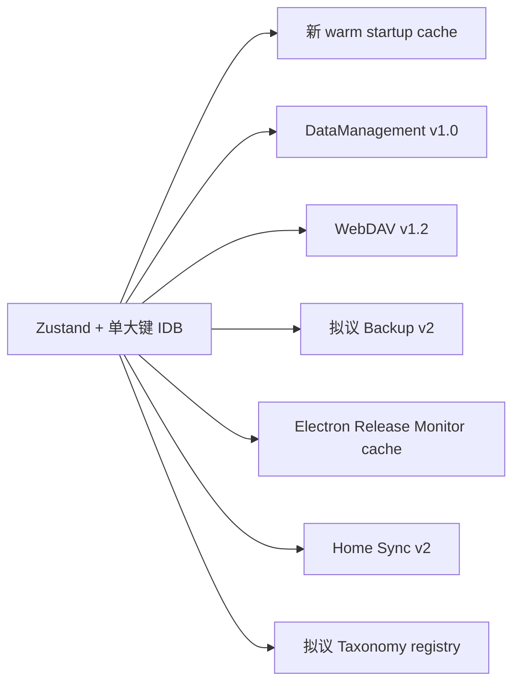
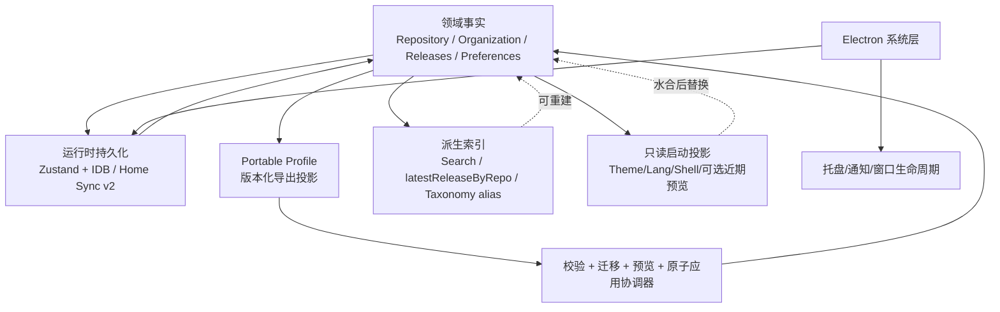

# GSM 优化方向可行性与架构改进综合分析报告

> 分析日期：2026-10-03
> 分析范围：`docs/product` 六份优化方向文档及其对应前端、Electron、Server、Home Sync 实现
> 当前版本：`package.json` = `0.8.4`
> 文档目的：判断现有优化方案的真实性、可行性、风险与实施顺序，并给出比“逐文档照搬实现”更稳妥的统一架构方案。

---

## 1. 执行结论

六份文档的主要问题诊断大多抓住了真实痛点，但不能按六条互相独立的改造线直接实施。当前 GSM 已经同时存在 Zustand 持久化、IndexedDB、Discovery/Workbench 独立存储、Home Sync v2、Electron `userData` 文件、安全存储和后端 SQLite。若再分别引入“启动快照”“新备份模型”“主进程 Release 状态”“独立标签真相源”，会把同一份业务数据复制到更多位置，最终让迁移、恢复、同步和故障排查更困难。

本次代码审查后的总体判断如下。

| 方向 | 原方案可行性 | 结论 | 建议优先级 |
| --- | --- | --- | --- |
| 单一配置文件备份与迁移 | 高，但必须重定义范围 | 应落地为**统一的版本化 Portable Profile/Backup 协议**，不能替代运行时存储，也不能宣称覆盖完整机器工作区 | P0/P1 |
| 个人开发流与冷启动 | 高，但指标缺少基线 | 字体、i18n 前置加载、全量 IDB 水合屏障都是真问题；“第二份完整 warm cache”不建议 | P0/P1 |
| 海量数据虚拟化与功耗 | 很高，当前性能收益最大 | 先修宽订阅、重复扫描和分组计算，再引入虚拟化；同步侧优先收敛到已有 Home Sync v2 | P0/P1 |
| 混合检索与标签降噪 | 检索高，标签自动合并中等 | Hybrid Search 应优先；标签治理要改为**来源感知、可逆 alias、人工确认**，不能自动重写用户标签 | P1/P2 |
| 卡片视觉与微交互 | 中高，适合增量改良 | 多数应复用现有设计 token、Radix Sheet 和 reduced-motion；不应重写 `RepositoryCard` | P2 |
| 桌面原生融合与后台监控 | 生命周期修复高；后台监控中高；强制内存压缩不建议 | 多项桌面设置已经实现；应修复真实生命周期问题，后台 Release 任务需复用已有同步权威；**删除 PowerShell 工作集修剪方案** | P0/P2 |

其中优先级定义为：P0 是低风险正确性/架构止损；P1 是高收益核心改造；P2 是在基础稳定后实施的能力与体验升级。

最重要的统一原则只有一条：**业务事实尽量只有一个权威来源，其余缓存、索引、预览、搜索结果和桌面通知状态都必须是可重建的派生数据。**

---

## 2. 审查方法与证据边界

本次没有只阅读产品文档，而是沿每份文档涉及的真实调用链核对实现，重点检查了：

- Zustand store、`partialize`、迁移和水合：`src/store/useAppStore.ts`、`src/store/persistence/*`、`src/services/indexedDbStorage.ts`。
- 本地文件与 WebDAV 备份恢复：`DataManagementPanel.tsx`、`useBackupActions.ts`、Discovery workspace 备份、AI 配置恢复和组织结构 helper。
- 启动链路：`src/main.tsx`、`src/App.tsx`、`src/i18n/index.ts`、主题与字体入口。
- 仓库大列表：`RepositoryList.tsx`、`RepositoryGroups.tsx`、`RepositoryGrid.tsx`、`RepositoryCard.tsx` 与卡片 hooks。
- 搜索：`useSearchActions.ts`、`repoSearch.ts`、`vectorSearchService.ts`、AI 搜索与重排相关逻辑。
- 桌面：`electron/main.js`、`desktopPrefs.js`、`preload.js`、`electronProxy.ts`、`GeneralPanel.tsx`。
- 同步：legacy `autoSync.ts`、`backendAdapter.ts`、`src/home/*`、`server/src/routes/syncV2.ts`、仓库服务端分页接口。
- Release：`useReleaseTimelineActions.ts`、GitHub API、多源解析、Home projection 与后端 release 持久化。

仓库中已经存在性能埋点，但没有足够的可重复基准数据支持六份文档里的很多绝对数字。例如“FCP < 120ms”“700MB 降到 80MB”“2.5GB/h”“100% 精确率”“标签减少 65%”都没有对应测试夹具或基准结果。因此本报告把这些数字视为**目标假设**，不视为已经验证的收益。

现有 `dist` 快照的 bundle report 显示现代入口约 1.54 MiB、legacy 入口约 1.75 MiB，但当前工作区有大量未提交改动，`dist` 也不能证明来自当前精确源码状态，所以只适合说明“启动包仍有优化空间”，不适合作为优化前正式基线。正式实施前应在干净、可复现构建上建立基线。

并行只读核验还执行了现有启动/Home 数据库与桌面开发地址测试，报告结果分别为 23/23 与 4/4 通过。它们证明当前已经有一些启动懒加载和固定开发 origin 的行为保护，后续改造需要保留这些契约。

---

## 3. 六份文档共同存在的架构风险：事实源继续增加

如果逐份照文档实现，可能形成下面的状态结构：



问题不在于“缓存多”，而在于每一层都可能开始承担写入和恢复职责。一旦两个层都能修改业务实体，就需要解决版本、冲突、回滚、跨账户身份和部分失败问题。

更稳妥的目标架构应收敛为：



这里最关键的区别是：

1. **Portable Profile 是导出投影，不是新的运行时数据库。**
2. **启动快照是只读快速投影，不参与正常业务写入。**
3. **搜索索引、Release 映射、标签 alias 都是派生层，可以重新生成。**
4. **Electron 主进程优先负责系统能力和调度，不再维护另一份独立业务世界。**
5. **配置了 Home backend 时，Home Sync v2 应优先成为跨进程/跨设备同步的收敛路径。**

---

## 4. 单一配置文件备份与迁移：方向正确，但应改名为 Portable Profile

### 4.1 当前问题是真实的

目前至少有两套主要 JSON 备份语义：

- `DataManagementPanel.tsx` 导出 `version: '1.0'`。
- `useBackupActions.ts` 的 WebDAV 路径导出 `version: '1.2'`。

两条路径字段覆盖并不一致。DataManagement v1.0 的字段清单落后于当前 `appPersistenceOptions`，容易遗漏 `subcategories`、`subcategoryOrder`、`repositoryOrder`、`categoryListIdMap`、`themeTokens`、`repositoryCardFields`、`repositoryChatSettings`、active AI 配置等新资产，同时仍带有部分 Discovery 会话/运行时数据。

更明显的是版本信息已经漂移：`package.json` 当前是 `0.8.4`，但 `DataManagementPanel` 和文档拟议的新 `SingleBackupPanel` 示例都硬编码了 `appVersion: '0.4.0'`。这说明继续靠每个导出入口手工维护字段和版本，长期必然再次分叉。

WebDAV v1.2 路径的设计更成熟：它复用了 `incomingOrganizationSnapshot`，并通过 `restoreAIConfigs` 处理脱敏密钥恢复，比本地 v1.0 的分支式多次写入更接近正确方向。

### 4.2 文档中的 V2 不能直接复制

文档提出 Zod schema、版本适配、replace/merge 两种模式，这些思路值得保留，但样例实现有若干实质问题：

- `Repository` 投影不完整，容易遗漏 owner、fork/timestamp 等当前模型仍需要的字段。
- 缺少 `repositoryOrder`，会导致用户手工排序无法完整迁移。
- `activeAIConfigId` 被导出但示例 patch 没有完整恢复。
- `assetFilters.length > 0` 才恢复意味着“用户明确恢复为空集合”无法表达。
- merge 示例使用 `local.custom_description || incoming.custom_description`，会把“用户明确清空为空字符串”误判为缺失。现有持久化迁移已经专门处理过空字符串语义，不能回退。
- `categoryListIdMap` 不能简单按 key 跨账户覆盖，因为 GitHub List ID 有账户上下文。
- “一次 `useAppStore.setState(finalPatch)` 即原子恢复”只保证**内存里一次 React 状态提交**，不能保证 Discovery DB、Workbench DB、Home DB、IndexedDB 持久化和后端同步的持久原子性。

### 4.3 更好的备份分层

建议把“单一配置文件”重新定义为三层产品：

**A. Portable Profile（主推）**

用于设备间迁移个人配置、仓库注释与知识组织，默认不包含机器绑定信息和明文密钥。它应包括：

- 仓库用户资产与必要 GitHub 元数据。
- 分类、子分类、排序、锁定状态与稳定 ID。
- 用户/AI 描述与标签。
- AI 配置的非敏感部分，密钥默认省略或脱敏。
- 主题、语言、卡片字段、搜索/Release 偏好等可迁移偏好。
- Release 订阅与已读状态。
- 可选的 Discovery/Workbench 数据块，但必须通过各自已有导入导出服务接入，而不是直接抓运行时缓存。

**B. Device Profile（默认不随 Portable Profile 导出）**

包括代理地址、RPC、本机路径、AGY executable、Electron desktop prefs、插件本机状态等。它们要么留在本机，要么以明确的“高级设备配置”可选导出。

**C. Full Workspace/Machine Backup**

如果未来真的需要“整机恢复”，应是单独的协调器/归档格式。它要处理 Home DB、Workbench、Discovery、Electron 安全存储、插件数据、backend SQLite 及 encryption key，而不是把所有东西塞进 Zustand JSON。

### 4.4 推荐实现

新增一个共享 backup codec/service，而不是新建一套 UI 内嵌逻辑：

```text
src/services/backup/
  schema.ts          # Canonical schema + Zod
  projection.ts      # buildPortableProfile(state, externalStores)
  adapters.ts        # v1.0 / v1.2 -> canonical
  validate.ts        # schema + semantic invariants + identity checks
  apply.ts           # preview / replace / merge / rollback coordination
```

本地文件和 WebDAV 都调用这组服务。版本号来自 package/build metadata，不再硬编码。导入前先完成全量 parse、schema 校验、账户身份检查、冲突预览与 patch 构建；真正跨多个持久化域时，复用项目已经存在的 repository identity migration 思路：writer gate、pre-image、checkpoint/fingerprint 和失败恢复，而不是把“setState 一次”当作持久原子事务。

### 4.5 结论

这份文档值得实施，但产品命名和架构边界必须修正。**最高价值不是“一个 JSON”，而是“只有一个受版本控制的可移植备份协议”。**

---

## 5. 冷启动与个人开发流：先测量，再缩短首屏关键路径

### 5.1 文档识别的瓶颈大多成立

`src/main.tsx` 在入口静态 import 了 15 组字体包，并且在 `createRoot` 之前等待 `ensureLanguageLoaded(initialLanguage)` 与 fallback language。`src/i18n/index.ts` 的 `ensureLanguageLoaded` 会一次装入该语言的全部 14 个 namespace，因此非 fallback 语言启动时确实可能在 React 挂载前拉取两组 namespace。

`src/App.tsx` 又有 `if (!hasHydrated) return Loading...` 的完整水合屏障。底层 `indexedDbStorage.ts` 每次 get/set/delete 都重新 `indexedDB.open`，同时 Zustand 快照作为一个 JSON 字符串整体读取、`JSON.parse` 和迁移。

这些都是可以优化的真实结构问题。

### 5.2 文档有三处需要降级结论

第一，文档把字体静态 CSS import 直接等同于“15 款字体二进制全部在首屏下载”，这个结论需要浏览器网络 trace 验证。静态导入肯定增加 CSS/module 入口负担，但真正字体文件加载还受 `@font-face` 使用、预加载与浏览器策略影响。

第二，文档认为主视图存在大量没有懒加载的页面组件，但 `App.tsx` 已经对 Release、Fork、Settings、Discovery、Gist 和 AI Workbench 做了 `React.lazy`。真正剩余的优化对象主要是 Repository 主路径内部的重模态/面板，而不是重新做整个 App 路由懒加载。

第三，文档提出 FCP 120/150ms 等绝对目标，但仓库没有可重复 Electron 冷/热启动基准，因此这些只能是性能预算，不是预期必达结果。

### 5.3 不建议复制完整仓库到第二份 warm cache

`authStorage.ts` 已经有同步 localStorage 镜像。文档提出进一步把 Top 15 仓库等数据写入同步缓存，以达到“0ms 真实卡片”。如果这个缓存参与业务状态初始化和后续 merge，它会立刻成为第二套需要迁移和一致性维护的数据库。

更好的方式是只维护一个**非权威 Bootstrap Projection**：

```ts
type BootstrapProjection = {
  schemaVersion: number;
  theme: string;
  themePreset: string;
  language: string;
  lastView: string;
  authPresent: boolean; // 不复制 token
  recentRepoPreview?: Array<{
    id: number;
    fullName: string;
    description?: string | null;
    language?: string | null;
  }>;
};
```

它只负责首屏“看起来已经进入应用”，水合完成后整块被权威状态替换，不承接修改。任何需要完整 Repository、密钥或可写分类语义的操作，在 full hydration 完成前保持受控状态。

### 5.4 建议的冷启动顺序

建议按以下顺序改，而不是先做大规模双缓存：

1. **先建立基准**：扩展现有 `gsm:store-hydration-start`、`gsm:store-hydrated`、`gsm:first-hydrated-frame`，增加 Electron process start、DOM ready、React mount、search-ready 等时间点；分别测 cold/warm + 100/1000/5000 repo。
2. **移除空白水合屏障**：先渲染 shell/bootstrap projection，再异步替换完整数据。
3. **i18n 改为 critical namespace 首载**：首屏只装 `common/app/login/repositories` 等必要资源，其余由 view boundary 预取。还要给 `ensureLanguageLoaded` 增加 in-flight 去重，避免并发重复请求。
4. **复用 IndexedDB 连接**：缓存 DB connection，并正确处理 `versionchange`/close，而不是每次 open/close。
5. **字体按主题/预设加载**：保留稳定 fallback；当前主题所需字体首载，其余动态加载。验证 FOIT/FOUT 后再扩大。
6. **主路径内部 lazy**：只 lazy 确认会显著增加入口的 README、批量分类、AI 整理等重组件。
7. **列表首屏策略与虚拟化统一设计**：不要一边把初始 50 改成 15，一边另一份文档再引入 virtualizer，最终保留两套机制。

### 5.5 `SyncModeChoiceModal` 不应以“性能优化”名义直接删除

它确实是 blocking modal，且重复启动用户通常不需要它。但“默认 `syncModeConfigured=true` 并静默选择 stars”会改变首次使用的同步语义，可能让用户无意识失去 Lists 能力。

更合适的策略是把它当产品决策：个人版可以给出明确默认值，同时把首次选择降级为非阻塞提示或在设置中保证可发现性。它不是启动性能优化的必要条件。

### 5.6 开发流还有一个独立问题

仓库存在两套桌面开发启动习惯：`dev-desktop.mjs` 与另一个固定端口 launcher 的行为并不完全一致，DevTools 和 backend 启动策略也不同。对 GSM 这类 IndexedDB 强依赖应用，dev origin 变化会改变浏览器存储 origin，导致“像丢数据一样”的开发体验。

建议最终合并为一个 launcher，显式支持：

```text
--origin stable|ephemeral
--backend auto|on|off
--devtools on|off
```

日常个人开发默认使用稳定 origin；只有需要并行隔离实例时才使用动态端口。

---

## 6. 海量数据虚拟化与功耗：最值得先做，但先修 O(N×M) 与宽订阅

### 6.1 文档判断“批加载不是虚拟化”完全成立

`RepositoryList.tsx` 的 `visibleCount` 和 `RepositoryGroups.tsx` 的 GroupBatch 都是每次增加 50，然后继续渲染 `slice(0, count)`。一旦滚到底，之前所有卡片仍然挂在 DOM 中。因此它改善的是首批挂载，而不是长期内存和 DOM 上限。

在 3000～5000 repo 场景里，引入真正 windowing/virtualization 是合理的。

### 6.2 但在引入 TanStack Virtual 之前，还有三个更便宜的高收益问题

**问题 A：每张卡片订阅完整 repositories**
`useRepositoryCardActions.ts` 为“找相似”这类显式点击动作订阅整个 `repositories` 数组。仓库任意变化都会扩大更新传播。这里直接在动作发生时 `useAppStore.getState().repositories` 更合理。

**问题 B：每张卡片扫描完整 releases**
`RepositoryCard.tsx` 订阅完整 releases，再按 repo filter + sort 求最新 release。卡片数量与 release 数量都上去后是典型 N×M。应在 releases 变化时一次生成：

```ts
latestReleaseByRepoId: Map<number, Release>
```

卡片只按自己的 repo id 取值。

**问题 C：分组计算重复遍历**
`RepositoryGroups` 有 section×repositories 的过滤和顺序查找。应先一次性把仓库 partition 到 Map，再基于 `repositoryOrder` 建 id->rank index，避免反复 `filter/find`。

这些修复风险低，而且会让后续 virtualizer 的真实收益更容易测量。

### 6.3 虚拟化的真实接入成本比文档写的高

当前分组列表依赖真实 DOM heading ref、`getBoundingClientRect()`、拖拽目标和卡片本地 modal/menu 状态。offscreen row 被虚拟化卸载后，这些假设都会变化。

因此推荐先把数据模型扁平化：

```ts
type RepositoryVirtualRow =
  | { type: 'group-header'; groupId: string }
  | { type: 'cards'; groupId?: string; repoIds: number[] };
```

并完成以下基础改造：

- 目录跳转从 DOM heading ref 改为 `groupId -> virtualIndex -> scrollToIndex`。
- 卡片详情、编辑、README、Release Sheet 的打开对象尽量提升为 ID 驱动的 overlay state，避免卡片一离开 overscan 区就关闭。
- 拖拽使用 overlay，并设计 offscreen autoscroll/drop 行为。
- dynamic measurement 处理卡片高度变化。
- resize 后列数变化时保留 scroll anchor。
- 小数据量不必强制 virtualizer，可设置 300～500 条阈值，减少复杂度。

建议先做 list mode，再做 grid/group mode，因为 list 的一维高度与滚动模型简单得多。

### 6.4 与视觉动效文档存在直接冲突

视觉文档建议折叠分组使用 CSS Grid `0fr -> 1fr`，本质是为了动画而保留子 DOM。对于小分组很好，但对于几百/几千卡片会抵消虚拟化的主要收益。

建议采用阈值策略：

- 小分组：允许短暂保留 DOM 做展开/收起动画。
- 大分组：立即卸载内容，header 只做 opacity/chevron 动效。
- virtualized group：由 virtual row model 决定可见性，不能长期保留整组 DOM。

### 6.5 功耗问题应优先收敛同步协议，而不是继续装补丁

legacy `autoSync.ts` 确实存在固定 5 秒轮询和多个完整数据 shard 拉取，但这条路径在 `getDesktopHomeSync()` 激活后会直接 no-op。因此文档把 5 秒轮询描述为所有桌面场景的固定功耗来源并不准确。

更重要的是，项目已经有更好的 Home Sync v2：

- `src/home/sync.ts` 有 visibility-aware 轮询、local change debounce、online/visibility wake。
- 使用 cursor-based changes 和 paged snapshot。
- 支持 operation push 和 backoff。
- `server/src/routes/syncV2.ts` 已明确声明 v2 是 canonical sync，并保护 workspace-bound identity。

所以优先策略应是：**能迁到 Sync v2 的调用方继续收敛过去，而不是给 legacy 的 7 个全量接口分别增加 ETag。**

如果 legacy 必须长期保留，再借用 v2 的原则：visibility、指数退避、随机抖动，以及最好增加单调 revision/change feed。文档提出的 `COUNT + MAX(timestamp)` ETag 不够稳，因为某些数据变化可能不更新被选中的 timestamp，存在漏变更风险。

此外，服务端仓库接口本身支持 `page/limit`，但 `backendAdapter.fetchRepositories()` 直接请求 `?limit=10000`，说明“服务端有分页”目前并没有转化为客户端的内存收益。后续如果 normalized entity store 和 v2 sync 已经解决常驻状态规模，再决定 UI 是否需要真正的 server pagination，不要把分页、虚拟化、同步协议同时改成三套新机制。

---

## 7. 混合检索与标签降噪：搜索要先修正确性，标签要先修数据模型

### 7.1 向量 TopK 硬过滤是真正的搜索正确性缺陷

当前 `useSearchActions.ts` 在向量结果非空时建立 vector score map，然后把 repositories 过滤成向量返回的 ID 集合。也就是说：

- 未建立向量的新同步仓库可能完全消失。
- 名称完全匹配但向量得分不足的仓库可能消失。
- 缩写、专有名词和短 query 的 embedding 漂移会比普通自然语言更明显。

只有 vector 为空/失败时才回退关键词，这不是 hybrid search。

因此文档提出词法 + 向量并行召回、再融合的核心方向是正确的。

### 7.2 不能只把当前搜索器替换成一个简单 RRF 函数

现有搜索路径不仅有纯向量，还包含 query expansion、可选 HyDE、LLM selection/rerank 等语义能力。文档示例若全部拿掉，长自然语言检索可能反而退化。

更好的搜索调度器是“按 query intent 控制昂贵步骤”：

```text
标识符/短词查询
  -> 立即 local lexical
  -> 向量并行（若就绪）
  -> exact/prefix tier + RRF

自然语言查询
  -> local lexical 立即给第一版结果
  -> semantic branch: expansion/HyDE -> vector
  -> union + fusion
  -> 仅对 Top-K 可选 rerank
```

精确字段应有确定性优先级：

1. exact `full_name`
2. exact `name`
3. name/full_name prefix
4. tags/topics/language exact token
5. lexical weighted score
6. vector fused rank

不能宣称“官方仓库必然 #1”，因为多个 owner 可以拥有同名 repo，系统也没有可靠“官方 owner”事实源。能保证的是：用户输入 `owner/repo` 时 exact full_name 必须稳定置顶；仅输入 `express` 这类名称时允许多个 exact-name 候选按次级信号排序。

### 7.3 搜索状态本身也要升级

当前 SearchBar 会在 repos/filter 变化时重新执行基本过滤，而 vector path 又靠临时 score map/ref 保存排序。引入 hybrid 后，如果仍沿用这套旁路，很容易在同步、筛选或分类切换后丢掉融合排序。

建议新增一等的 search session：

```ts
type SearchSession = {
  query: string;
  mode: 'lexical' | 'semantic' | 'hybrid';
  candidateIds: number[];
  rankById: Record<number, number>;
  scoreById?: Record<number, number>;
  sourcesById?: Record<number, Array<'exact' | 'lexical' | 'vector' | 'rerank'>>;
};
```

筛选逻辑消费这个 session，而不是自己重新构造另一套搜索结果。

### 7.4 标签治理文档最大风险：`custom_tags` 不是纯 AI 噪声

当前代码里 `custom_tags` 可能来自用户手工编辑，也可能承载 GitHub Lists 名称，并参与 category matching。文档样例把 `ai_tags` 和 `custom_tags` 一起做自动同义词改写，会修改用户明确输入的数据，甚至改变分类结果。

文档内置 alias 也存在语义过强的问题，例如：

- `container -> Docker`
- `diffusion -> Stable Diffusion`
- `sd -> Stable Diffusion`
- `agent -> AI Agent`

这些映射在特定 repo 上并不总成立。前缀和 Levenshtein 相似也只能证明字符串像，不能证明概念同义。

### 7.5 推荐的 Taxonomy 模型

自动行为只做无损标准化：NFKC、trim、分隔符/大小写显示规范。真正同义词通过 alias 层表达，不直接改写原始数据：

```ts
type TagSource = 'ai' | 'user' | 'github-list' | 'github-topic';

type TagAlias = {
  alias: string;
  canonicalId: string;
  sourceScope?: TagSource[];
  confidence: number;
  approvedByUser: boolean;
};
```

推荐规则：

- AI tag 可以在模型输出后自动应用**已批准 alias**。
- 用户 tag、GitHub List tag 默认不做破坏性改写。
- fuzzy/Levenshtein 只生成 suggestion，不自动 merge。
- 治理中心展示“合并后会影响哪些 repo/分类/向量索引”，支持 preview 与撤销。
- O(T²) 聚类放 Web Worker，不能在 modal render/useMemo 里同步跑。
- canonical vocabulary 由高频标签 + 用户批准词表组成，但 Prompt 不应强制“至少两个必须来自 Top Tags”，否则热门标签会不断吞噬真正的新领域。
- 大批标签确认变更后，把向量 reindex 明确显示为独立的后续任务及成本，而不是宣称索引自动已经更新。

Hybrid Search 应先于 Taxonomy 改造，因为前者是当前搜索正确性问题，后者是知识库治理能力。

---

## 8. 卡片视觉、微交互与动效：适合增量打磨，不适合另起设计体系

### 8.1 文档里值得直接采用的部分

- `RepositoryGrid.tsx` 当前 width 初始为 0，再由 `ResizeObserver` 计算列数，首帧自然从 1 列开始。CSS Grid `repeat(auto-fit/auto-fill, minmax(...))` 可以消除这类 JS 测量闪变。
- 部分 grid/list 的文本尺寸和 footer 细节不统一，值得整理。
- `RepositoryLanguageStars.tsx` 使用固定颜色点，可以增加与背景的对比 ring，并保证文字仍是信息主载体。
- Details drawer 动效方向合理。

### 8.2 但项目已经有一套设计 token 与无障碍动效基础

`src/index.css` 已经定义：

- `--ui-shadow-card`
- `--ui-shadow-float`
- radius token
- `.ui-card`
- 用户级 animation reduced 模式
- `@media (prefers-reduced-motion: reduce)`

所以文档不应再引入平行的 card shadow/radius/motion token 体系。应扩充现有 token，而不是重新命名一套。

同样，`src/components/ui/sheet.tsx` 已经基于 Radix Dialog 实现 focus trap、overlay、close、slide-in/out。Repository details 若要改成抽屉，应复用/扩展 Sheet，而不是自己造 raw fixed drawer。

### 8.3 不建议重写 RepositoryCard

当前 `RepositoryCard.tsx` 很大，但它已经承载键盘操作、selection、drag、插件 action、README/Release 等 lazy overlay、菜单状态和多种 view mode。文档里的 ModernRepositoryCard 示例只覆盖视觉层，直接替换会丢大量行为契约。

更合理的是拆分内部 presentation component，同时保留现有 controller/interaction semantics。

### 8.4 动效必须服从大列表架构

以下做法不建议全局使用：

- 给几千卡片常驻 `will-change: transform`，会增加合成 layer 和显存压力。
- draggable 卡片大幅 translate hover，会影响拖拽触感；最多在 fine pointer 上轻微 1px 位移，或者只用 border/shadow。
- 对大量 skeleton 同时 shimmer，会制造不必要 GPU 活动；只给视口内虚拟行使用，并尊重 reduced motion。
- 为动画永久保留折叠组 DOM，会与 virtualization 冲突。

视觉优化应放在列表状态订阅和虚拟化基础完成之后，否则很容易用更多 GPU 动效掩盖底层 DOM 过量问题。

---

## 9. 桌面原生融合与后台监控：文档部分已过时，部分问题非常真实

### 9.1 文档“需要实现”的一部分已经存在

当前代码已经实现：

- 跨平台开机自启。
- OS 应用失败时的 auto-launch rollback。
- `--hidden` 启动。
- close to tray / minimize to tray。
- desktop prefs 持久化。
- Tray 创建与菜单。
- GeneralPanel 中三项桌面设置。
- preload/renderer bridge。

因此文档第 4 章若按样例再实现一遍，会制造重复路径。应以现有 `desktopPrefs.js` 和 `useDesktopActions` 为基线扩展。

### 9.2 真实存在且值得优先修的生命周期问题

**macOS Dock 激活隐藏窗口**
`app.on('activate')` 目前只有在 `BrowserWindow.getAllWindows().length === 0` 时 createWindow。close-to-tray 后窗口仍存在但 hidden，点击 Dock 可能没有恢复。这里应统一走 `restoreMainWindow()`。

**Windows/Linux tray click 三态问题**
当前只要 `isVisible()` 就 hide。窗口虽然 visible 但在其他窗口后面时，第一次点击托盘会把它隐藏。正确状态应是：hidden/minimized -> restore；visible but unfocused -> focus；visible and focused -> hide（macOS 则按菜单栏习惯单独设计）。

**Tray menu 状态**
当前文本固定“显示主窗口”，且没有 `minimizeToTray` 开关，可以基于窗口状态动态显示“显示/隐藏”，并补齐现有 prefs。

**second-instance 参数**
现在只 restore，没有读取 commandLine/additionalData。它不是当前重大 bug，但在未来加入 `gsm://` deep link 或 notification click routing 时必须修。

**Windows native notification AUMID**
当前没有显式 `app.setAppUserModelId`。`electron-builder.yml` 已有稳定的 `appId: com.github-stars-manager.app`，可以直接作为 AUMID 来源，在真正引入 Notification 之前补上并在打包环境验证 Action Center 行为。

**打包图标配置还有一处独立错误**
`electron-builder.yml` 的 Windows/macOS/Linux/DMG `icon` 都指向 `dist/vite.svg`，但当前 `dist/vite.svg` 实际不存在；仓库里已经有 `build/icon.ico`、`build/icon.png` 和 `build/gsm-star.ico`。这会直接影响原生安装包、通知和系统 UI 的一致性，应与 AUMID 一起作为桌面 P0/P1 修复，而不是等 Release monitor 完成后再处理。

**Windows session end**
文档指出 close-to-tray 可能干扰关机的风险值得处理，但样例建议监听 `app.on('session-end')` 不符合当前 Electron 类型。当前 Electron 的 `query-session-end` / `session-end` 是 BrowserWindow 事件，应按实际 API 在 window 层置位 quitting/允许关闭，并写平台测试。

另外，`desktopPrefs.js` 当前是直接 `writeFileSync`，如果后续把 desktop prefs 扩大，应改为 tmp + rename 的原子写入，而不是文档中直接声称已有“原子持久化”。

### 9.3 Release monitor 不应复制第二套 Release 业务逻辑

文档提出在 Electron main 里维护订阅仓库、latest tag、ETag 与 release cursor，然后弹系统通知。这在离线桌面模式可行，但当前项目已经有：

- `resolveReleaseSources()` 统一解析 starred subscription、Watch/custom sources。
- renderer 的 foreground refresh 已有受控并发、分页、prerelease 语义、add/upsert。
- Home projection 已同步 `releases` 和 `releaseSubscriptions`。
- server 已有 release UPSERT。
- ReleaseTimeline 已有 task target/定位入口。

如果 main process 只存“发现了 tag X”，而不把完整 Release 通过现有领域路径写入，用户点击通知后很可能跳到一个 timeline 里还不存在的 release。

文档给出的 monitor 样例还存在几个实现级缺口：

- 样例只请求 `releases?per_page=1`，但当前 `githubApi.getMultipleRepositoryReleases()` 在 `includePreRelease=false` 时会继续翻页，直到找到最新 stable release。直接改成 `per_page=1` 会让后台语义比现有前台刷新更弱。
- 仅比较 `tag_name` 是否变化无法可靠表达“出现了哪些新 release”，两次轮询之间产生多个 release 时可能丢事件；更稳妥的是使用 release id/published time + 已知水位线。
- 文档定义了 class、IPC contract 和 preload 片段，但没有完整展示 monitor 实例化、`ipcMain.handle('desktop:releaseMonitor:*')` 注册、renderer 订阅同步和 renderer ready 前导航队列，不能视为端到端可直接落地代码。
- GSM 已支持多账户 workspace。monitor cache、subscription 和 credential 必须按 GitHub identity/workspace 隔离，并在 logout/account switch 时显式清空。文档样例的全局 repo-name cache 与“token 只有 truthy 时才覆盖”会留下旧账户 token/订阅的风险。
- 文档样例用 `repoFullName` 调 `toggleReleaseExpandedRepository`，但当前 store API 要求 numeric `repoId`。已有 `ReleaseTimeline` 的 `useTaskTarget('releases', releaseId)` 更适合作为通知点击后的统一定位入口。

推荐分部署模式：

**有 Home backend**
后台服务承担定时 Release 检查和 release 持久化，因为它才是天然常驻、已有 credential 和同步数据库的一方。Electron main 只消费“有新 release”的事件，负责 OS Notification 和点击后窗口导航。

**纯离线 Electron**
主进程可以有轻量 scheduler，但应该调用抽离出来的共享 release domain service，结果写回统一存储/renderer ingest 通道，不能维护独立 latest-tag 事实源。

令牌处理也不应简单通过 `syncSubscriptions({repos, token})` 长期塞在 main 内存里。项目已经有 Electron `safeStorage` 的 X/auth 等先例；若纯桌面 monitor 必须持有 GitHub credential，应设计专门 credential vault，或者让 backend 持有它。

### 9.4 ETag 值得用，但不能夸大

针对订阅源的 conditional request 可以减少响应体和部分限流压力，但不应把“304 一定完全零配额”作为架构前提。真正决定功耗的是：

- 只轮询用户明确订阅的 source。
- 使用足够低频的 schedule，例如 30～60 分钟级，而不是分钟级全扫。
- 有 Home backend 时服务端集中调度。
- 根据 rate-limit header 做 backoff。
- 对大量 repo 研究批量/GraphQL/集中变更源，而不是单纯让 1000 个 GET 都带 ETag。

### 9.5 强制 PowerShell 工作集修剪应从方案中删除

文档“隐藏 15 秒后将 200MB 工作集压到 30MB”这一类方案不建议实施，原因包括：

- Electron 有 main/renderer/GPU/utility 多进程，只针对当前 PID 并不代表整体内存。
- OS working-set trim 不是释放 JS heap，而是把页面踢出 working set，恢复时会产生 page fault 和明显抖动。
- 启动 PowerShell 子进程容易受到策略、路径、杀软和企业环境影响。
- 内存数字没有实测依据。

正确的后台内存治理优先级应是：虚拟化 DOM、限制缓存、避免重复全量快照、停止真正无意义的网络和 timer，并用 Electron process metrics 分别测 main/renderer/GPU。剩余的内存管理交给 Chromium 和 OS。

实际测量可以直接从 `app.getAppMetrics()`/renderer 性能指标开始，先证明是哪一个进程、哪一类缓存持续占用，再决定是否在 hide 时清理特定可重建缓存。

---

## 10. 跨文档冲突清单

### 10.1 “折叠动画保留 DOM” vs “虚拟化卸载 DOM”

二者不能无条件同时成立。按 group size 和虚拟化模式决定动画策略。

### 10.2 “Top 15 仓库 warm cache” vs “单一事实源”

只允许只读 bootstrap projection，不允许它成为第二个可写 store。

### 10.3 “主进程 Release Monitor” vs “Home Sync/Server Release 状态”

后台 monitor 必须成为已有 release domain 的生产者，而不是另一套独立 release cache。

### 10.4 “标签自动合并” vs “custom_tags 是用户/List 数据”

未经来源建模和用户确认，不能批量重写 custom_tags。

### 10.5 “继续优化 legacy autoSync” vs “Home Sync v2 已经存在”

应先决定 legacy 的生命周期。若计划淘汰，就不值得投入完整 ETag/FSM 重构；只做必要止损，然后迁移调用方。

### 10.6 “单文件完整备份” vs “多个独立持久化域”

一份 portable profile 可以统一用户可迁移语义，但完整 workspace 备份需要多域协调器，不能把问题伪装成一次 Zustand `setState`。

---

## 11. 推荐统一目标架构

### 11.1 Domain State

保留清晰的领域对象和稳定身份：Repository、Organization、Release、Preferences、AI/Embedding 配置、Discovery/Workbench workspace。

中期可以考虑把巨大 repositories 数组进一步 normalized 为 entity map + ordered ids，但不要仅为了“架构漂亮”立刻全量改写。首先用 selector/index 解决已知热点；当 search/virtualization 共同需要高频 ID lookup 时再推进 normalized store。

建议的派生结构：

```ts
repositoriesById: Map<number, Repository>
repositoryIds: number[]
latestReleaseByRepoId: Map<number, Release>
groupRepoIds: Map<string, number[]>
searchSession: SearchSession | null
taxonomyAliases: TagAlias[]
```

其中后四项都可以根据领域事实重建，不应成为备份中不可替代的核心真相。

### 11.2 Runtime Persistence

短期继续 Zustand + IDB，但：

- 缓存 IDB connection。
- 监控 snapshot bytes/stringify/parse/hydration duration。
- 把非常大的独立域继续留在专属数据库，不重新塞回主 Zustand snapshot。
- 长期如果主 snapshot 仍达到多 MB 并持续产生 long task，再按域拆 object store，而不是靠更多 localStorage mirror。

### 11.3 Sync

Home Sync v2 是目前仓库里最完整的同步基础：账户绑定、changes、snapshot、operation、冲突和 backoff。桌面/Home 场景应继续朝 v2 收敛。

legacy backend sync 只保留明确的兼容窗口和最小止损，不继续发展成第二套先进协议。

### 11.4 Portable Backup

从当前 persistence/domain normalizer 派生明确的 portable projection，并通过同一个 codec 服务本地文件、WebDAV 与未来 archive coordinator。

### 11.5 Derived Services

搜索、taxonomy、release index、bootstrap preview 都是派生服务，要求：可重建、有 schema/version、失败不污染领域事实。

---

## 12. 推荐实施路线

### Phase 0：测量 + 正确性止损

这一阶段不依赖大型新库，适合立即执行。

1. 建立可重复的 cold/warm Electron 启动基准和 100/1000/5000 repo fixture。
2. 修复导出 `appVersion: 0.4.0` 硬编码。
3. 定义统一 backup codec/projection 的字段清单与身份边界，停止新增第三套手工导出结构。
4. 去掉每卡完整 repositories 订阅，建立 `latestReleaseByRepoId`。
5. RepositoryGroups 一次 partition + order index。
6. 修 macOS activate hidden window、tray visible-unfocused、动态 tray menu。
7. 给 Hybrid Search 建固定 query corpus，覆盖 exact full_name、同名不同 owner、缩写、自然语言、未向量化 repo、vector outage。

**预期收益**：先降低无意义 rerender/O(N×M)，消除明确桌面 bug，并为后面所有性能声称建立证据。

### Phase 1：高收益核心架构

1. Hybrid lexical + vector union，加入 exact/prefix tier 和 search session。
2. i18n critical namespace 首载 + in-flight 去重。
3. IDB connection reuse。
4. 非权威 bootstrap projection，移除全屏 hydration blank barrier。
5. 默认主题字体与其他字体拆分按需加载。
6. list mode virtualization；稳定后扩展到 grid/group flattened virtual rows。
7. 明确 legacy sync 退役计划；可迁移调用方收敛 Home Sync v2。
8. Portable Profile vNext 正式上线，本地/WEBdav 共用同一 codec。

### Phase 2：知识治理与桌面深度能力

1. 标签 provenance + canonical registry + alias persistence。
2. Web Worker taxonomy suggestion + preview/undo。
3. UI card/detail 增量视觉整理，复用现有 Sheet/token/reduced-motion。
4. 桌面原生 Notification + AUMID + deep link/navigation contract。
5. Release 后台监控：Home backend 优先；纯离线桌面采用共享 release domain service。
6. Electron session-end、second-instance 参数与通知点击的端到端平台测试。

### Phase 3：只有数据证明需要时再做

1. 主 Zustand snapshot 按领域拆成多 object store。
2. repositories entity normalization 的全面 store 重构。
3. 更激进的启动 repo preview 缓存。
4. 服务端搜索/分页接管部分 UI 状态。

这些都不应在没有明确性能证据时提前实施，因为它们提高长期维护复杂度。

---

## 13. 验收指标建议

### 13.1 启动

至少记录：

- process start -> DOM ready
- DOM ready -> React mount
- store hydration duration
- first shell paint
- first hydrated frame
- first searchable/interactable time
- IDB payload bytes / JSON parse time

分 cold/warm，100/1000/5000 repo，重复至少多轮取 median 与 p95。

### 13.2 大列表

记录：

- DOM node 数量峰值
- React commit p95
- scroll frame p95 / long task
- renderer JS heap
- renderer working set/private memory
- 从顶部滚到底再返回顶部后的内存回落
- grid resize / group collapse / DnD / modal open 的滚动锚点与状态正确性

虚拟化验收目标不应只写“FPS 60”，而应保证 DOM 数量与总 repo 数量近似解耦。

### 13.3 搜索

建立固定人工 query set，至少分：

- `owner/repo` exact
- bare repo name
- acronym / framework name
- 中文功能描述
- 多词 AND 条件
- 新同步未向量化 repo
- vector service unavailable
- 相同 name 不同 owner

用 Recall@20、MRR/NDCG 等指标比较 lexical、vector、hybrid，不再用单个 demo query 声称“100% 精确率”。

### 13.4 备份

自动化覆盖：

- v1.0/v1.2 migration fixture
- 当前版本 round trip
- 空数组/空字符串语义
- masked secret 不冲刷本地真密钥
- 跨账户 category/List identity
- malformed JSON/schema
- external store 中途失败后的 rollback
- backup size cap

### 13.5 桌面

Windows/macOS/Linux 至少验证：

- close/minimize/tray click 三态
- macOS Dock activate
- second instance
- auto-launch rollback
- system logout/shutdown
- Notification 到 Action Center
- 通知点击 -> restore -> navigate -> release 已存在于领域状态

---

## 14. 明确不建议实施的方案

以下内容建议从后续执行计划中删除或改写：

1. **把 Portable Backup 当成新的运行时存储格式。**
2. **复制完整 repositories/token 到第二份 localStorage warm store。**
3. **直接复制文档中的 V2 merge 代码。** 当前存在字段缺失、空值语义和身份边界问题。
4. **对 `custom_tags` 做无人确认的 fuzzy 自动合并。**
5. **把 Levenshtein/前缀相似当成同义关系。** 只能用于 suggestion。
6. **为每张卡片长期 `will-change`，或为了折叠动画永久保留大组 DOM。**
7. **整块替换 `RepositoryCard` 为文档示例卡片。** 会丢失现有行为契约。
8. **在已有 Home Sync v2 的情况下，把 legacy full-shard polling 再发展成另一套完整同步协议。**
9. **Electron main 建一套不写回领域状态的独立 Release truth/cache。**
10. **通过 PowerShell/working-set API 强制压 Electron 内存。**
11. **在没有真实 benchmark 前把文档中的 FCP、内存、流量、搜索精度百分比写成承诺。**

---

## 15. 最终建议排序

如果目标是在较短时间内得到最明显且风险最低的提升，推荐实际执行顺序为：

1. **性能测量与卡片状态隔离**：去宽订阅、release index、group partition，并建立启动/列表基准。
2. **统一备份协议**：先解决当前 v1.0/v1.2 分叉和字段漂移，避免继续积累不可迁移资产。
3. **Hybrid Search 正确性**：解决向量 TopK 硬过滤，再做高级 rerank。
4. **启动关键路径**：i18n、IDB connection、bootstrap shell、字体按需。
5. **真正 virtualization**：在卡片状态、group navigation 和 overlay 模型准备好后接入。
6. **桌面生命周期 bug**：这部分改动小、用户可感知强，可与前几项并行推进。
7. **同步协议收敛**：优先 Home Sync v2，确定 legacy 的退出边界。
8. **Taxonomy 治理**：先 provenance/alias，再做 AI prompt 约束和治理 UI。
9. **视觉与动效**：在性能架构稳定后做增量打磨。
10. **后台 Release 通知**：明确 Home/离线两种部署模型后实现，避免重复状态源。

这套顺序与六份原文档最大的区别是：先解决**数据与状态所有权、正确性和可测量性**，再投入视觉、后台常驻和更复杂的自动治理。这样能够让后续每一项优化建立在稳定的事实源上，也能避免今天解决的性能问题在新的备份、搜索或桌面模块里再次出现。

---

## 16. 逐文档最终判定

### `GSM_单一配置文件备份与迁移分析.md`

**判定：值得做，方案需重构。** 采用 versioned Portable Profile + shared codec + identity scope；不要承诺单 JSON 覆盖完整机器状态。

### `GSM_个人开发流与冷启动效率全方位深度分析.md`

**判定：核心诊断正确，数字和部分现状已经过时。** 先测量，使用轻量只读 bootstrap projection；不要复制完整业务状态到第二份缓存。

### `GSM_海量数据虚拟化与功耗控制分析.md`

**判定：最高优先级之一。** 真虚拟化很有价值，但先消除卡片宽订阅、releases N×M 与 group 重复扫描；同步优先收敛已有 v2。

### `GSM_混合检索与标签分类降噪全方位分析.md`

**判定：Hybrid Search 应尽快做；自动 taxonomy merge 需要重新设计。** 用 deterministic exact tier + lexical/vector union + fusion；标签采用 provenance + alias + confirm/undo。

### `GSM_卡片视觉体系、微交互与动效质感全方位打磨分析.md`

**判定：适合作为增量 UI backlog，不适合作为组件重写方案。** 复用现有 token、Sheet、reduced-motion，并服从 virtualized list 的 DOM 生命周期。

### `GSM_桌面原生融合与后台监控全方位分析.md`

**判定：需要拆开处理。** 已实现能力不要重做；真实生命周期 bug 先修；Release monitor 与 Home/Release domain 合流后再做；PowerShell 工作集修剪删除。
