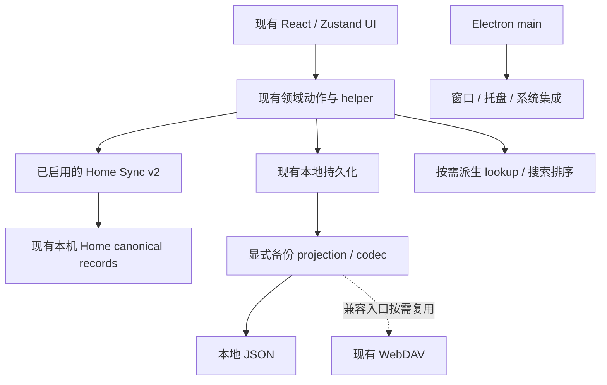

# GSM 本机 Windows 自用优化总指导

> **阶段 4～8 代码更新（2026-10-03）**：阶段 4B～8 已按本机范围实施并验证；阶段 3 未扩展。备份安全范围、搜索 session、启动单点收益、grid 和 Windows 验收边界以交付报告为准。下文原文档校准/候选描述保留历史语境。 详见 [连续开发交付报告](GSM_阶段4至8连续开发交付报告.md)。

> 文档状态：**本机自用开发总纲**
> 修订日期：2026-10-03（Asia/Shanghai）
> 应用 package 版本：`0.8.4`；个人交付记录：`P0.2.1`，两者不是同一个版本号
> 权威关系：本文定义六个专项的范围、优先级和验收边界；专项提供当前代码证据与按需细节。
> 本轮交付：只校准这七份文档，未实现本文中的待办功能。

---

## 0. 用户已经确认的范围

| 决策项 | 本轮确认 | 对后续开发的影响 |
| --- | --- | --- |
| 使用平台 | 仅当前本机 Windows | Windows 是开发与实机验收目标；保留既有 macOS/Linux 分支，但不新增适配或要求全平台验收 |
| Home | 保留现有本机 Home backend / Home Sync v2 | 不规划远程部署、多设备、新同步传输；不停止服务、不改变其已有 owner |
| 备份 | 本地 JSON 优先，保留 WebDAV 兼容 | 不规划全域/整机归档、Device Profile 或跨账户克隆；共享必要格式逻辑即可 |
| 当前体验 | 多页面突然展示大量内容时卡顿；包括滚动、分类/分组、展开折叠及发现页大量仓库 | 首要排查整批派生与挂载，不能只处理主仓库列表，也不能因历史小规模验收忽略现状 |
| 标签治理 | 不列为确定开发目标 | 保护原标签；来源模型、alias registry、Worker、批量治理只记录边界 |
| Release 后台通知 | 不列为确定开发目标 | 保留现有前台 Release；不新增 scheduler、watermark、通知队列或主进程业务缓存 |
| 启动投影 | 不列为确定开发目标 | 不新增 Bootstrap Projection；先测现有启动与渲染路径 |

涉及功能范围、数据覆盖、交互取舍的后续决策，应提出具体选项请用户决定。代码事实、已有兼容逻辑和数据安全约束不能因本机自用而省略。

### 0.1 如何使用专项文档

| 专项 | 当前主线 | 按需内容 |
| --- | --- | --- |
| [备份迁移](GSM_单一配置文件备份与迁移分析.md) | 本地导出版本/字段完整性、兼容、安全恢复边界 | 跨库恢复只在实际选中的数据需要时设计 |
| [冷启动](GSM_个人开发流与冷启动效率全方位深度分析.md) | 保持生产 file-origin 入口，定位真实阻塞 | i18n/IDB/font/chunk 优化须有启动证据 |
| [列表与功耗](GSM_海量数据虚拟化与功耗控制分析.md) | 当前卡顿复现、宽订阅/重复扫描治理 | 残余瓶颈需要时才接虚拟化，先验证常用视图 |
| [搜索与标签](GSM_混合检索与标签分类降噪全方位分析.md) | exact/lexical 不能被向量硬过滤，维持查询排序 | 标签治理不排期，保留已有语义能力 |
| [卡片视觉](GSM_卡片视觉体系、微交互与动效质感全方位打磨分析.md) | 在现有 token/Radix 上做可独立验证的小改动 | 不以虚拟化或完整设计系统重构为前置条件 |
| [桌面后台](GSM_桌面原生融合与后台监控全方位分析.md) | 现有 Windows 托盘/退出路径的实际问题 | 安装包、系统通知、其它平台不作为日常使用前置 |

优先级按问题证据确定：数据丢失/错误写入先处理；当前卡顿先复现；代码确认的算法/正确性问题随后分小步处理。可选功能不因在文档里出现就自动进入开发计划。

---

## 1. 当前问题、根因与停止条件

当前有两类问题，不能混为一谈：

1. **文档范围过大**：原路线把全域恢复协调器、机器可读 Registry、全平台生命周期、虚拟行编译器、标签 Worker、后台通知等组合成固定阶段。这些方案有适用条件，但本机自用没有自动需要它们。
2. **已有代码仍有确定的改进点**：卡片宽订阅、逐卡 Release 扫描、分组重复查找、搜索向量硬过滤和本地导出字段漂移都能在源码中定位。它们是否解释当前卡顿，仍需 trace，不能仅凭代码形态下结论。

本轮目标是缩小文档的强制范围，保留数据与账户安全，并使后续每次开发只解决一个可复现问题。

后续性能工作的停止条件：当前常用操作在相同机器、数据 fixture、视图与窗口尺寸下达到双方确认的可用程度，且回归通过。达到目标就停止增加基础设施，不自动继续 Worker、实体化 store、分 object store 或全视图虚拟化。

历史验收的 62 仓库不是当前规模证明，也不是“不会卡顿”的证据。用户已确认触发场景集中在突然展示大量内容，发现页也明显受影响；当前数量、最小复现步骤、后台任务和瓶颈位置仍须在下一次性能任务中确认。1000/5000 仓库可作为压力夹具，不是本机交付的固定规模承诺。

---

## 2. 当前代码基线：必须承认已经存在的能力

后续设计必须从真实代码出发，而不是从六份文档最初撰写时的假设出发。

### 2.0 个人版实际交付

- [个人版记录](../personal/README.md)与[P0.2.1 启动维护记录](../personal/upgrades/P0.2.1-desktop-startup.md)已记录日常快捷方式走 `start-desktop.vbs -> start-home-desktop.cjs -> electron/main.js -> dist/index.html`。
- [生产启动器](../../scripts/start-home-desktop.cjs)剔除 dev URL，以 production 模式启动已有构建；不启动 Vite，也不管理已有 Windows 后端服务。
- `http://127.0.0.1:5174` 是保留的独立开发来源；生产 file-origin 和开发 HTTP origin 的存储不可混用。本轮不改 URL、userData、服务或快捷方式。
- 个人版语言入口已限中英，历史语言资源与 API 兼容仍保留，见 [languages.ts](../../src/i18n/languages.ts)。不继续做通用多语言扩展。
- P0.2.1 的耗时是历史单次样本，不是本轮 benchmark；当前卡顿以新的用户复现为准。

### 2.1 状态与持久化

- 主应用仍以 Zustand 为运行时 UI/领域状态入口。
- `appPersistenceOptions` 当前 persistence version 为 `17`，主快照写入 IndexedDB，失败时回退 localStorage。
- 主持久化已经有 stringify/write 耗时日志，以及 `gsm:store-hydration-start`、`gsm:store-hydrated`、`gsm:first-hydrated-frame` 等性能 mark。
- Discovery、Workbench/Home 等大域已经部分脱离主 Zustand 单大键，存在各自的存储边界。
- `HomeDatabase` 已经实现**缓存 IDB connection、Zod backup schema、账户/工作区校验、20MB 上限、单事务导入和 secret stripping**，这是后续 Portable Profile 和主 IndexedDB 改造的重要参考实现。

### 2.2 Home Sync v2

Home Sync v2 已经具备：

- workspace + GitHub account identity。
- cursor changes / paged snapshot。
- operation outbox、版本冲突和 pending replay。
- visibility-aware 调度、online wake、backoff。
- server 端 canonical guard，阻止已绑定 workspace 继续走 legacy 写入。

`src/home/performance.test.ts` 已经覆盖 5000 repositories + 10000 messages 的增量缓存场景。它不是 UI 性能基准，但说明项目已经有适合大规模数据的增量存储模型，应优先复用，而不是继续强化 legacy 全量同步。

### 2.3 跨存储迁移已有可靠范式

`repositoryIdentityMigration.ts` 已经包含一套比原备份文档更成熟的跨存储操作模式：

- writer gate / exclusive operation。
- durable journal。
- pre-image backup。
- participant checkpoint。
- fingerprint 防止恢复期间本地状态漂移。
- 分阶段 apply / resume / explicit restore。
- Home、Vector、Workbench、Discovery、App Store 多参与者协调。

Portable Profile 的“真正跨域恢复”应复用这套思想，而不是把一次 `useAppStore.setState()` 称为原子恢复。

### 2.4 UI 与桌面基础设施

- `RepositoryCard` 已承载键盘、拖拽、选择、插件、README/Release 等复杂行为。
- `ui-card`、shadow/radius token 与 reduced-motion 已存在。
- `ui/sheet.tsx` 已基于 Radix Dialog 实现抽屉基础能力。
- Electron 已经有 single-instance、自启、close/minimize-to-tray、desktop prefs、preload bridge 和设置面板。
- Windows 生命周期细节是独立候选；原生通知与后台业务整合不排期，不能再造一套 desktop prefs。

### 2.5 本轮验证的范围

文档校准使用现有测试核实启动、备份、搜索、分类、账户与 Home 行为，不把这些测试当成待办功能已实现的证明。

- 根项目类型检查：`npm run typecheck`。
- 修改后相关前端/领域测试：30 文件、312 项通过；覆盖 App 启动、备份入口、Discovery backup/结果卡片/分析/阅读定位/存储、搜索、卡片/分组/详情/Sheet、Home、身份迁移与账户 helper。
- 服务端集成：`server/tests/integration/homeWorkspace.test.ts`，1 文件、3 项；采用内存 SQLite 与 mock provider。
- Node 桌面测试：生产/开发启动器、desktop prefs、WebDAV IPC，共 69 项。

本轮文档还检查了本地链接、代码路径、UTF-8、标题层级、代码围栏与 diff whitespace。测试运行中的 Node localStorage 参数 warning 不影响退出码与通过结果；它不提供 renderer 性能测量。

`src/home/performance.test.ts` 的 5000 repositories + 10000 messages 仅验证增量缓存契约，没有采集 UI FPS、heap 或 CPU，因此不能证明当前 renderer 卡顿已经解决。搜索测试保护现有行为，不代表拟议的 hybrid union 已完成；备份测试也不代表跨库原子恢复已实现。

本轮不运行生产数据 benchmark、付费 AI、真实 Star 写入、索引重建或服务部署。纯文档变更无需重新生成 build/installers。

---

## 3. 六条不可违反的架构原则

### 原则 A：业务事实只有一个权威来源

Repository、Release、Organization、用户偏好、账户身份等事实可以有缓存和投影，但任何时刻必须能回答“谁有最终写权限”。

允许：

- Search index。
- latestReleaseByRepoId。
- taxonomy alias index。
- bootstrap preview。
- virtual row model。

这些都应是可重建的派生状态。

不允许：

- 为冷启动复制一份可写 repositories warm store。
- Electron Release monitor 自己维护一套不写回主领域的 release truth。
- 为本地文件和 WebDAV 继续增加互相漂移的字段清单；历史格式仍通过兼容读取保留。

### 原则 B：账户和工作区身份是所有持久化操作的第一维度

凡是涉及以下内容，都必须明确 `githubUserId`，有 Home backend 时还必须明确 `workspaceId`：

- backup/import。
- taxonomy alias。
- Release monitor cache/subscriptions。
- search/vector namespace。
- Discovery/Workbench 数据。

禁止依赖 repo name 或全局 cache 推断账户作用域。

### 原则 C：测量优先于“优化数字”

专项文档中任何 FCP、内存、FPS、流量、搜索精确率百分比，如果没有当前基线脚本/trace 结果，都只是目标，不得写成改造后承诺。

工程评审只接受三类证据：

1. 可重复自动 benchmark/test。
2. 可重复 Electron/浏览器 trace。
3. 固定 fixture/query corpus 上的前后对比。

### 原则 D：先降低算法/订阅复杂度，再引入复杂基础设施

典型顺序：

```text
宽订阅 / 重复扫描 / 不必要全量复制
        ↓
预计算索引 / ID lookup / 分区
        ↓
虚拟化 / worker / 分域存储
```

如果第一层仍然存在，直接加 virtualizer、Web Worker 或第二个数据库通常只是在隐藏根因。

### 原则 E：跨存储写入必须可恢复，不把“内存一次 setState”当事务

涉及用户事实的跨 durable store 修改，必须明确 journal/checkpoint/recovery/rollback；先确定本次真实写入集合，不能用一次 `setState()` 宣称原子性。仅派生索引可失败后重建，但未确认的 outbox/用户编辑不能当缓存删除。若安全恢复边界尚未实现，先交付只读导出或预览，不开放破坏性恢复。

### 原则 F：桌面主进程是系统集成层，不重新实现业务域

Electron main 适合负责：

- window/tray/lifecycle。
- Notification。
- native credential vault。
- 系统调度和唤醒。

Release 解析、订阅源语义、持久化和业务排序仍应复用共享 domain service / Home backend。

---

## 4. 最小架构：沿用现有 owner，不新建通用平台



图中运行路径沿用既有边界，备份 projection/codec 的共享收敛仍是待办。它不要求建立新的 Domain State 框架、统一任务调度器或 Durable Data Registry。文档清单加对应测试足以支撑本机维护；只有持续遗漏且简单办法无法控制时才另行提案。

### 4.1 当前所有权与恢复边界

| 数据 | 当前权威边界 | 可否重建/省略 |
| --- | --- | --- |
| Repository / 分类 / Release / 订阅 / 已读 | Home v2 激活后，已确认记录以本机 server v2 canonical records 为准；本地领域入口提交编辑，Home IDB outbox 保存未确认意图，Zustand/专属 store 承接投影 | GitHub 元数据可重取；用户注释、分类、已读及未确认操作不可按缓存删除 |
| 未启用 Home 的上述数据 | 现有 app/domain 持久化及账户 workspace；保留当前兼容模式 | 不另建 warm store，不借文档瘦身改变运行路径 |
| 全局偏好与设备配置 | 沿用 app store、Electron userData、既有 credential owner 的各自边界 | 默认不把设备路径/凭据变成 portable 内容 |
| Discovery / Workbench / chat / analysis / HTML Reading | 各自专属 store；仅已经纳入 Home 的 collections 按现有协议投影 | 本地 JSON 不覆盖全部域；不能宣称可完整恢复这些用户历史 |
| Release lookup、group partition/rank、搜索 session、virtual rows | 不持久化的派生计算 | 可丢弃重算；先有收益再引入 |
| Vector index | 当前 vector service/provider 的派生索引 | 可重建但有网络/embedding 成本，不能自动触发大批重建 |
| Taxonomy suggestion | 未排期的派生建议 | 可重建；用户将来批准的 alias 则是配置事实，不能混为缓存 |
| Electron window/tray | Electron main | 系统运行状态；不持有第二份 Release 或 Repository 业务事实 |

唯一 authoritative owner 不等于只允许一个数据库文件。现有缓存、投影与 durable outbox 有不同职责；不能删除它们来追求形式上的“单一存储”。

### 4.2 本地 JSON 的最小协议

只定义一套显式字段 projection、schema/version、身份与空值语义。不要直接导出 persistence `partialize` 的全部结果：其内容可能含凭据、账户 workspace 或运行细节。`partialize` 是完整性核对依据，不是默认备份白名单。

本地优先修 appVersion、二级分类和顺序等已证实遗漏，沿用 normalizer、`incomingOrganizationSnapshot()`、`restoreAIConfigs()`。保留 v1.0/v1.2 读取；WebDAV 只在需要维护相关字段时复用共享格式逻辑，不成为本地修复的前置项目。

如果选中的恢复范围会经 Home capture 写 outbox 或触及独立 DB，也属于跨存储恢复。必须先设计该真实参与集合的恢复协议，或先只交付导出/预览；不能为“本地文件”取消一致性约束。

---

## 5. 六个方向的范围决定

| 方向 | 现在保留 | 不排期/进入条件 |
| --- | --- | --- |
| 当前卡顿 | 固定主仓库与发现页大量内容复现，采样派生/render/commit/long task；优先宽订阅、Release/分组/任务查找重复扫描 | 简单修复后仍是 DOM/挂载瓶颈，才让用户决定常用视图的虚拟化范围 |
| 备份 | 本地版本与字段、兼容 fixture、身份与 masked-secret/空值保护 | 不做全域归档、Device Profile、加密 secret package、跨账户 clone、通用 adapter 拓扑框架 |
| 搜索 | exact full_name/name + lexical 不被向量候选硬排除，filters 保持查询顺序；保留当前语义配置 | 需要会话状态时仅内存 IDs/rank/query/identity，避免新持久化 slice 或复杂 generation 平台 |
| 启动 | 保持生产入口，区分首次渲染与 Home 后台就绪；按 trace 优化已存在 i18n/IDB/chunk/font 工作 | Bootstrap Projection 不列目标；当前启动已可用时不再新增缓存层 |
| 视觉 | 复用 ui-card/token/Radix，局部一致性、焦点与 reduced-motion | 不重写卡片、主题框架；视觉改善不强制等待虚拟化，也不为动画保留大 DOM |
| 桌面 | 当前 Windows tray unfocused 行为、菜单与 session-end 的真实问题 | 不新增 macOS/Linux 适配、安装包工程、AUMID/通知链路或 Release scheduler；只有明确使用需要再提案 |

搜索 exact 正确性是规模无关问题，值得保留；标签 Worker 与搜索正确性并没有必须一起实现的依赖。

---

## 6. 后续每次只做一个子阶段

以下是候选队列，不是一次实施所有项目的授权。本轮结束后不自动开始。

| 顺序 | 可独立交付的任务 | 核心文件 | 不改 | 验证/退出条件 |
| --- | --- | --- | --- | --- |
| 1 | 多页面大量内容卡顿复现与定位 | RepositoryList/Card/Groups、DiscoveryView、Builtin/CustomChannelResults、阅读 anchor hooks、既有采样入口 | 用户数据、存储、同步、视觉样式 | 在当前常用操作可重复定位热点；区分渲染、查询、Home capture 与后台任务 |
| 2 | 按证据选择一项低风险修复 | 卡片 actions/Release/group helper，或发现 results 的任务/成员 lookup 与订阅 | 不同时接 virtualizer/Worker | 相同 fixture 前后比较；原有动作、排序与账户回归通过 |
| 3 | 本地导出一个正确性修复 | DataManagementPanel、现有配置/分类 helper；必要的共享 codec | 不拓展所有 DB、不顺带替换 WebDAV restore | 对应版本/字段 roundtrip 和 legacy fixture 通过；导出不触及业务写入 |
| 4 | 搜索候选与查询状态小步修复 | useSearchActions、repoSearch、SearchBar | 不做 taxonomy、AI 服务升级或向量重建 | 完整 exact/unindexed/outage/中文/semantic corpus 与筛选/取消回归 |
| 5 | 根据当前需要选启动、视觉或 Windows 生命周期的小修复 | 对应专项列出的既有入口 | 不把多个方向打包合并 | 只验收实际改动的路径；需求或证据不足就停止 |

若第 2 步后仍存在严重卡顿，不能因顺序表而强迫先做备份/视觉。应根据残余热点提出下一项方案；DOM 瓶颈才评估虚拟化，CPU 查找/排序热点先改算法。

---

## 7. 验收按实际改动缩放

### 7.1 通用要求

- 开始前读专项、检查 git status 和调用链，列出修改文件/owner/明确非目标。
- 一次只实现一个可独立测试与回滚的子阶段；涉及新产品取舍先请用户决定。
- 修改后运行 TypeScript、对应单元与集成测试、`git diff --check`。bundle/打包入口变化才需要 build；性能实现变化才需要固定 fixture 前后比较。
- 新 durable state 必须列 owner、schema/version、account/workspace scope、backup/migration/clear policy。新后台任务必须列 identity、cancellation、retry/backoff、前后台行为与恢复策略。
- 代码回退不等于持久化数据回滚；不删除未经证明可退役的兼容路径。

### 7.2 当前卡顿与启动

固定复现操作、数据、机器、production/dev、窗口大小、视图、前后台状态和采样方法。至少区分 React commit、JS long task、DOM 挂载量、数据扫描、Home capture/网络任务，按热点选择指标。先以实际规模或匿名 fixture 复现；压力夹具另记，不替代当前问题。

启动场景单独记录 hydration、首个可操作页面、Home 后台就绪。历史单次耗时不能写成预算；重复采样后才讨论 median/p95。不要求每个普通 UI 小修复都搭建全套性能 CI。

### 7.3 搜索

涉及搜索时必须覆盖 exact owner/repo、exact repo name、同名不同 owner、未 vector indexed repo、vector unavailable、中文自然语言、semantic query；同时验证筛选、显式排序、取消旧请求和账户切换。fixture 使用确定性 provider mock，不调用付费模型来证明单元正确性。

### 7.4 备份/迁移

涉及备份实现时必须覆盖 legacy adapter、current version roundtrip、empty/null/absent、account/workspace mismatch、masked secret、partial failure/recovery。只交付导出时明确验证无写入且恢复未启用；实际涉及多个 durable store 的恢复先有 journal/checkpoint/recovery/rollback 验证。

不能把 Home 单 DB import 的事务保证外推为本地 JSON 全应用原子恢复。旧备份身份缺失也不能自动当作当前账户数据。

### 7.5 桌面

本机 Windows 为实机验收目标。纯 helper/IPC 测试不能代替注销、重启、真实托盘和安装包验证；未实测标为未验证。macOS/Linux 分支保留兼容，相关结果不推断为其它平台通过，不要求为本机任务准备 icns/Linux 发布产物。

---

## 8. 明确排除的复杂化

本机路线不规划：通用数据域 Registry/CI 完备框架、万能 Restore Coordinator、Device Profile/全域归档、跨账户克隆、多设备同步传输、统一后台调度平台、taxonomy provenance/alias/Worker 管理界面、Release 后台采集/系统通知、Bootstrap Projection，以及无证据的 normalized store/分 object store/全视图 virtual row model。

下列约束继续强制保留：

1. 不新增可写业务事实源或第二份完整 repositories warm store。
2. Search/Release/virtual rows 等派生状态可丢弃；用户事实与未确认操作不能当缓存清除。
3. 账户相关持久化考虑 GitHub scope；涉及 Home 同时考虑 workspace。
4. 不把一次 Zustand setState 当跨 IDB/Home/backend 的事务。
5. 不扩张 legacy 全量同步，不借瘦身拆掉当前 Home v2。
6. Electron main 只负责系统集成，不重新实现 Repository/Release。
7. 不自动模糊合并 user/List/topic 标签。
8. 不用强制 GC、PowerShell working-set trim、MinWorkingSet 掩盖实际内存问题。
9. 不承诺未经 benchmark 验证的性能数字，不改变首次使用或账户切换语义。

---

## 9. 本轮修改与后续决策

本轮仅修订文档范围与现状：把“六方向全部实施”改为“证实当前问题后逐项选择”，纠正生产/开发入口与个人版本背景，并保留安全约束。没有新增 owner、数据库、后台任务、依赖或功能开关。

下一步推荐：先对主仓库与发现页“突然展示大量内容”的卡顿做一个独立复现与采样任务。采样后提供具体热点、最小修复文件、预期影响、验证方法和需要用户决定的取舍，不直接实施下一个阶段。

重新引入被排除的功能、扩大备份覆盖或选择改变交互的虚拟化方案时，先请用户明确决定，再更新本文与相应专项。
