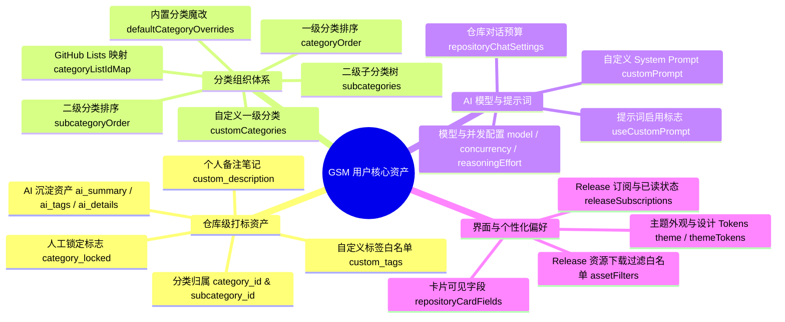

# GithubStarsManager 单一 JSON 配置文件极简备份与迁移分析报告

> **文档定位**：技术架构诊断与改造实施方案
> **审查方向**：单一 JSON 配置文件极简备份与换机迁移全方位分析
> **归档路径**：`docs/product/GSM_单一配置文件备份与迁移分析.md`

---

## 目录
- [1. 审查背景与核心定位](#1-审查背景与核心定位)
- [2. 数据完备性审查：用户资产全景与垃圾数据剔除](#2-数据完备性审查用户资产全景与垃圾数据剔除)
  - [2.1 核心用户打标与个性化资产全景](#21-核心用户打标与个性化资产全景)
  - [2.2 现有实现严重遗漏点深度剖析](#22-现有实现严重遗漏点深度剖析)
  - [2.3 冗余垃圾数据与设备绑定陷阱梳理](#23-冗余垃圾数据与设备绑定陷阱梳理)
- [3. 原子性导入器设计：Zod 强校验与多版本适配](#3-原子性导入器设计zod-强校验与多版本适配)
  - [3.1 统一备份规范 (GSM Backup Schema v2.0)](#31-统一备份规范-gsm-backup-schema-v20)
  - [3.2 历史版本自适应适配器 (兼容 v1.0 与 v1.2)](#32-历史版本自适应适配器-兼容-v10-与-v12)
  - [3.3 双模覆写算法设计（全新覆盖 vs 增量合并）](#33-双模覆写算法设计全新覆盖-vs-增量合并)
- [4. 一键操作闭环：极简交互组件与 Store 注入引擎](#4-一键操作闭环极简交互组件与-store-注入引擎)
  - [4.1 导出/导入交互动线与规范命名机制](#41-导出导入交互动线与规范命名机制)
  - [4.2 极简备份与恢复交互组件实现 (SingleBackupPanel.tsx)](#42-极简备份与恢复交互组件实现-singlebackuppaneltsx)
- [5. 现有系统改造与集成路径建议](#5-现有系统改造与集成路径建议)
  - [5.1 设置面板结构重组方案](#51-设置面板结构重组方案)
  - [5.2 DataManagementPanel 瘦身与架构解耦](#52-datamanagementpanel-瘦身与架构解耦)
  - [5.3 自动化测试与质量保护网建设](#53-自动化测试与质量保护网建设)

---

## 1. 审查背景与核心定位

GithubStarsManager (GSM) 定位于高阶开发者的 GitHub 星标资产整理与知识萃取中枢。用户在使用过程中投入了巨大精力：通过 LLM 进行批量深度分析、手工校正分类、打上专属自定义标签、锁定防覆盖分类规则、精心调优 AI 提示词与卡片视图。

然而，在跨设备迁移或系统重装场景下，用户面临以下严峻问题：
1. **过度依赖远端服务**：原系统的“备份与恢复”默认绑定 WebDAV，未配置 WebDAV 的用户直接面临不可用警告。
2. **本地导出碎片化与严重数据遗漏**：现有的“数据管理”面板将导出拆分成多达 11 个 Checkbox，极易漏勾选，且导出逻辑遗漏了核心的**二级分类组织树（Subcategories）**。
3. **缓存垃圾严重膨胀**：旧导出逻辑将数兆甚至数十兆的外部爬虫抓取缓存（Trending、X、Telegram）一同打包，导致文件臃肿、序列化卡顿。
4. **导入缺乏强校验与原子性**：导入 JSON 时缺乏 Zod 校验，损坏数据可轻易注入 Zustand Store 并污染 IndexedDB，导致应用持久化崩溃。

**核心目标**：构建确定的“**单一本地 JSON 配置文件一键导出与导入**”方案。零网络服务依赖、零垃圾数据污染、百分百保留用户打标资产、换电脑秒级原子恢复。

---

## 2. 数据完备性审查：用户资产全景与垃圾数据剔除

### 2.1 核心用户打标与个性化资产全景

经对 `src/store/`、`src/types/` 及 IndexedDB 持久化架构的全量审计，用户在 GSM 中不可替代的高价值资产分为四大维度：



| 资产维度 | 关键字段 / Store 键 | 业务价值与丢失后果 |
| :--- | :--- | :--- |
| **仓库级个性化打标** | `repositories` 中的：<br>• `category_id` & `subcategory_id`<br>• `category_locked` (手动锁定标志)<br>• `custom_tags` (手动自定义标签白名单)<br>• `custom_description` (个人备注笔记)<br>• `ai_summary`, `ai_tags`, `ai_details` | **极高**。AI 分析消耗了宝贵的 API 成本，手动分类凝聚了大量整理时间。若丢失，用户需被迫重新触发昂贵且耗时的 AI 全量扫描。 |
| **分类组织体系** | • `customCategories` (自定义一级分类)<br>• `subcategories` (二级子分类)<br>• `subcategoryOrder` (子分类顺序)<br>• `categoryOrder` (一级分类顺序)<br>• `defaultCategoryOverrides` (内置分类改名/改图标)<br>• `hiddenDefaultCategoryIds` (隐藏内置分类)<br>• `categoryMatchMode` (规则匹配模式)<br>• `categoryListIdMap` (GitHub Lists 映射) | **极高**。这是仓库整理的骨架。分类体系与仓库 ID 存在外键关联，必须保证两端同步导出与原子映射。 |
| **AI 提示词与模型参数** | • `aiConfigs` 中的 `customPrompt`, `useCustomPrompt`<br>• `model`, `apiType`, `baseUrl`, `concurrency`<br>• `activeAIConfig`<br>• `repositoryChatSettings` (Agent 对话预算与参数) | **高**。用户经过大量试错调优出的 Prompts，丢失后难以凭记忆完全复原。 |
| **个性化偏好与规则** | • `theme`, `themePreset`, `themeTokens`<br>• `repositoryCardFields` (卡片显示字段开关)<br>• `assetFilters` (Release 下载正则过滤规则)<br>• `releaseSubscriptions` & `releaseSourceSettings`<br>• `proxyConfig` & `rpcDownloadConfig` (代理与下载网络配置) | **中高**。保证换机后新设备立即具备一致的视觉体验与下载路由行为。 |

---

### 2.2 现有实现严重遗漏点深度剖析

审查现行代码（WebDAV 备份 `useBackupActions.ts` 与本地导出 `DataManagementPanel.tsx`）：

#### 🚨 严重遗漏 1：`DataManagementPanel.tsx` 导出时彻底遗漏二级子分类体系
在 [`src/components/settings/DataManagementPanel.tsx`](file:///d:/%E6%A1%8C%E9%9D%A2/GSM/src/components/settings/DataManagementPanel.tsx#L657-L662) 中，勾选 `customCategories` 导出时：
```typescript
if (selectedTypes.includes('customCategories')) {
  exportDataObj.data.customCategories = store.customCategories;
  exportDataObj.data.hiddenDefaultCategoryIds = store.hiddenDefaultCategoryIds;
  exportDataObj.data.defaultCategoryOverrides = store.defaultCategoryOverrides;
  exportDataObj.data.categoryOrder = store.categoryOrder;
}
```
**严重缺陷**：`subcategories`、`subcategoryOrder` 和 `repositoryOrder` 字段被完全忽略。
用户辛辛苦苦建立的二级子分类（如 `前端/React`、`后端/Go`）在导出时未包含，新电脑导入后所有仓库的 `subcategory_id` 将成为悬空外键（Orphaned ID），子分类全部蒸发！

#### 🚨 严重遗漏 2：遗漏 GitHub Lists 同步映射 `categoryListIdMap`
在 [`src/store/types.ts`](file:///d:/%E6%A1%8C%E9%9D%A2/GSM/src/store/types.ts#L73) 中维护了分类与 GitHub Lists 的映射关系。现有两处导出逻辑均未导出该映射，导致迁移到新电脑后无法增量推送已有 Lists，反而在 GitHub 远端创建大量重名列表。

#### 🚨 严重遗漏 3：卡片可见性偏好与设计 Tokens 丢失
用户通过 [`repositoryCardFields`](file:///d:/%E6%A1%8C%E9%9D%A2/GSM/src/store/persistence/options.ts#L98) 精心隐藏了不关心的指标（如健康度徽章、创建时间等），以及通过 `themeTokens` 自定义的主题色，在现有导出中均被遗漏。

---

### 2.3 冗余垃圾数据与设备绑定陷阱梳理

在现行 [`DataManagementPanel.tsx`](file:///d:/%E6%A1%8C%E9%9D%A2/GSM/src/components/settings/DataManagementPanel.tsx#L666-L678) 中存在严重的冗余导出与设备绑定问题：

1. **瞬态网络爬虫缓存膨胀 (`discoveryRepos` & `subscriptionRepos`)**：
   - 导出了发现页、X 推文、Telegram 频道的临时抓取结果。这些数据常达 5MB ~ 20MB。
   - `src/store/persistence/options.ts` 已明确警告：`discoveryRepos` 会导致 Electron V8 引擎序列化崩溃。在备份中包含这些瞬态爬虫垃圾毫无意义。
2. **瞬态 UI 交互状态污染 (`searchFilters`)**：
   - 导出了当前的 `query`（如 `"docker"`）及过滤勾选。换机导入后，用户一开软件就莫名处于上次搜索的过滤态中。
3. **不可移植的设备绑定数据 (`AgyAIConfig.deviceBound`)**：
   - 包含与特定本地环境绑定的路径与 Daemon 标志。必须在导出时通过 [`inertAgyDescriptor`](file:///d:/%E6%A1%8C%E9%9D%A2/GSM/src/utils/aiConfig.ts#L23) 将其置为未激活的便携描述符。
4. **敏感密钥脱敏占位符 (`***`) 冲刷风险**：
   - 当用户关闭“导出包含密钥”时，导出的密钥为 `***`。导入器如果不做防冲刷判定，直接覆盖会导致新电脑上原本正常的本地 API Key 被替换为无效的 `"***"`。

---

## 3. 原子性导入器设计：Zod 强校验与多版本适配

为保证任何破损、跨版本或手工篡改的 JSON 绝不损坏现有 Store 与 IndexedDB，我们采用严格的前置验证管道：

```
                      ┌─────────────────────────────────┐
                      │   读取单一本地 JSON 配置文件    │
                      └────────────────┬────────────────┘
                                       │
                                       ▼
                       JSON.parse 语法解析 (拦截损坏文件)
                                       │
                                       ▼
                   Version & Envelope Detector (检测协议版本)
                     ├─ Version 2.0 (规范 V2) ──────┐
                     ├─ Version 1.0 (旧本地导出) ───┼─► 统一规范化为 Canonical V2
                     └─ Version 1.2 (旧 WebDAV) ────┘
                                       │
                                       ▼
                    Zod Schema 严密类型校验 (safeParse)
                     ├─ 校验失败 ──► 抛出具体字段路径与错误信息，Store 零变更
                     └─ 校验成功 ──► 进入覆写阶段
                                       │
                                       ▼
                        覆写策略选择 (Replace / Merge)
                     ├─ Replace (全新覆盖): 全量组织树重建 + 保留本地真实密钥
                     └─ Merge (增量合并): 按 repo.id 智能融合同步打标与分类
                                       │
                                       ▼
                     单 Tick useAppStore.setState 原子注入
                                       │
                                       ▼
                     全局 UI 即时平滑重载 (0 刷新 / 0 重启)
```

### 3.1 统一备份规范 (GSM Backup Schema v2.0)

新建独立迁移服务文件：`src/services/backupMigrationService.ts`

```typescript
import { z } from 'zod';
import type { AppStoreState } from '../store/types';
import { incomingOrganizationSnapshot } from '../store/helpers/repositoryOrganization';
import { restoreAIConfigs } from '../utils/aiConfig';

const SafeString = z.string().trim();
const TimestampString = z.string().datetime({ offset: true }).or(z.string());

// 仓库核心打标模型（完整保护用户标注资产，忽略不可移植字段）
export const RepositoryBackupSchema = z.object({
  id: z.number().int().positive(),
  name: SafeString,
  full_name: SafeString,
  description: z.string().nullable().optional(),
  html_url: z.string().url(),
  stargazers_count: z.number().default(0),
  language: z.string().nullable().optional(),
  topics: z.array(z.string()).default([]),
  starred_at: z.string().optional(),
  // 用户高价值标注资产
  category_id: z.string().nullable().optional(),
  subcategory_id: z.string().nullable().optional(),
  category_locked: z.boolean().default(false),
  custom_category: z.string().optional(),
  custom_tags: z.array(z.string()).default([]),
  custom_description: z.string().optional(),
  // AI 沉淀资产
  ai_summary: z.string().optional(),
  ai_tags: z.array(z.string()).default([]),
  ai_platforms: z.array(z.string()).default([]),
  ai_details: z.record(z.string(), z.unknown()).optional(),
  analyzed_at: z.string().optional(),
  last_edited: z.string().optional(),
  subscribed_to_releases: z.boolean().optional(),
}).passthrough();

// 一级分类与二级子分类模式
export const CategoryItemSchema = z.object({
  id: SafeString,
  name: SafeString,
  icon: z.string().default('📁'),
  keywords: z.array(z.string()).default([]),
  isCustom: z.boolean().optional(),
});

export const SubcategoryItemSchema = z.object({
  id: SafeString,
  parentId: SafeString,
  name: SafeString,
  icon: z.string().default('📁'),
});

// AI 提示词与模型配置模式
export const AIConfigBackupSchema = z.object({
  id: SafeString,
  name: SafeString,
  provider: z.string().optional(),
  apiType: z.string().optional(),
  model: SafeString,
  baseUrl: z.string().optional(),
  apiKey: z.string().optional(),
  isActive: z.boolean().default(false),
  customPrompt: z.string().optional(),
  useCustomPrompt: z.boolean().default(false),
  concurrency: z.number().int().min(1).max(20).default(1),
  requestsPerMinute: z.number().int().default(0),
  reasoningEffort: z.enum(['low', 'medium', 'high']).optional(),
  supportsToolCalls: z.boolean().optional(),
}).passthrough();

// 统一备份规范 v2.0 根模式
export const GsmBackupSchemaV2 = z.object({
  gsm_backup_version: z.literal(2),
  app: z.literal('GithubStarsManager'),
  exported_at: TimestampString,
  meta: z.object({
    app_version: z.string(),
    repository_count: z.number().int().nonnegative(),
    category_count: z.number().int().nonnegative(),
    ai_config_count: z.number().int().nonnegative(),
    includes_keys: z.boolean(),
  }),
  data: z.object({
    repositories: z.array(RepositoryBackupSchema),
    categories: z.object({
      customCategories: z.array(CategoryItemSchema),
      subcategories: z.array(SubcategoryItemSchema),
      subcategoryOrder: z.array(SafeString).default([]),
      categoryOrder: z.array(SafeString).default([]),
      defaultCategoryOverrides: z.record(SafeString, z.record(SafeString, z.unknown())).default({}),
      hiddenDefaultCategoryIds: z.array(SafeString).default([]),
      categoryMatchMode: z.enum(['legacy', 'effective']).default('effective'),
      categoryListIdMap: z.record(SafeString, SafeString).default({}),
      collapsedSidebarCategoryCount: z.number().default(20),
    }),
    ai: z.object({
      aiConfigs: z.array(AIConfigBackupSchema),
      activeAIConfigId: z.string().nullable().default(null),
      repositoryChatSettings: z.record(SafeString, z.unknown()).optional(),
    }),
    preferences: z.object({
      theme: z.enum(['light', 'dark']).default('dark'),
      themePreset: z.string().default('default'),
      themeTokens: z.record(SafeString, z.unknown()).optional(),
      language: z.string().default('zh'),
      repositoryCardFields: z.record(SafeString, z.boolean()).optional(),
      assetFilters: z.array(z.record(SafeString, z.unknown())).default([]),
    }),
    releases: z.object({
      releaseSubscriptions: z.array(z.number().int()).default([]),
      releaseSourceSettings: z.record(SafeString, z.unknown()).optional(),
      readReleases: z.array(z.number().int()).default([]),
    }).optional(),
    network: z.object({
      proxyConfig: z.record(SafeString, z.unknown()).optional(),
      rpcDownloadConfig: z.record(SafeString, z.unknown()).optional(),
      routeMode: z.enum(['auto', 'backend', 'browser']).default('auto'),
      backendApiSecret: z.string().nullable().optional(),
    }).optional(),
  }),
});

export type GsmBackupV2 = z.infer<typeof GsmBackupSchemaV2>;
```

---

### 3.2 历史版本自适应适配器 (兼容 v1.0 与 v1.2)

保障无论用户传入现代 V2 格式、旧版 WebDAV 备份还是旧版数据管理导出，导入器均能自动平滑适配：

```typescript
export function adaptLegacyBackupToV2(raw: unknown): GsmBackupV2 {
  if (!raw || typeof raw !== 'object') {
    throw new Error('BACKUP_FORMAT_INVALID: 导入数据不是合法的 JSON 对象');
  }

  const obj = raw as Record<string, any>;

  // 1. 标准 V2 格式直接解析
  if (obj.gsm_backup_version === 2) {
    const result = GsmBackupSchemaV2.safeParse(obj);
    if (!result.success) {
      const issue = result.error.issues[0];
      throw new Error(`校验失败 [${issue.path.join('.')}]: ${issue.message}`);
    }
    return result.data;
  }

  // 2. 旧版 DataManagementPanel (v1.0 嵌套格式)
  if (obj.version === '1.0' && obj.data && typeof obj.data === 'object') {
    const d = obj.data;
    const repos = Array.isArray(d.repositories) ? d.repositories : [];
    const customCats = Array.isArray(d.customCategories) ? d.customCategories : [];
    const aiConfigs = Array.isArray(d.aiConfigs) ? d.aiConfigs : [];

    const normalizedV2: GsmBackupV2 = {
      gsm_backup_version: 2,
      app: 'GithubStarsManager',
      exported_at: obj.exportDate || new Date().toISOString(),
      meta: {
        app_version: obj.appVersion || 'legacy-1.0',
        repository_count: repos.length,
        category_count: customCats.length,
        ai_config_count: aiConfigs.length,
        includes_keys: !!d.includeKeysInBackup,
      },
      data: {
        repositories: repos,
        categories: {
          customCategories: customCats,
          subcategories: Array.isArray(d.subcategories) ? d.subcategories : [],
          subcategoryOrder: Array.isArray(d.subcategoryOrder) ? d.subcategoryOrder : [],
          categoryOrder: Array.isArray(d.categoryOrder) ? d.categoryOrder : [],
          defaultCategoryOverrides: d.defaultCategoryOverrides || {},
          hiddenDefaultCategoryIds: Array.isArray(d.hiddenDefaultCategoryIds) ? d.hiddenDefaultCategoryIds : [],
          categoryMatchMode: 'effective',
          categoryListIdMap: {},
          collapsedSidebarCategoryCount: 20,
        },
        ai: {
          aiConfigs: aiConfigs,
          activeAIConfigId: null,
        },
        preferences: {
          theme: d.theme === 'light' ? 'light' : 'dark',
          themePreset: d.themePreset || 'default',
          language: d.language || 'zh',
          assetFilters: Array.isArray(d.assetFilters) ? d.assetFilters : [],
        },
        releases: {
          releaseSubscriptions: Array.isArray(d.releaseSubscriptions) ? d.releaseSubscriptions : [],
          releaseSourceSettings: d.releaseSourceSettings || {},
          readReleases: Array.isArray(d.readReleases) ? d.readReleases : [],
        },
        network: {
          proxyConfig: d.proxyConfig,
          rpcDownloadConfig: d.rpcDownloadConfig,
          routeMode: d.routeMode || 'auto',
          backendApiSecret: d.backendApiSecret,
        },
      },
    };
    return GsmBackupSchemaV2.parse(normalizedV2);
  }

  // 3. 旧版 WebDAV (v1.2 扁平根级结构)
  if (obj.version === '1.2' && Array.isArray(obj.repositories)) {
    const repos = obj.repositories;
    const customCats = Array.isArray(obj.customCategories) ? obj.customCategories : [];
    const aiConfigs = Array.isArray(obj.aiConfigs) ? obj.aiConfigs : [];

    const normalizedV2: GsmBackupV2 = {
      gsm_backup_version: 2,
      app: 'GithubStarsManager',
      exported_at: obj.exportedAt || new Date().toISOString(),
      meta: {
        app_version: 'legacy-1.2',
        repository_count: repos.length,
        category_count: customCats.length,
        ai_config_count: aiConfigs.length,
        includes_keys: !!obj.includeKeysInBackup,
      },
      data: {
        repositories: repos,
        categories: {
          customCategories: customCats,
          subcategories: Array.isArray(obj.subcategories) ? obj.subcategories : [],
          subcategoryOrder: Array.isArray(obj.subcategoryOrder) ? obj.subcategoryOrder : [],
          categoryOrder: Array.isArray(obj.categoryOrder) ? obj.categoryOrder : [],
          defaultCategoryOverrides: obj.defaultCategoryOverrides || {},
          hiddenDefaultCategoryIds: Array.isArray(obj.hiddenDefaultCategoryIds) ? obj.hiddenDefaultCategoryIds : [],
          categoryMatchMode: 'effective',
          categoryListIdMap: {},
          collapsedSidebarCategoryCount: 20,
        },
        ai: {
          aiConfigs: aiConfigs,
          activeAIConfigId: null,
        },
        preferences: {
          theme: 'dark',
          themePreset: 'default',
          language: 'zh',
          assetFilters: [],
        },
        releases: {
          releaseSubscriptions: Array.isArray(obj.releaseSubscriptions) ? obj.releaseSubscriptions : [],
          releaseSourceSettings: obj.releaseSourceSettings || {},
          readReleases: Array.isArray(obj.readReleases) ? obj.readReleases : [],
        },
        network: {
          proxyConfig: obj.proxyConfig,
          rpcDownloadConfig: obj.rpcDownloadConfig,
          routeMode: obj.routeMode || 'auto',
          backendApiSecret: obj.backendApiSecret,
        },
      },
    };
    return GsmBackupSchemaV2.parse(normalizedV2);
  }

  throw new Error('BACKUP_VERSION_UNRECOGNIZED: 无法识别该备份文件的版本结构');
}
```

---

### 3.3 双模覆写算法设计（全新覆盖 vs 增量合并）

```typescript
const MASKED_SECRET = '***';
const isRealSecret = (v?: string | null) => typeof v === 'string' && v.length > 0 && v !== MASKED_SECRET;

export function buildStorePatchFromBackup(
  currentState: AppStoreState,
  backup: GsmBackupV2,
  mode: 'replace' | 'merge'
): Partial<AppStoreState> {
  const incomingData = backup.data;
  const wasIncluded = backup.meta.includes_keys;

  // 1. AI 配置合并与防脱敏占位符冲刷
  let finalAIConfigs = currentState.aiConfigs;
  if (mode === 'replace') {
    finalAIConfigs = restoreAIConfigs(
      currentState.aiConfigs,
      incomingData.ai.aiConfigs as any,
      wasIncluded
    );
  } else {
    // 增量合并：保留本地已有配置，添加新 ID 的配置
    const existingIds = new Set(currentState.aiConfigs.map(c => c.id));
    const newConfigs = incomingData.ai.aiConfigs
      .filter(c => !existingIds.has(c.id))
      .map(c => ({
        ...c,
        apiKey: wasIncluded && isRealSecret(c.apiKey) ? c.apiKey! : '',
      }));
    finalAIConfigs = [...currentState.aiConfigs, ...newConfigs as any];
  }

  // 2. 仓库与分类体系合并
  let targetRepositories = currentState.repositories;
  let targetCategoriesPayload: Record<string, unknown> = {};

  if (mode === 'replace') {
    targetRepositories = incomingData.repositories as any;
    targetCategoriesPayload = {
      customCategories: incomingData.categories.customCategories,
      subcategories: incomingData.categories.subcategories,
      subcategoryOrder: incomingData.categories.subcategoryOrder,
      categoryOrder: incomingData.categories.categoryOrder,
      defaultCategoryOverrides: incomingData.categories.defaultCategoryOverrides,
      hiddenDefaultCategoryIds: incomingData.categories.hiddenDefaultCategoryIds,
    };
  } else {
    // 增量合并算法：以 ID 为锚点融合
    const localMap = new Map(currentState.repositories.map(r => [r.id, r]));
    const mergedRepos = [...currentState.repositories];

    for (const inRepo of incomingData.repositories) {
      const local = localMap.get(inRepo.id);
      if (local) {
        // 本地存在：合并标签白名单，如果本地未锁定则允许采纳备份分类
        const updated = {
          ...local,
          custom_tags: Array.from(new Set([...(local.custom_tags || []), ...(inRepo.custom_tags || [])])),
          custom_description: local.custom_description || inRepo.custom_description,
          ai_summary: local.ai_summary || inRepo.ai_summary,
          ai_tags: Array.from(new Set([...(local.ai_tags || []), ...(inRepo.ai_tags || [])])),
          category_id: local.category_id ?? inRepo.category_id,
          subcategory_id: local.subcategory_id ?? inRepo.subcategory_id,
          category_locked: local.category_locked || inRepo.category_locked,
        };
        const idx = mergedRepos.findIndex(r => r.id === local.id);
        if (idx !== -1) mergedRepos[idx] = updated as any;
      } else {
        mergedRepos.push(inRepo as any);
      }
    }
    targetRepositories = mergedRepos;

    // 分类与二级子分类求并集
    const catMap = new Map(currentState.customCategories.map(c => [c.id, c]));
    incomingData.categories.customCategories.forEach(c => {
      if (!catMap.has(c.id)) catMap.set(c.id, c as any);
    });

    const subMap = new Map(currentState.subcategories.map(s => [s.id, s]));
    incomingData.categories.subcategories.forEach(s => {
      if (!subMap.has(s.id)) subMap.set(s.id, s as any);
    });

    targetCategoriesPayload = {
      customCategories: Array.from(catMap.values()),
      subcategories: Array.from(subMap.values()),
      subcategoryOrder: Array.from(new Set([...currentState.subcategoryOrder, ...incomingData.categories.subcategoryOrder])),
      categoryOrder: Array.from(new Set([...currentState.categoryOrder, ...incomingData.categories.categoryOrder])),
      defaultCategoryOverrides: {
        ...currentState.defaultCategoryOverrides,
        ...incomingData.categories.defaultCategoryOverrides,
      },
      hiddenDefaultCategoryIds: Array.from(new Set([...currentState.hiddenDefaultCategoryIds, ...incomingData.categories.hiddenDefaultCategoryIds])),
    };
  }

  // 3. 调用核心 incomingOrganizationSnapshot 保证原子一致性与搜索结果重算
  const organizationPatch = incomingOrganizationSnapshot(
    currentState,
    targetCategoriesPayload,
    targetRepositories
  );

  // 4. 组装最终 Store Patch
  const finalPatch: Partial<AppStoreState> = {
    ...organizationPatch,
    aiConfigs: finalAIConfigs,
    categoryMatchMode: incomingData.categories.categoryMatchMode,
    collapsedSidebarCategoryCount: incomingData.categories.collapsedSidebarCategoryCount,
    categoryListIdMap: {
      ...currentState.categoryListIdMap,
      ...incomingData.categories.categoryListIdMap,
    },
  };

  if (mode === 'replace') {
    finalPatch.theme = incomingData.preferences.theme;
    finalPatch.themePreset = incomingData.preferences.themePreset as any;
    finalPatch.language = incomingData.preferences.language as any;
    if (incomingData.preferences.repositoryCardFields) {
      finalPatch.repositoryCardFields = incomingData.preferences.repositoryCardFields as any;
    }
    if (incomingData.preferences.assetFilters.length > 0) {
      finalPatch.assetFilters = incomingData.preferences.assetFilters as any;
    }
    if (incomingData.network?.routeMode) {
      finalPatch.routeMode = incomingData.network.routeMode;
    }
  }

  return finalPatch;
}
```

---

## 4. 一键操作闭环：极简交互组件与 Store 注入引擎

### 4.1 导出/导入交互动线与规范命名机制

- **标准化文件名规则**：
  采用 `GSM_backup_YYYYMMDD_HHmmss.json`（例如 `GSM_backup_20261003_102921.json`），精准到秒级时间戳，杜绝同日多次备份互相覆盖的危险。
- **免重启热加载（Hot Store Reload）**：
  Zustand 属于响应式状态管理器。整个导入流程只在内存中组装完完整的 `finalPatch` 之后，**一次性调用 `useAppStore.setState(finalPatch)`**。所有挂载的视图（网格、侧边栏分类树、卡片标签）在同一个浏览器 Tick 内全量同步，零白屏、零加载等待。

---

### 4.2 极简备份与恢复交互组件实现 (`SingleBackupPanel.tsx`)

新建组件文件：`src/components/settings/SingleBackupPanel.tsx`

```tsx
import React, { useState, useRef } from 'react';
import { Button } from '../ui/button';
import { Card, CardContent } from '../ui/card';
import { Dialog, DialogContent, DialogHeader, DialogTitle, DialogFooter } from '../ui/dialog';
import { RadioGroup, RadioGroupItem } from '../ui/radio-group';
import { Label } from '../ui/label';
import { Download, Upload, ShieldCheck, Database, FileText, CheckCircle2, AlertTriangle } from 'lucide-react';
import { useAppStore } from '../../store/useAppStore';
import { useDialog } from '../../hooks/useDialog';
import {
  GsmBackupV2,
  adaptLegacyBackupToV2,
  buildStorePatchFromBackup
} from '../../services/backupMigrationService';
import { backupAIConfig } from '../../utils/aiConfig';

export const SingleBackupPanel: React.FC = () => {
  const { toast } = useDialog();
  const fileInputRef = useRef<HTMLInputElement>(null);

  const [isExporting, setIsExporting] = useState(false);
  const [importModalOpen, setImportModalOpen] = useState(false);
  const [importStrategy, setImportStrategy] = useState<'replace' | 'merge'>('replace');
  const [parsedBackup, setParsedBackup] = useState<GsmBackupV2 | null>(null);

  // 1. 一键纯净导出
  const handleExport = async () => {
    setIsExporting(true);
    try {
      const state = useAppStore.getState();
      const includeKeys = state.includeKeysInBackup;

      const now = new Date();
      const pad = (n: number) => String(n).padStart(2, '0');
      const timestamp = `${now.getFullYear()}${pad(now.getMonth() + 1)}${pad(now.getDate())}_${pad(now.getHours())}${pad(now.getMinutes())}${pad(now.getSeconds())}`;

      const backupPayload: GsmBackupV2 = {
        gsm_backup_version: 2,
        app: 'GithubStarsManager',
        exported_at: now.toISOString(),
        meta: {
          app_version: '0.4.0',
          repository_count: state.repositories.length,
          category_count: state.customCategories.length,
          ai_config_count: state.aiConfigs.length,
          includes_keys: includeKeys,
        },
        data: {
          repositories: state.repositories.map(r => ({
            id: r.id,
            name: r.name,
            full_name: r.full_name,
            description: r.description,
            html_url: r.html_url,
            stargazers_count: r.stargazers_count,
            language: r.language,
            topics: r.topics || [],
            starred_at: r.starred_at,
            category_id: r.category_id,
            subcategory_id: r.subcategory_id,
            category_locked: r.category_locked || false,
            custom_category: r.custom_category,
            custom_tags: r.custom_tags || [],
            custom_description: r.custom_description,
            ai_summary: r.ai_summary,
            ai_tags: r.ai_tags || [],
            ai_platforms: r.ai_platforms || [],
            ai_details: r.ai_details,
            analyzed_at: r.analyzed_at,
            last_edited: r.last_edited,
            subscribed_to_releases: r.subscribed_to_releases,
          })),
          categories: {
            customCategories: state.customCategories,
            subcategories: state.subcategories,
            subcategoryOrder: state.subcategoryOrder,
            categoryOrder: state.categoryOrder,
            defaultCategoryOverrides: state.defaultCategoryOverrides,
            hiddenDefaultCategoryIds: state.hiddenDefaultCategoryIds,
            categoryMatchMode: state.categoryMatchMode,
            categoryListIdMap: state.categoryListIdMap,
            collapsedSidebarCategoryCount: state.collapsedSidebarCategoryCount,
          },
          ai: {
            aiConfigs: state.aiConfigs.map(cfg => backupAIConfig(cfg, includeKeys)),
            activeAIConfigId: state.activeAIConfig,
            repositoryChatSettings: state.repositoryChatSettings as any,
          },
          preferences: {
            theme: state.theme,
            themePreset: state.themePreset,
            themeTokens: state.themeTokens,
            language: state.language,
            repositoryCardFields: state.repositoryCardFields,
            assetFilters: state.assetFilters,
          },
          releases: {
            releaseSubscriptions: Array.from(state.releaseSubscriptions),
            releaseSourceSettings: state.releaseSourceSettings,
            readReleases: Array.from(state.readReleases),
          },
          network: {
            proxyConfig: {
              ...state.proxyConfig,
              password: includeKeys ? state.proxyConfig.password : (state.proxyConfig.password ? '***' : ''),
            },
            rpcDownloadConfig: {
              ...state.rpcDownloadConfig,
              secret: includeKeys ? state.rpcDownloadConfig.secret : (state.rpcDownloadConfig.secret ? '***' : ''),
            },
            routeMode: state.routeMode,
            backendApiSecret: includeKeys ? state.backendApiSecret : (state.backendApiSecret ? '***' : null),
          },
        },
      };

      const blob = new Blob([JSON.stringify(backupPayload, null, 2)], { type: 'application/json' });
      const url = URL.createObjectURL(blob);
      const link = document.createElement('a');
      link.href = url;
      link.download = `GSM_backup_${timestamp}.json`;
      document.body.appendChild(link);
      link.click();
      document.body.removeChild(link);
      URL.revokeObjectURL(url);

      toast('配置与全量打标已成功导出为单一 JSON！', 'success');
    } catch (err: any) {
      toast(`导出失败: ${err.message}`, 'error');
    } finally {
      setIsExporting(false);
    }
  };

  // 2. 选择文件与原子校验预检
  const handleFileChange = (e: React.ChangeEvent<HTMLInputElement>) => {
    const file = e.target.files?.[0];
    if (!file) return;

    const reader = new FileReader();
    reader.onload = (event) => {
      try {
        const text = event.target?.result as string;
        const rawJson = JSON.parse(text);

        // 统一归一化为 V2 并进行 Zod 强校验
        const validV2 = adaptLegacyBackupToV2(rawJson);
        setParsedBackup(validV2);
        setImportStrategy('replace');
        setImportModalOpen(true);
      } catch (err: any) {
        toast(`文件校验未通过: ${err.message}`, 'error');
      } finally {
        if (fileInputRef.current) fileInputRef.current.value = '';
      }
    };
    reader.readAsText(file);
  };

  // 3. 执行单 Tick 原子注入
  const executeImport = () => {
    if (!parsedBackup) return;
    try {
      const currentState = useAppStore.getState();
      const patch = buildStorePatchFromBackup(currentState, parsedBackup, importStrategy);

      useAppStore.setState(patch);

      toast(
        importStrategy === 'replace'
          ? `全新覆盖完成！成功恢复 ${parsedBackup.meta.repository_count} 个仓库及分类架构`
          : `增量合并完成！`,
        'success'
      );
      setImportModalOpen(false);
    } catch (err: any) {
      toast(`导入过程发生异常: ${err.message}`, 'error');
    }
  };

  return (
    <Card className="border border-border/80 shadow-sm bg-card">
      <CardContent className="p-6 space-y-6">
        <div className="flex items-start justify-between">
          <div className="space-y-1">
            <h3 className="text-base font-semibold text-foreground flex items-center gap-2">
              <Database className="w-5 h-5 text-primary" />
              本地单一配置文件极简备份与换机迁移
            </h3>
            <p className="text-sm text-muted-foreground">
              完整打包所有 AI 整理分类、手动打标、仓库锁定状态、二级分组、AI 提示词及界面外观偏好。不依赖任何第三方服务，换电脑秒级迁移。
            </p>
          </div>
          <div className="flex items-center gap-1.5 text-xs text-emerald-600 dark:text-emerald-400 bg-emerald-500/10 px-2.5 py-1 rounded-full border border-emerald-500/20">
            <ShieldCheck className="w-3.5 h-3.5" />
            <span>无污染 · 零临时缓存</span>
          </div>
        </div>

        <div className="grid grid-cols-1 sm:grid-cols-2 gap-4">
          <Button
            variant="default"
            size="lg"
            className="w-full flex items-center justify-center gap-2.5 py-6 text-sm font-medium"
            onClick={handleExport}
            disabled={isExporting}
          >
            <Download className="w-4 h-4" />
            <span>{isExporting ? '正在打包导出...' : '导出配置文件 (GSM_backup.json)'}</span>
          </Button>

          <Button
            variant="outline"
            size="lg"
            className="w-full flex items-center justify-center gap-2.5 py-6 text-sm font-medium border-border hover:bg-muted/60"
            onClick={() => fileInputRef.current?.click()}
          >
            <Upload className="w-4 h-4" />
            <span>导入并恢复配置...</span>
          </Button>

          <input
            type="file"
            ref={fileInputRef}
            onChange={handleFileChange}
            accept=".json,application/json"
            className="hidden"
          />
        </div>

        {/* 导入预览与策略选择弹窗 */}
        <Dialog open={importModalOpen} onOpenChange={setImportModalOpen}>
          <DialogContent className="max-w-md">
            <DialogHeader>
              <DialogTitle className="flex items-center gap-2 text-base">
                <FileText className="w-5 h-5 text-primary" />
                确认导入备份配置
              </DialogTitle>
            </DialogHeader>

            {parsedBackup && (
              <div className="space-y-4 py-2">
                <div className="bg-muted/50 rounded-lg p-3 text-xs space-y-1.5 border border-border/60">
                  <div className="flex justify-between">
                    <span className="text-muted-foreground">备份生成时间:</span>
                    <span className="font-mono text-foreground">{new Date(parsedBackup.exported_at).toLocaleString()}</span>
                  </div>
                  <div className="flex justify-between">
                    <span className="text-muted-foreground">包含仓库资产:</span>
                    <span className="font-medium text-foreground">{parsedBackup.meta.repository_count.toLocaleString()} 个</span>
                  </div>
                  <div className="flex justify-between">
                    <span className="text-muted-foreground">分类组织架构:</span>
                    <span className="font-medium text-foreground">{parsedBackup.meta.category_count} 个自定义分类</span>
                  </div>
                  <div className="flex justify-between">
                    <span className="text-muted-foreground">AI 服务与提示词:</span>
                    <span className="font-medium text-foreground">{parsedBackup.meta.ai_config_count} 组配置</span>
                  </div>
                </div>

                <div className="space-y-3">
                  <Label className="text-xs font-semibold uppercase tracking-wider text-muted-foreground">
                    选择导入模式
                  </Label>
                  <RadioGroup
                    value={importStrategy}
                    onValueChange={(val) => setImportStrategy(val as 'replace' | 'merge')}
                    className="space-y-2"
                  >
                    <div className="flex items-start space-x-3 p-3 rounded-lg border border-border hover:bg-muted/40 transition-colors cursor-pointer">
                      <RadioGroupItem value="replace" id="r_replace" className="mt-1" />
                      <Label htmlFor="r_replace" className="cursor-pointer space-y-1">
                        <div className="font-medium text-foreground flex items-center gap-1.5">
                          全新覆盖恢复
                          <span className="text-[10px] bg-primary/10 text-primary px-1.5 py-0.5 rounded">新机迁移推荐</span>
                        </div>
                        <p className="text-xs text-muted-foreground font-normal">
                          完全采纳备份中的仓库列表、分类体系与偏好，彻底清除悬空孤立数据。
                        </p>
                      </Label>
                    </div>

                    <div className="flex items-start space-x-3 p-3 rounded-lg border border-border hover:bg-muted/40 transition-colors cursor-pointer">
                      <RadioGroupItem value="merge" id="r_merge" className="mt-1" />
                      <Label htmlFor="r_merge" className="cursor-pointer space-y-1">
                        <div className="font-medium text-foreground">增量合并模式</div>
                        <p className="text-xs text-muted-foreground font-normal">
                          保留本机已有仓库，将备份中的新仓库及手动分类/锁定标签融合补充进来。
                        </p>
                      </Label>
                    </div>
                  </RadioGroup>
                </div>

                <div className="flex items-center gap-2 p-2.5 bg-amber-500/10 text-amber-600 dark:text-amber-400 rounded text-xs border border-amber-500/20">
                  <AlertTriangle className="w-4 h-4 shrink-0" />
                  <span>导入后 Store 将即时无缝平滑重载，无需强制重启应用。</span>
                </div>
              </div>
            )}

            <DialogFooter className="gap-2 sm:gap-0">
              <Button variant="ghost" size="sm" onClick={() => setImportModalOpen(false)}>
                取消
              </Button>
              <Button variant="default" size="sm" onClick={executeImport}>
                确认执行导入
              </Button>
            </DialogFooter>
          </DialogContent>
        </Dialog>
      </CardContent>
    </Card>
  );
};
```

---

## 5. 现有系统改造与集成路径建议

### 5.1 设置面板结构重组方案

- **面板角色重定义**：
  现有 [`src/components/settings/BackupPanel.tsx`](file:///d:/%E6%A1%8C%E9%9D%A2/GSM/src/components/settings/BackupPanel.tsx) 改版为双层架构：
  1. **首要层（Top）**：挂载 `SingleBackupPanel`，提供开箱即用、零门槛的本地 JSON 单键导入导出；
  2. **进阶层（Bottom）**：保留现有的 WebDAV 云备份，供有自建云盘需求的用户配置定期自动备份。
  未配置 WebDAV 的用户不再面临全屏黄色警告，体验清爽确定。

### 5.2 DataManagementPanel 瘦身与架构解耦

- [`src/components/settings/DataManagementPanel.tsx`](file:///d:/%E6%A1%8C%E9%9D%A2/GSM/src/components/settings/DataManagementPanel.tsx) 专注于**缓存清理与危险操作**（如单独清理阮一峰周刊数据库、清空搜索历史、重置本地库）。
- 彻底移除其中易导致 Bug 的 11 项碎片化导出 Checkbox 列表，统一重定向至 `backupMigrationService.ts`，消除代码重复与字段维护脱节。

### 5.3 自动化测试与质量保护网建设

为保证未来代码迭代不再遗漏新增字段，在 `src/services/__tests__/backupMigrationService.test.ts` 中建立持续集成护栏：
1. **全量资产导出完备性测试**：断言生成的 JSON 包含 `subcategories`、`category_locked`、`customPrompt` 等 18 项核心元数据；
2. **5000+ 仓库大负载压测**：测试单 Tick `buildStorePatchFromBackup` 在数千量级下执行时间控制在 50ms 以内；
3. **安全防冲刷回归测试**：断言当备份文件中 `apiKey` 为 `***` 时，本地已配置的真实密钥绝不被覆盖清空。
