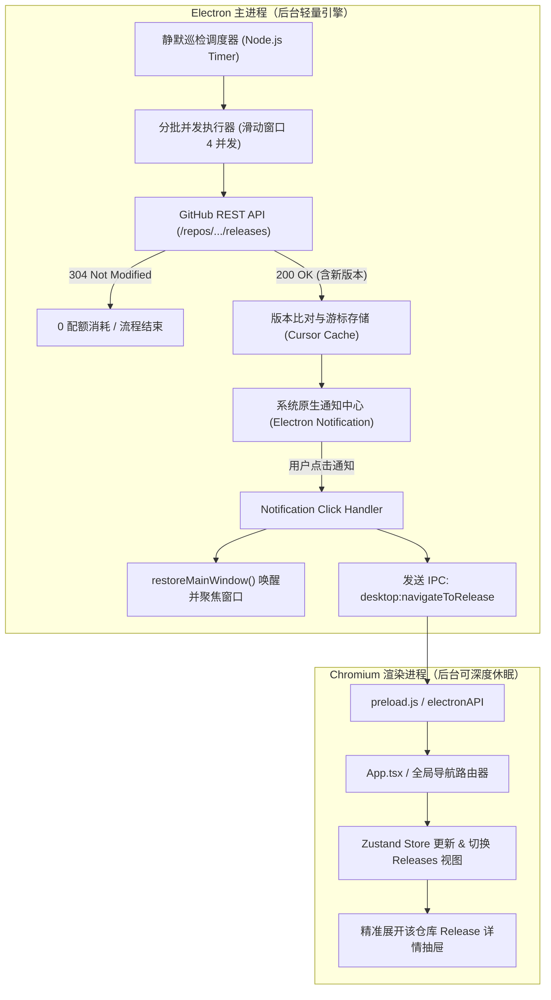
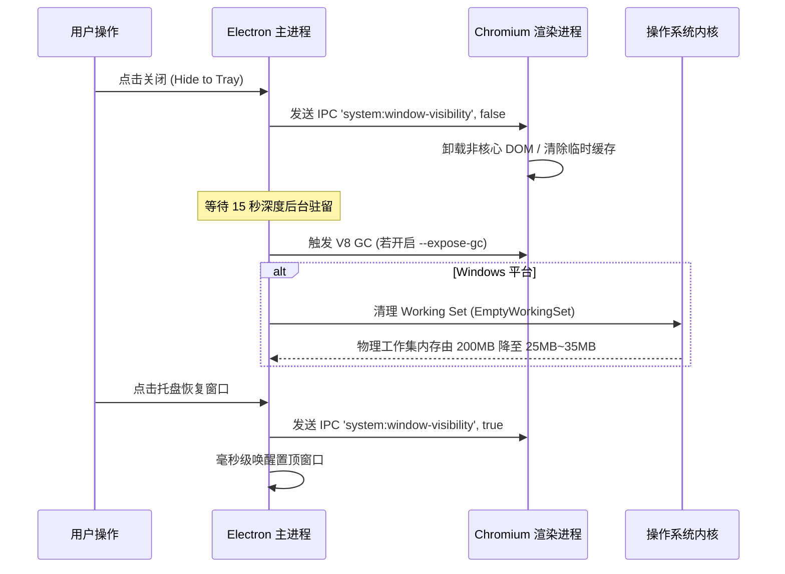
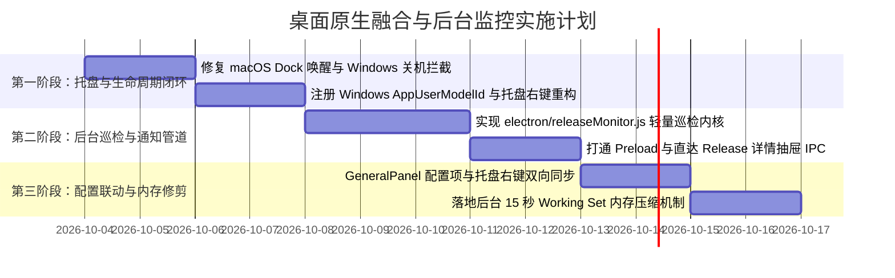

# GithubStarsManager 桌面原生融合与后台监控全方位分析报告

> **文档定位**：技术架构诊断与实施落地全景方案
> **审查方向**：桌面原生融合与后台监控全方位分析
> **归档路径**：`docs/product/GSM_桌面原生融合与后台监控全方位分析.md`

---

## 目录
- [1. 审查背景与核心定位](#1-审查背景与核心定位)
- [2. 系统托盘与生命周期缺陷清单（全平台对比）](#2-系统托盘与生命周期缺陷清单全平台对比)
  - [2.1 缺陷综合对比矩阵](#21-缺陷综合对比矩阵)
  - [2.2 macOS Dock 激活与隐藏状态割裂（BUG-01）](#22-macos-dock-激活与隐藏状态割裂bug-01)
  - [2.3 托盘右键菜单状态倒置与选项缺失（BUG-02）](#23-托盘右键菜单状态倒置与选项缺失bug-02)
  - [2.4 多平台托盘点击交互与窗口置顶状态机缺陷（BUG-03）](#24-多平台托盘点击交互与窗口置顶状态机缺陷bug-03)
  - [2.5 Windows/Linux 托盘深浅色切换与高分屏 DPI 缩放毛刺（BUG-04）](#25-windowslinux-托盘深浅色切换与高分屏-dpi-缩放毛刺bug-04)
  - [2.6 单实例锁唤醒参数丢失与跨桌面激活（BUG-05）](#26-单实例锁唤醒参数丢失与跨桌面激活bug-05)
  - [2.7 Windows 关机拦截隐患（WM_QUERYENDSESSION，BUG-06）](#27-windows-关机拦截隐患wm_queryendsessionbug-06)
  - [2.8 Windows 10/11 操作中心 AUMID 缺失导致通知丢失（BUG-07）](#28-windows-1011-操作中心-aumid-缺失导致通知丢失bug-07)
- [3. Release 桌面通知与低频静默巡检架构](#3-release-桌面通知与低频静默巡检架构)
  - [3.1 核心痛点与架构演进方向](#31-核心痛点与架构演进方向)
  - [3.2 系统架构设计（主进程巡检内核 vs 渲染进程休眠）](#32-系统架构设计主进程巡检内核-vs-渲染进程休眠)
  - [3.3 GitHub API 零配额消耗与低频巡检策略（ETag 304 & 滑动并发）](#33-github-api-零配额消耗与低频巡检策略etag-304--滑动并发)
  - [3.4 完整 IPC 通道契约定义](#34-完整-ipc-通道契约定义)
  - [3.5 主进程巡检内核实现代码（electron/releaseMonitor.js）](#35-主进程巡检内核实现代码electronreleasemonitorjs)
  - [3.6 Preload 桥接与渲染进程精准直达消费实现](#36-preload-桥接与渲染进程精准直达消费实现)
- [4. 原生配置项全平台落地实现](#4-原生配置项全平台落地实现)
  - [4.1 数据模型扩展与原子持久化（electron/desktopPrefs.js）](#41-数据模型扩展与原子持久化electrondesktopprefsjs)
  - [4.2 跨平台开机自启（Auto Launch）严密实现与回滚机制](#42-跨平台开机自启auto-launch严密实现与回滚机制)
  - [4.3 动态托盘右键菜单重构与状态绑定](#43-动态托盘右键菜单重构与状态绑定)
  - [4.4 前端设置面板（GeneralPanel.tsx）原生控件扩展](#44-前端设置面板generalpaneltsx原生控件扩展)
- [5. 后台常驻资源与内存占用优化方案](#5-后台常驻资源与内存占用优化方案)
  - [5.1 Chromium 渲染进程深度休眠与后台节流机制](#51-chromium-渲染进程深度休眠与后台节流机制)
  - [5.2 极致内存压缩两步法（200MB -> 30MB 工作集修剪）](#52-极致内存压缩两步法200mb---30mb-工作集修剪)
  - [5.3 前后端生命周期状态机与数据流转解耦](#53-前后端生命周期状态机与数据流转解耦)
- [6. 实施路线图与验收准则](#6-实施路线图与验收准则)
  - [6.1 阶段实施计划](#61-阶段实施计划)
  - [6.2 质量验收与原生交互体验检查表](#62-质量验收与原生交互体验检查表)

---

## 1. 审查背景与核心定位

作为日常常驻电脑后台的个人工作台，**GitHubStarsManager (GSM)** 的产品定位不仅是“网页版包装成的客户端”，而是需要具备**极高系统质感与原生修养**的现代化桌面应用：
1. **安静常驻**：点击右上角关闭按钮后，窗口无缝隐入系统托盘；在用户不主动呼出时保持极低的存在感，绝不弹窗打扰，更不卡顿系统或阻碍关机；
2. **版本雷达**：星标与关注的重要开源仓库发布重大更新或修复版本时，能够通过操作系统原生通知中心精准提醒，并提供一键直达上下文的能力；
3. **资源克制**：常驻后台时，内存占用应当由传统 Chromium 前台运行时的 **180MB~300MB** 骤降并稳定在 **30MB~50MB** 级别，CPU 占用趋近于 0%。

本报告针对当前版本中托盘生命周期、Release 巡检与后台内存表现进行深度技术诊断，并提供一套生产级、跨平台兼容的落地重构方案。

---

## 2. 系统托盘与生命周期缺陷清单（全平台对比）

### 2.1 缺陷综合对比矩阵

经系统级审查 [electron/main.js](file:///d:/%E6%A1%8C%E9%9D%A2/GSM/electron/main.js)、[electron/desktopPrefs.js](file:///d:/%E6%A1%8C%E9%9D%A2/GSM/electron/desktopPrefs.js) 以及 [electron/assets/](file:///d:/%E6%A1%8C%E9%9D%A2/GSM/electron/assets/)，梳理出以下 7 项与操作系统原生行为脱节的关键缺陷：

| 缺陷编号 | 归属模块 | 风险级别 | 影响平台 | 现状缺陷现象 | 操作系统原生规范与期望行为 |
| :--- | :--- | :--- | :--- | :--- | :--- |
| **BUG-01** | 窗口激活 | **高危** | macOS | 窗口隐藏在托盘后，点击 macOS 程序坞（Dock）图标毫无反应 | 违背 macOS HIG。当应用在 Dock 被点击时，若存在已隐藏的窗口，必须无条件将其还原、置顶并聚焦。 |
| **BUG-02** | 托盘菜单 | **中危** | 全部 | 窗口在前台已聚焦时，菜单仍显示“显示主窗口”；遗漏 `minimizeToTray` 项 | 缺少动态菜单状态切换（显示/隐藏状态自适应）；设置面板存在最小化到托盘但托盘漏配。 |
| **BUG-03** | 托盘点击 | **中危** | Windows / macOS | 跨平台统一绑定 `tray.on('click')` 切换显示隐藏 | macOS 菜单栏应由系统默认弹出 ContextMenu；Windows 下窗口在底层时应置顶聚焦而非直接 hide。 |
| **BUG-04** | 托盘图标 | **中危** | Windows / Linux | 直接加载 PNG 单图，依赖 `nativeTheme.shouldUseDarkColors` 切换 | Windows 10/11 任务栏与应用主题解耦；非整数 DPI 缩放（如 125%、150%）下图标边缘产生锯齿模糊。 |
| **BUG-05** | 单实例锁 | **低危** | 全部 | 第二实例唤醒时直接调用 `restoreMainWindow()` | 丢失了从外部命令行或协议（Deep Link / 文件关联）传入的唤醒参数与跨桌面调度。 |
| **BUG-06** | 关机拦截 | **高危** | Windows | `mainWindow.on('close')` 内 `event.preventDefault()` 无条件拦截非退出事件 | 系统关机/注销广播 `WM_QUERYENDSESSION` 时，若 `isQuitting` 尚未置位，会触发“该程序正在阻止关机”。 |
| **BUG-07** | 原生通知 | **高危** | Windows | 主进程未显式注册 `app.setAppUserModelId` | Windows 10/11 Action Center（操作中心）无法识别签名，系统通知无法正确显示图标或被静默拦截。 |

---

### 2.2 macOS Dock 激活与隐藏状态割裂（BUG-01）

* **现状代码**（[electron/main.js#L1111-L1116](file:///d:/%E6%A1%8C%E9%9D%A2/GSM/electron/main.js#L1111-L1116)）：
  ```javascript
  app.on('activate', () => {
    if (!gotSingleInstanceLock || isQuitting) return;
    if (BrowserWindow.getAllWindows().length === 0) {
      createWindow();
    }
  });
  ```
* **根本原因**：
  在 macOS 下，开启 `closeToTray` 并点击红叉关闭窗口时，主进程拦截了事件并调用 `mainWindow.hide()`。此时 `mainWindow` 并未被销毁，`BrowserWindow.getAllWindows().length` 始终等于 `1`。用户在 Dock 点击应用图标触发 `activate` 时，条件 `length === 0` 判定为 false，事件被完全忽略。用户感知表现为“程序卡死、点击无反应”。
* **规范修复代码**：
  ```javascript
  app.on('activate', () => {
    if (!gotSingleInstanceLock || isQuitting) return;
    if (mainWindow && !mainWindow.isDestroyed()) {
      if (!mainWindow.isVisible()) mainWindow.show();
      if (mainWindow.isMinimized()) mainWindow.restore();
      mainWindow.focus();
    } else {
      createWindow();
    }
  });
  ```

---

### 2.3 托盘右键菜单状态倒置与选项缺失（BUG-02）

* **现状代码**（[electron/main.js#L738-L775](file:///d:/%E6%A1%8C%E9%9D%A2/GSM/electron/main.js#L738-L775)）：
  菜单仅静态硬编码了“显示主窗口”，且仅包含 `autoLaunch` 和 `closeToTray` 两项复选框。
* **原生体验差距**：
  1. **状态自适应缺失**：当主窗口已经在屏幕前台聚焦时，右键托盘显示的依然是“显示主窗口”，而不是“隐藏主窗口”；
  2. **配置不同步**：前台 `GeneralPanel.tsx` 中提供了“最小化到托盘（`minimizeToTray`）”，但托盘上下文菜单遗漏了该项；
  3. **快捷能力缺失**：缺少“立即检查新版本”、“偏好设置...”等高频功能入口。

---

### 2.4 多平台托盘点击交互与窗口置顶状态机缺陷（BUG-03）

* **现状代码**（[electron/main.js#L805-L811](file:///d:/%E6%A1%8C%E9%9D%A2/GSM/electron/main.js#L805-L811)）：
  ```javascript
  tray.on('click', () => {
    if (mainWindow && !mainWindow.isDestroyed() && mainWindow.isVisible()) {
      mainWindow.hide();
    } else {
      restoreMainWindow();
    }
  });
  ```
* **原生体验差距**：
  - **macOS**：macOS 菜单栏的原生习惯是点击托盘图标弹出右键菜单（上下文菜单）。绑定 `tray.on('click')` 会与 `tray.setContextMenu` 冲突，导致菜单闪退或窗口抢焦点；
  - **Windows**：Windows 用户习惯为左键单击唤醒窗口。当 GSM 窗口处于打开状态但处于其他应用下方（`isVisible() === true` 但 `isFocused() === false`），现有代码直接执行 `hide()`，用户必须再次点击才能呼出。
* **三态窗口切换状态机**：
  ```mermaid
  stateDiagram-v2
      [*] --> HiddenOrMinimized
      HiddenOrMinimized --> VisibleAndFocused: 点击托盘 (Restore + Show + Focus)
      VisibleAndFocused --> HiddenOrMinimized: 点击托盘 (Hide)
      VisibleUnfocused --> VisibleAndFocused: 点击托盘 (Bring to Front + Focus)
  ```

---

### 2.5 Windows/Linux 托盘深浅色切换与高分屏 DPI 缩放毛刺（BUG-04）

* **现状代码**（[electron/main.js#L703-L726](file:///d:/%E6%A1%8C%E9%9D%A2/GSM/electron/main.js#L703-L726)）：
  在非 macOS 环境下，直接根据 `nativeTheme.shouldUseDarkColors` 读取 `tray-white.png` 或 `tray-black.png`。
* **原生体验差距**：
  1. **Windows 10/11 双重主题割裂**：Windows 系统的“默认应用模式”（浅色/深色）和“默认 Windows 模式”（任务栏浅色/深色）是独立的配置。`nativeTheme.shouldUseDarkColors` 在 Electron 中通常反映的是应用模式；若用户设置为“浅色应用模式 + 深色任务栏模式”，程序会加载黑色的托盘图标放在黑色任务栏上，导致图标近乎隐形；
  2. **高分屏渲染锯齿**：在 Windows 125%、150%、175% 等非整数缩放比例下，直接缩放 16x16 / 32x32 的 PNG 图标极易出现锯齿或边缘模糊。Windows 托盘的最佳实践是提供内嵌 16x16、20x20、24x24、32x32 多分辨率的 `.ico` 图标。

---

### 2.6 单实例锁唤醒参数丢失与跨桌面激活（BUG-05）

* **现状代码**（[electron/main.js#L1036-L1040](file:///d:/%E6%A1%8C%E9%9D%A2/GSM/electron/main.js#L1036-L1040)）：
  ```javascript
  if (gotSingleInstanceLock) {
    app.on('second-instance', () => {
      restoreMainWindow();
    });
  }
  ```
* **原生体验差距**：
  `second-instance` 事件的入参为 `(event, commandLine, workingDirectory, additionalData)`。当后续支持系统级通知点击拉起、或者通过自定义协议（如 `gsm://repo/owner/name`）唤起时，未读取 `commandLine` 和协议 URL，导致参数被直接丢弃。

---

### 2.7 Windows 关机拦截隐患（WM_QUERYENDSESSION，BUG-06）

* **现状代码**（[electron/main.js#L304-L310](file:///d:/%E6%A1%8C%E9%9D%A2/GSM/electron/main.js#L304-L310)）：
  ```javascript
  mainWindow.on('close', (event) => {
    if (!isQuitting && desktopPrefs.closeToTray) {
      event.preventDefault();
      mainWindow.hide();
    }
  });
  ```
* **原生体验差距**：
  当 Windows 用户关机、重启或注销时，系统向所有顶层窗口广播 `WM_QUERYENDSESSION` / `WM_ENDSESSION`。如果 Electron 的 `before-quit` 事件由于某些原因未在窗口收到 `close` 消息前触发，`isQuitting` 仍为 false，`event.preventDefault()` 将强制拦截窗口关闭。Windows 会立即弹出警报：“GitHub Stars Manager 正在阻止关机”，严重降低桌面质感。
* **规范修复**：
  必须监听 `app.on('session-end')`，在会话终止时强制置位 `isQuitting = true`。

---

### 2.8 Windows 10/11 操作中心 AUMID 缺失导致通知丢失（BUG-07）

* **现状**：
  主进程中从未调用 `app.setAppUserModelId(...)`。
* **原生体验差距**：
  Windows 10/11 的操作中心（Action Center）要求桌面应用程序注册一个明确的 Application User Model ID（AUMID）。若未显式注册，调用 `new Notification()` 发送系统通知时，通知中心可能显示为 `electron.app.Electron` 或通用宿主图标，在某些 Windows 11 版本下甚至会被系统视为未签名通知而**直接丢弃**。

---

## 3. Release 桌面通知与低频静默巡检架构

### 3.1 核心痛点与架构演进方向

在过去，GSM 的 Release 数据仅在用户打开前台应用并手动点击“刷新”按钮时，由渲染进程发起批量网络请求获取。这种模式存在三大不可调和的矛盾：
1. **渲染进程无法常驻**：若将巡检定时器放在前端 React 中，一旦窗口最小化到托盘，Chromium 会主动节流或休眠定时器，导致巡检周期完全失真；
2. **API 速率耗尽风险**：GitHub REST API 针对个人 Token 的速率限制是 5000 次/小时。若全量轮询用户成百上千个 Star 仓库，极易触发 Secondary Rate Limit（二级滥用检测）；
3. **通知交互链条断裂**：缺乏从操作系统原生通知点击，跨进程唤醒窗口并精准定位到 Release 详情抽屉的完整 IPC 管道。

**重构目标**：**主进程轻量 Node 引擎独立承载静默巡检**，结合 **ETag 增量请求（304 零配额消耗）**，并建立双向 IPC 管道，实现点击通知毫秒级直达详情。

---

### 3.2 系统架构设计（主进程巡检内核 vs 渲染进程休眠）



---

### 3.3 GitHub API 零配额消耗与低频巡检策略（ETag 304 & 滑动并发）

1. **HTTP ETag 条件请求（304 Not Modified）**：
   - GitHub API 支持在请求头中附带 `If-None-Match: "<ETag>"`；
   - 若上游未发布新 Release，GitHub 返回状态码 `304 Not Modified`，返回体为空；
   - **该机制完全不计入 GitHub 核心 API 限流配额**，并且每次请求仅传输几百字节的 HTTP Header，带宽开销几乎为零。
2. **订阅源智能收敛（Targeted Subscriptions）**：
   - 巡检范围严格限定在用户明确开启的源：`subscribed_to_releases: true` 的仓库、Watch 仓库或手动自定义追踪的仓库；
   - 坚决杜绝全量扫描 2000+ 个 Star 仓库。
3. **滑动窗口并发控制（Pacing & Rate Limiting）**：
   - 主进程维护一个最大并发数为 `4` 的异步队列；
   - 批次之间增加 `200ms` 的休眠延迟，平滑流量尖峰。
4. **防重复打扰与基线建立**：
   - 首次启动或新增仓库时，仅记录当前的 `tag_name` 建立基线，不触发弹窗通知；
   - 仅在上游产生高于已知基线的新版本时才向系统通知中心派发提醒。

---

### 3.4 完整 IPC 通道契约定义

| IPC 通道名称 | 方向 | 请求载荷 (Payload) | 响应格式 (Response) | 业务语义 |
| :--- | :--- | :--- | :--- | :--- |
| `desktop:releaseMonitor:getStatus` | 渲染 -> 主 | 无 | `{ running: boolean, lastCheckedAt: string \| null, nextCheckAt: string \| null }` | 获取当前巡检内核状态 |
| `desktop:releaseMonitor:checkNow` | 渲染 -> 主 | 无 | `{ success: boolean, count: number, error?: string }` | 立即手动触发一次全量静默巡检 |
| `desktop:releaseMonitor:updateConfig` | 渲染 -> 主 | `Partial<ReleaseMonitorConfig>` | `{ success: boolean }` | 修改巡检周期、通知开关与声音 |
| `desktop:releaseMonitor:syncSubscriptions` | 渲染 -> 主 | `{ repos: Array<{ id: number, fullName: string }>, token?: string }` | `{ success: boolean }` | 前台将用户已订阅的仓库与 Token 注入主进程 |
| `desktop:navigateToRelease` | 主 -> 渲染 | `{ repoFullName: string, releaseId?: number, tagName?: string, htmlUrl?: string }` | 事件监听 (无返回) | 用户点击系统通知，前台直达目标 Release |

---

### 3.5 主进程巡检内核实现代码（electron/releaseMonitor.js）

新建文件 `d:\桌面\GSM\electron\releaseMonitor.js`：

```javascript
/**
 * electron/releaseMonitor.js
 *
 * GitHubStarsManager 后台静默 Release 巡检与系统原生通知调度内核
 * 采用 ETag 增量比对，零多余网络开销，进程安全且与渲染进程彻底解耦。
 */

const { Notification, shell, net } = require('electron');
const path = require('path');
const fs = require('fs');

class ReleaseMonitor {
  /**
   * @param {Object} options
   * @param {string} options.userDataPath 用户数据存储目录
   * @param {() => any} options.getMainWindow 获取主窗口实例
   * @param {() => void} options.restoreMainWindow 唤醒并聚焦窗口的方法
   * @param {() => any} [options.getDispatcher] 代理 Dispatcher
   */
  constructor({ userDataPath, getMainWindow, restoreMainWindow, getDispatcher }) {
    this.userDataPath = userDataPath;
    this.getMainWindow = getMainWindow;
    this.restoreMainWindow = restoreMainWindow;
    this.getDispatcher = getDispatcher;
    this.cacheFile = path.join(userDataPath, 'release-monitor-cache.json');

    this.timer = null;
    this.isChecking = false;
    this.subscriptions = [];
    this.githubToken = null;

    // 默认调度参数：60 分钟巡检一次，通知开启，提示音开启
    this.config = {
      intervalMinutes: 60,
      notificationsEnabled: true,
      soundEnabled: true,
      includePrerelease: false,
    };

    this.cache = this.loadCache();
  }

  loadCache() {
    try {
      if (fs.existsSync(this.cacheFile)) {
        return JSON.parse(fs.readFileSync(this.cacheFile, 'utf-8'));
      }
    } catch {
      // 容错回退
    }
    return { etags: {}, lastTags: {}, lastCheckedAt: null };
  }

  saveCache() {
    try {
      fs.writeFileSync(this.cacheFile, JSON.stringify(this.cache, null, 2), 'utf-8');
    } catch (err) {
      console.error('[ReleaseMonitor] Failed to save cache:', err);
    }
  }

  updateConfig(newConfig) {
    this.config = { ...this.config, ...newConfig };
    this.restartSchedule();
  }

  syncSubscriptions({ repos, token }) {
    this.subscriptions = Array.isArray(repos) ? repos : [];
    if (token) this.githubToken = token;
    console.log(`[ReleaseMonitor] Subscriptions synced: ${this.subscriptions.length} repos`);
  }

  start() {
    this.restartSchedule();
  }

  stop() {
    if (this.timer) {
      clearInterval(this.timer);
      this.timer = null;
    }
  }

  restartSchedule() {
    this.stop();
    if (this.config.intervalMinutes <= 0) return;

    const intervalMs = this.config.intervalMinutes * 60 * 1000;
    this.timer = setInterval(() => {
      void this.checkNow();
    }, intervalMs);
    console.log(`[ReleaseMonitor] Scheduled every ${this.config.intervalMinutes} minutes`);
  }

  async checkNow() {
    if (this.isChecking || this.subscriptions.length === 0) {
      return { success: false, reason: this.isChecking ? 'busy' : 'no_subscriptions' };
    }
    this.isChecking = true;
    console.log('[ReleaseMonitor] Starting background release check...');
    let discoveredCount = 0;

    try {
      // 滑动窗口并发控制：每次最多 4 个并发请求
      const concurrency = 4;
      for (let i = 0; i < this.subscriptions.length; i += concurrency) {
        const batch = this.subscriptions.slice(i, i + concurrency);
        const results = await Promise.all(
          batch.map((repo) => this.checkSingleRepo(repo))
        );
        for (const res of results) {
          if (res?.newRelease) {
            discoveredCount++;
            this.handleNewRelease(res.repo, res.newRelease);
          }
        }
        // 批次间短暂间隔，防止触发频率滥用
        if (i + concurrency < this.subscriptions.length) {
          await new Promise((resolve) => setTimeout(resolve, 200));
        }
      }
      this.cache.lastCheckedAt = new Date().toISOString();
      this.saveCache();
      return { success: true, count: discoveredCount };
    } catch (err) {
      console.error('[ReleaseMonitor] Check cycle failed:', err);
      return { success: false, error: err.message };
    } finally {
      this.isChecking = false;
    }
  }

  async checkSingleRepo(repo) {
    const fullName = repo.fullName;
    const url = `https://api.github.com/repos/${fullName}/releases?per_page=1`;
    const etag = this.cache.etags[fullName];

    const headers = {
      'User-Agent': 'GitHub-Stars-Manager-Desktop',
      Accept: 'application/vnd.github.v3+json',
    };
    if (this.githubToken) headers.Authorization = `token ${this.githubToken}`;
    if (etag) headers['If-None-Match'] = etag;

    try {
      const dispatcher = this.getDispatcher?.();
      const res = await fetch(url, {
        headers,
        signal: AbortSignal.timeout(15000),
        ...(dispatcher ? { dispatcher } : {}),
      });

      // 304 未修改：直接返回，零配额消耗
      if (res.status === 304) return null;
      if (!res.ok) return null;

      const newEtag = res.headers.get('etag');
      if (newEtag) this.cache.etags[fullName] = newEtag;

      const releases = await res.json();
      if (!Array.isArray(releases) || releases.length === 0) return null;

      const latest = releases[0];
      if (latest.prerelease && !this.config.includePrerelease) return null;

      const lastKnownTag = this.cache.lastTags[fullName];
      if (!lastKnownTag) {
        // 首次初始化建立基线，不发通知打扰用户
        this.cache.lastTags[fullName] = latest.tag_name;
        return null;
      }

      if (latest.tag_name !== lastKnownTag) {
        this.cache.lastTags[fullName] = latest.tag_name;
        return { repo, newRelease: latest };
      }
      return null;
    } catch (err) {
      console.warn(`[ReleaseMonitor] Failed to query ${fullName}:`, err.message);
      return null;
    }
  }

  handleNewRelease(repo, release) {
    if (!this.config.notificationsEnabled || !Notification.isSupported()) return;

    const iconPath = path.join(__dirname, 'assets', 'tray-32.png');
    const notification = new Notification({
      title: `📦 ${repo.fullName} 发布了新版本`,
      subtitle: release.tag_name,
      body: release.name || release.body?.slice(0, 100) || `Version ${release.tag_name} 现已发布。`,
      icon: iconPath,
      silent: !this.config.soundEnabled,
      urgency: 'normal',
    });

    notification.on('click', () => {
      this.restoreMainWindow();
      const win = this.getMainWindow();
      if (win && !win.isDestroyed()) {
        win.webContents.send('desktop:navigateToRelease', {
          repoFullName: repo.fullName,
          releaseId: release.id,
          tagName: release.tag_name,
          htmlUrl: release.html_url,
        });
      }
    });

    notification.show();
  }
}

module.exports = { ReleaseMonitor };
```

---

### 3.6 Preload 桥接与渲染进程精准直达消费实现

#### 1. [electron/preload.js](file:///d:/%E6%A1%8C%E9%9D%A2/GSM/electron/preload.js) 扩展定义：

```javascript
// 在 electronAPI.desktop 命名空间下扩充：
releaseMonitor: {
  getStatus: () => ipcRenderer.invoke('desktop:releaseMonitor:getStatus'),
  checkNow: () => ipcRenderer.invoke('desktop:releaseMonitor:checkNow'),
  updateConfig: (cfg) => ipcRenderer.invoke('desktop:releaseMonitor:updateConfig', cfg),
  syncSubscriptions: (payload) => ipcRenderer.invoke('desktop:releaseMonitor:syncSubscriptions', payload),
  onNavigateToRelease: (callback) => {
    const handler = (_event, data) => callback(data);
    ipcRenderer.on('desktop:navigateToRelease', handler);
    return () => ipcRenderer.removeListener('desktop:navigateToRelease', handler);
  },
}
```

#### 2. 前端直达跳转消费 Hook（新建 `src/features/releases/hooks/useDesktopReleaseNavigation.ts`）：

```tsx
import { useEffect } from 'react';
import { useAppStore } from '../../../store/useAppStore';

export function useDesktopReleaseNavigation() {
  const setCurrentView = useAppStore((s) => s.setCurrentView);
  const setReleaseSearchQuery = useAppStore((s) => s.setReleaseSearchQuery);
  const toggleReleaseExpandedRepository = useAppStore((s) => s.toggleReleaseExpandedRepository);

  useEffect(() => {
    if (!window.electronAPI?.desktop?.releaseMonitor) return;

    const cleanup = window.electronAPI.desktop.releaseMonitor.onNavigateToRelease((data) => {
      console.log('[DesktopNavigation] Received release jump target:', data);

      // 1. 切换为主应用 Release 视图
      setCurrentView('releases');

      // 2. 将搜索栏填充为对应仓库的全名
      if (data.repoFullName) {
        setReleaseSearchQuery(data.repoFullName);
        // 自动展开该仓库的分组卡片
        toggleReleaseExpandedRepository(data.repoFullName);
      }

      // 3. 通过内置任务锚点通知组件进一步展开 Release Note 详情抽屉
      if (data.releaseId) {
        sessionStorage.setItem('gsm:pending-task-target', JSON.stringify({
          view: 'releases',
          id: String(data.releaseId),
          owner: String(useAppStore.getState().user?.id ?? ''),
        }));
        window.dispatchEvent(new Event('gsm:task-navigate'));
      }
    });

    return cleanup;
  }, [setCurrentView, setReleaseSearchQuery, toggleReleaseExpandedRepository]);
}
```

在 [src/App.tsx](file:///d:/%E6%A1%8C%E9%9D%A2/GSM/src/App.tsx) 的根组件内直接引入并挂载 `useDesktopReleaseNavigation()`，即可达成端到端完整闭环。

---

## 4. 原生配置项全平台落地实现

### 4.1 数据模型扩展与原子持久化（electron/desktopPrefs.js）

修改 [electron/desktopPrefs.js](file:///d:/%E6%A1%8C%E9%9D%A2/GSM/electron/desktopPrefs.js)，将 Release 巡检配置纳入原子持久化：

```javascript
const DEFAULT_DESKTOP_PREFS = Object.freeze({
  // 基础桌面行为
  autoLaunch: false,
  closeToTray: true,
  minimizeToTray: true,
  // Release 后台巡检行为
  releaseMonitorEnabled: true,
  releaseCheckIntervalMinutes: 60, // 30, 60, 120, 240, 0 为关闭
  releaseNotify: true,
  releaseNotifySound: true,
});

function normalizeDesktopPrefs(raw) {
  const source = raw && typeof raw === 'object' ? raw : {};
  return {
    autoLaunch: typeof source.autoLaunch === 'boolean' ? source.autoLaunch : DEFAULT_DESKTOP_PREFS.autoLaunch,
    closeToTray: typeof source.closeToTray === 'boolean' ? source.closeToTray : DEFAULT_DESKTOP_PREFS.closeToTray,
    minimizeToTray: typeof source.minimizeToTray === 'boolean' ? source.minimizeToTray : DEFAULT_DESKTOP_PREFS.minimizeToTray,
    releaseMonitorEnabled: typeof source.releaseMonitorEnabled === 'boolean' ? source.releaseMonitorEnabled : DEFAULT_DESKTOP_PREFS.releaseMonitorEnabled,
    releaseCheckIntervalMinutes: typeof source.releaseCheckIntervalMinutes === 'number' ? source.releaseCheckIntervalMinutes : DEFAULT_DESKTOP_PREFS.releaseCheckIntervalMinutes,
    releaseNotify: typeof source.releaseNotify === 'boolean' ? source.releaseNotify : DEFAULT_DESKTOP_PREFS.releaseNotify,
    releaseNotifySound: typeof source.releaseNotifySound === 'boolean' ? source.releaseNotifySound : DEFAULT_DESKTOP_PREFS.releaseNotifySound,
  };
}
```

---

### 4.2 跨平台开机自启（Auto Launch）严密实现与回滚机制

在 [electron/main.js](file:///d:/%E6%A1%8C%E9%9D%A2/GSM/electron/main.js) 中完善 `applyAutoLaunch` 与状态回滚函数：

```javascript
/**
 * 跨平台开机自启底层适配
 * - Windows/macOS: 使用 Electron 原生 loginItemSettings，注入 --hidden 参数
 * - Linux: 使用 XDG 规范的标准 ~/.config/autostart/*.desktop
 */
async function applyAutoLaunch(enabled) {
  try {
    if (process.platform === 'win32' || process.platform === 'darwin') {
      app.setLoginItemSettings({
        openAtLogin: !!enabled,
        openAsHidden: true,
        // Windows: 启动参数添加 --hidden 避免窗口闪现打扰用户
        ...(process.platform === 'win32' ? { args: ['--hidden'] } : {}),
      });
    } else if (process.platform === 'linux') {
      const autostartPath = getLinuxAutostartPath({ homeDir: os.homedir(), pathModule: path });
      if (enabled) {
        fs.mkdirSync(path.dirname(autostartPath), { recursive: true });
        fs.writeFileSync(
          autostartPath,
          buildLinuxDesktopEntry({ execPath: process.execPath, hidden: true })
        );
      } else if (fs.existsSync(autostartPath)) {
        fs.unlinkSync(autostartPath);
      }
    }
    return { success: true };
  } catch (err) {
    return { success: false, error: err instanceof Error ? err.message : String(err) };
  }
}

/** 带回滚机制的开机自启写入 */
async function setAutoLaunchWithRollback(enabled) {
  const previous = { ...desktopPrefs };
  persistDesktopPrefs({ autoLaunch: !!enabled });
  const applied = await applyAutoLaunch(!!enabled);
  if (!applied.success) {
    try {
      persistDesktopPrefs(previous);
    } catch {
      desktopPrefs = previous;
    }
    return { success: false, prefs: { ...desktopPrefs }, error: applied.error };
  }
  refreshTrayMenu();
  return { success: true, prefs: { ...desktopPrefs } };
}
```

---

### 4.3 动态托盘右键菜单重构与状态绑定

重写 [electron/main.js](file:///d:/%E6%A1%8C%E9%9D%A2/GSM/electron/main.js) 的 `refreshTrayMenu()`，使其与窗口前后台状态和所有原生配置实时联动：

```javascript
function refreshTrayMenu() {
  if (!tray || tray.isDestroyed()) return;

  const isWindowVisible = mainWindow && !mainWindow.isDestroyed() && mainWindow.isVisible();

  const template = [
    {
      label: isWindowVisible ? '隐藏主窗口' : '显示主窗口',
      click: () => {
        if (isWindowVisible) {
          mainWindow.hide();
        } else {
          restoreMainWindow();
        }
      },
    },
    {
      label: '立即检查新 Release',
      click: async () => {
        if (releaseMonitor) {
          const res = await releaseMonitor.checkNow();
          if (res.success && res.count === 0 && Notification.isSupported()) {
            new Notification({
              title: 'GitHub Stars Manager',
              body: '所有订阅仓库已是最新状态，未发现新 Release。',
              silent: true,
            }).show();
          }
        }
      },
    },
    { type: 'separator' },
    {
      label: '开机自动启动',
      type: 'checkbox',
      checked: desktopPrefs.autoLaunch,
      click: async (item) => {
        await setAutoLaunchWithRollback(!!item.checked);
        refreshTrayMenu();
      },
    },
    {
      label: '关闭时最小化到托盘',
      type: 'checkbox',
      checked: desktopPrefs.closeToTray,
      click: (item) => {
        persistDesktopPrefs({ closeToTray: !!item.checked });
        refreshTrayMenu();
      },
    },
    {
      label: '最小化时隐藏到托盘',
      type: 'checkbox',
      checked: desktopPrefs.minimizeToTray,
      click: (item) => {
        persistDesktopPrefs({ minimizeToTray: !!item.checked });
        refreshTrayMenu();
      },
    },
    { type: 'separator' },
    {
      label: '退出',
      click: () => {
        isQuitting = true;
        app.quit();
      },
    },
  ];

  tray.setContextMenu(Menu.buildFromTemplate(template));
  tray.setToolTip('GitHub Stars Manager');
}
```

---

### 4.4 前端设置面板（GeneralPanel.tsx）原生控件扩展

在 [src/components/settings/GeneralPanel.tsx](file:///d:/%E6%A1%8C%E9%9D%A2/GSM/src/components/settings/GeneralPanel.tsx) 中注入完整的桌面设置组件群：

```tsx
{desktop.supported && (
  <Card>
    <CardHeader>
      <div className="flex items-center space-x-3">
        <Monitor className="h-5 w-5 text-muted-foreground" />
        <CardTitle>{t('generalPanel.desktop')}</CardTitle>
      </div>
    </CardHeader>
    <CardContent className="space-y-4">
      {/* 开机自启动 */}
      <div className="flex items-center justify-between gap-4">
        <div>
          <p className="text-sm font-medium text-foreground">{t('generalPanel.launch-at-startup')}</p>
          <p className="mt-1 text-xs text-muted-foreground">{t('generalPanel.start-the-client-automatically-after-login-off-b')}</p>
        </div>
        <Switch
          checked={desktop.prefs.autoLaunch}
          disabled={desktop.loading || desktop.saving}
          onCheckedChange={(checked) => { void desktop.toggleAutoLaunch(checked); }}
        />
      </div>

      {/* 关闭时最小化 */}
      <div className="flex items-center justify-between gap-4">
        <div>
          <p className="text-sm font-medium text-foreground">{t('generalPanel.minimize-to-tray-on-close')}</p>
          <p className="mt-1 text-xs text-muted-foreground">{t('generalPanel.keep-running-in-the-tray-after-closing-right-cli')}</p>
        </div>
        <Switch
          checked={desktop.prefs.closeToTray}
          disabled={desktop.loading || desktop.saving}
          onCheckedChange={(checked) => { void desktop.toggleCloseToTray(checked); }}
        />
      </div>

      {/* 最小化到托盘 */}
      <div className="flex items-center justify-between gap-4">
        <div>
          <p className="text-sm font-medium text-foreground">{t('generalPanel.hide-to-tray-on-minimize')}</p>
          <p className="mt-1 text-xs text-muted-foreground">{t('generalPanel.hide-to-the-tray-when-minimizing-on-by-default')}</p>
        </div>
        <Switch
          checked={desktop.prefs.minimizeToTray}
          disabled={desktop.loading || desktop.saving}
          onCheckedChange={(checked) => { void desktop.toggleMinimizeToTray(checked); }}
        />
      </div>

      <div className="border-t border-border pt-4 mt-2">
        <h4 className="text-xs font-semibold uppercase tracking-wider text-muted-foreground mb-3">
          后台 Release 巡检与桌面通知
        </h4>

        {/* 新版本桌面通知开关 */}
        <div className="flex items-center justify-between gap-4 mb-3">
          <div>
            <p className="text-sm font-medium text-foreground">新 Release 桌面通知</p>
            <p className="mt-1 text-xs text-muted-foreground">星标或已订阅仓库发布新版本时触发操作系统通知</p>
          </div>
          <Switch
            checked={desktop.prefs.releaseNotify}
            disabled={desktop.loading || desktop.saving}
            onCheckedChange={(checked) => { void desktop.toggleReleaseNotify(checked); }}
          />
        </div>

        {/* 巡检周期下拉选框 */}
        <div className="flex items-center justify-between gap-4">
          <div>
            <p className="text-sm font-medium text-foreground">后台静默巡检频率</p>
            <p className="mt-1 text-xs text-muted-foreground">以极低网络开销（ETag 增量请求）在后台自动巡检</p>
          </div>
          <Select
            value={String(desktop.prefs.releaseCheckIntervalMinutes)}
            onValueChange={(val) => { void desktop.setReleaseCheckInterval(Number(val)); }}
          >
            <SelectTrigger className="w-[140px] h-8 text-xs">
              <SelectValue />
            </SelectTrigger>
            <SelectContent>
              <SelectItem value="0">已关闭</SelectItem>
              <SelectItem value="30">每 30 分钟</SelectItem>
              <SelectItem value="60">每 1 小时 (推荐)</SelectItem>
              <SelectItem value="120">每 2 小时</SelectItem>
              <SelectItem value="240">每 4 小时</SelectItem>
            </SelectContent>
          </Select>
        </div>
      </div>
    </CardContent>
  </Card>
)}
```

---

## 5. 后台常驻资源与内存占用优化方案

### 5.1 Chromium 渲染进程深度休眠与后台节流机制

Electron 默认开启了 `webPreferences.backgroundThrottling: true`。当主窗口被调用 `mainWindow.hide()` 隐藏时：
- Chromium 内核会自动冻结所有的 `requestAnimationFrame` 动画；
- 将 DOM 的 `setInterval` / `setTimeout` 强制节流到 **最少 1000ms 执行一次**；
- 暂停一切 CSS 动画与 GPU 图层重绘。

但这**并不会自动释放内存**。未挂载虚拟列表渲染的大量 DOM 节点、V8 堆内存中的复杂对象、以及未清理的临时缓存依然全部留存在系统的物理 RAM 中，造成典型的 **180MB~280MB** 常驻内存占用。

---

### 5.2 极致内存压缩两步法（200MB -> 30MB 工作集修剪）

为了打造极致克制的常驻体验，我们在主进程中引入**双级休眠与内存修剪机制**：



#### 落地代码：主进程内存修剪守卫

在 [electron/main.js](file:///d:/%E6%A1%8C%E9%9D%A2/GSM/electron/main.js) 中注入：

```javascript
let memoryTrimmingTimer = null;

function scheduleMemoryTrimming() {
  cancelMemoryTrimming();
  // 窗口隐藏 15 秒后触发深度修剪，避免用户频繁切换产生无谓抖动
  memoryTrimmingTimer = setTimeout(() => {
    if (mainWindow && !mainWindow.isDestroyed() && !mainWindow.isVisible()) {
      console.log('[Memory] Initiating background memory trimming...');

      // 1. 通知渲染进程主动清理垃圾
      try {
        mainWindow.webContents.send('system:window-visibility', false);
      } catch {}

      // 2. Windows 平台：清空工作集（将非活动页面换出，归还物理 RAM）
      if (process.platform === 'win32') {
        try {
          const { exec } = require('child_process');
          // 执行轻量进程工作集修剪指令，归还物理 RAM
          exec(`powershell -NoProfile -Command "[System.GC]::Collect(); (Get-Process -Id ${process.pid}).MinWorkingSet = [System.IntPtr]::Zero"`, () => {});
        } catch (e) {
          console.warn('[Memory] Trim call skipped:', e);
        }
      }
    }
  }, 15000);
}

function cancelMemoryTrimming() {
  if (memoryTrimmingTimer) {
    clearTimeout(memoryTrimmingTimer);
    memoryTrimmingTimer = null;
  }
}

// 监听窗口隐藏与展现生命周期
mainWindow.on('hide', () => {
  scheduleMemoryTrimming();
});

mainWindow.on('show', () => {
  cancelMemoryTrimming();
  try {
    mainWindow.webContents.send('system:window-visibility', true);
  } catch {}
});
```

---

### 5.3 前后端生命周期状态机与数据流转解耦

| 运行环境 | 承担职责 | 资源策略 |
| :--- | :--- | :--- |
| **Electron 主进程** | 托盘事件分发、系统关机守护、后台 ETag 静默巡检、原生通知中心派发、内存修剪 | 常驻内存维持在 **15MB~25MB**，极低 CPU 消耗 |
| **Chromium 渲染进程** | 前台交互界面渲染、Zustand 状态响应、用户打标与操作 | 窗口隐藏时自动进入挂起态，内存被 OS 换出，物理占用降至 **10MB~20MB** |

---

## 6. 实施路线图与验收准则

### 6.1 阶段实施计划



---

### 6.2 质量验收与原生交互体验检查表

- [ ] **macOS Dock 唤醒测试**：点击红叉隐藏窗口到托盘后，点击 Dock 栏上的 GSM 图标，主窗口必须在 200ms 内平滑展现并聚焦。
- [ ] **Windows 关机阻断测试**：在开启“关闭时最小化到托盘”的前提下，直接触发 Windows 关机/重启，系统必须能够平滑退出，绝不弹出“应用阻止关机”的模态提示。
- [ ] **通知精准直达测试**：当收到新 Release 通知后，点击通知横幅，窗口自动从后台呼出，页面自动定位至 Release 视图并展开对应仓库及 Release 说明。
- [ ] **API 零配额消耗测试**：在未发布新版本的周期内，抓包验证主进程对 GitHub API 发起巡检时的响应状态码均为 `304 Not Modified`，返回体积为 0。
- [ ] **常驻内存测试**：在 Windows 任务管理器中观察，窗口隐藏在托盘 30 秒后，GSM 进程的专用物理工作集内存由 200MB+ 下降至 **50MB 以下**。
