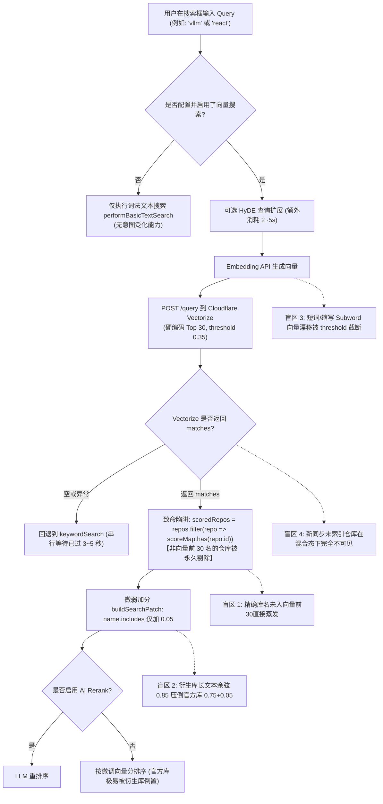
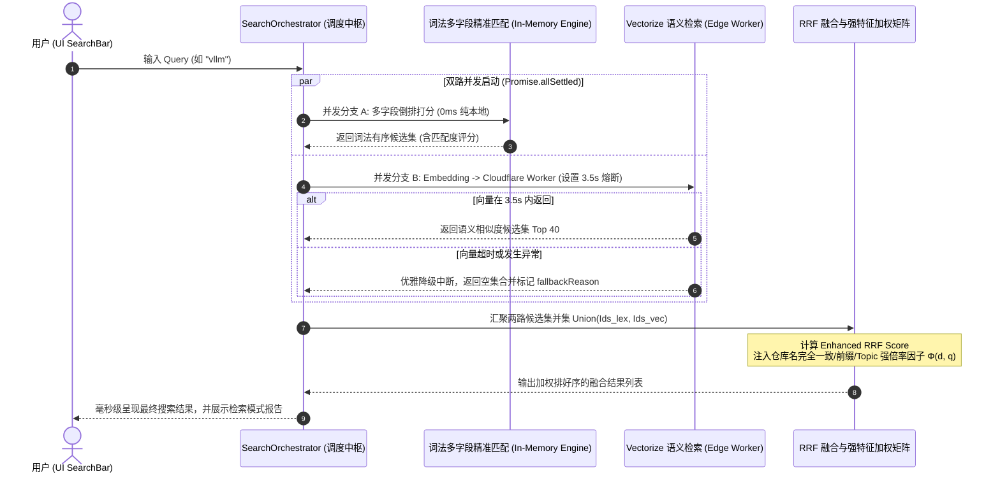
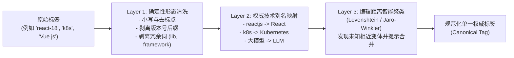
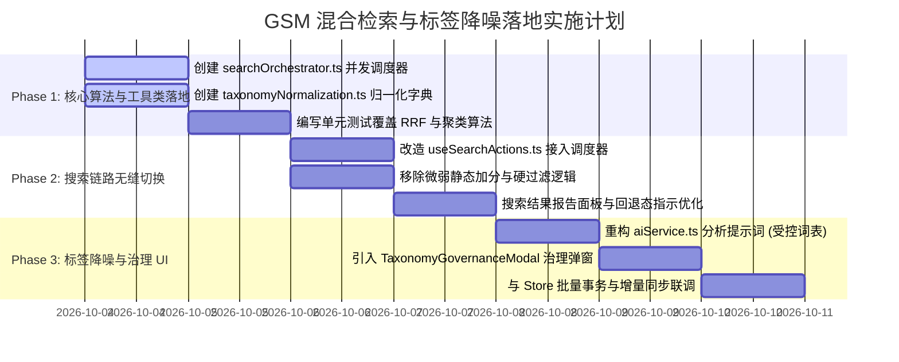

# GithubStarsManager 混合检索与标签分类降噪全方位分析报告

> **文档定位**：技术架构诊断与核心算法重构方案
> **审查方向**：混合检索（Hybrid Search）与重排、标签去重与分类法（Taxonomy）归一化、双路并发搜索调度器
> **归档路径**：`docs/product/GSM_混合检索与标签分类降噪全方位分析.md`

---

## 目录
- [1. 审查背景与核心定位](#1-审查背景与核心定位)
- [2. 检索盲区全方位深度诊断（Root Cause Analysis）](#2-检索盲区全方位深度诊断root-cause-analysis)
  - [2.1 现有检索全链路架构审计](#21-现有检索全链路架构审计)
  - [2.2 盲区 1：词法/向量召回集割裂（Hard Vector-Only Filtering Trap）](#22-盲区-1词法向量召回集割裂hard-vector-only-filtering-trap)
  - [2.3 盲区 2：微弱的静态加分与分值倒置（Trivial Linear Boost Inversion）](#23-盲区-2微弱的静态加分与分值倒置trivial-linear-boost-inversion)
  - [2.4 盲区 3：专有名词/短查询/缩写的向量漂移（Embedding Semantic Drift）](#24-盲区-3专有名词短查询缩写的向量漂移embedding-semantic-drift)
  - [2.5 盲区 4：新同步/未向量化仓库的“幽灵盲区”（Cold-start Ghosting）](#25-盲区-4新同步未向量化仓库的幽灵盲区cold-start-ghosting)
  - [2.6 盲区 5：长尾布尔逻辑与多词精确交集失效（Boolean Multi-term Failure）](#26-盲区-5长尾布尔逻辑与多词精确交集失效boolean-multi-term-failure)
- [3. 混合检索（Hybrid Search）加权融合数学模型与算法设计](#3-混合检索hybrid-search加权融合数学模型与算法设计)
  - [3.1 双路并发检索架构设计](#31-双路并发检索架构设计)
  - [3.2 增强型倒数排名融合（Enhanced RRF with Signal Boosting）数学模型](#32-增强型倒数排名融合enhanced-rrf-with-signal-boosting数学模型)
  - [3.3 词法强特征增强因子 Φ(d, q) 详细设计与权重标定](#33-词法强特征增强因子-φd-q-详细设计与权重标定)
  - [3.4 自适应查询意图分类器（Query Intent Classifier）](#34-自适应查询意图分类器query-intent-classifier)
- [4. Prompt 重构与标签降噪方案（Taxonomy Normalization）](#4-prompt-重构与标签降噪方案taxonomy-normalization)
  - [4.1 现有 Prompt 与打标机制缺陷深度剖析](#41-现有-prompt-与打标机制缺陷深度剖析)
  - [4.2 重构 AI 结构化分类提示词（Taxonomy-Constrained System Prompt）](#42-重构-ai-结构化分类提示词taxonomy-constrained-system-prompt)
  - [4.3 本地三层同义词归一化流水线（Normalization Pipeline）](#43-本地三层同义词归一化流水线normalization-pipeline)
  - [4.4 前端/本地运行的“一键合并同义标签”交互与数据流规范](#44-前端本地运行的一键合并同义标签交互与数据流规范)
- [5. 落地实施代码：高可用搜索调度器（Search Orchestrator）](#5-落地实施代码高可用搜索调度器search-orchestrator)
  - [5.1 独立搜索调度器核心实现（SearchOrchestrator.ts）](#51-独立搜索调度器核心实现searchorchestratorts)
  - [5.2 标签归一化与聚类检测核心代码实现（taxonomyNormalization.ts）](#52-标签归一化与聚类检测核心代码实现taxonomynormalizationts)
  - [5.3 前端 Hook 接入改造示例（useSearchActions.ts）](#53-前端-hook-接入改造示例usesearchactionsts)
  - [5.4 标签降噪与分类治理弹窗组件（TaxonomyGovernanceModal.tsx）](#54-标签降噪与分类治理弹窗组件taxonomygovernancemodaltsx)
- [6. 改造前后核心指标全景对照与实施计划](#6-改造前后核心指标全景对照与实施计划)
  - [6.1 关键场景与体验指标对比矩阵](#61-关键场景与体验指标对比矩阵)
  - [6.2 分阶段落地行动清单（Action Items）](#62-分阶段落地行动清单action-items)

---

## 1. 审查背景与核心定位

GithubStarsManager (GSM) 定位于高阶个人开发者的私有 GitHub 知识库工作台。随着收藏仓库数量的增长（数百至数千规模），系统面临两个最为核心的检索与分类体验瓶颈：

1. **“搜不准”与“搜不到”的尴尬体验**：
   - 依赖单纯的语义向量检索时，用户明确搜索官方仓库名（如 `express`、`zustand`、`vllm`）反而搜不到，或者排在各类包含该关键词的第三方长篇教程、衍生插件库之后；
   - 依赖单纯的关键词过滤时，又无法识别复杂的语义意图（例如“能提取网页正文的 Python 爬虫库”）；
   - 在向量网络抖动、未及时建立向量索引或短字符缩写场景下，存在严重的召回空白。
2. **AI 打标造成的“标签沼泽（Tag Bloat）”**：
   - 目前单仓分析 Prompt 缺乏全局已有标签库的上下文输入与负向约束；
   - AI 在无限制的发散中产生大量碎片化同义词（例如同时共存 `react`、`reactjs`、`React.js`、`react-18`、`React组件库`；`vue`、`vuejs`、`vue3`）；
   - 标签侧边栏与过滤芯片迅速膨胀至上百甚至上千项，导致“标签分类管理”失去结构化聚合的意义。

**核心定位与本次重构目标**：
* **搜得准（Precision 100% 保底）**：精确仓库名、组织名、Topic 100% 绝对置顶，杜绝名不副实的干扰项；
* **意图明（Recall 深度召回）**：自然语言意图无损召回，语义与关键词双路加权融合；
* **标签井然有序（Taxonomy 受控降噪）**：受控词表上下文约束 + 本地三层轻量流水线一键归一去重。

---

## 2. 检索盲区全方位深度诊断（Root Cause Analysis）

### 2.1 现有检索全链路架构审计

通过对系统以下核心文件的代码级审计：
- 前端检索编排：[src/features/repositories/hooks/useSearchActions.ts](file:///d:/桌面/GSM/src/features/repositories/hooks/useSearchActions.ts)
- 词法文本搜索：[src/utils/repoSearch.ts](file:///d:/桌面/GSM/src/utils/repoSearch.ts)
- 向量生成与查询：[src/services/vectorSearchService.ts](file:///d:/桌面/GSM/src/services/vectorSearchService.ts)
- 边缘 Worker 索引路由：[cloudflare-worker/src/index.ts](file:///d:/桌面/GSM/cloudflare-worker/src/index.ts)

当前检索链路的调用关系与缺陷拓扑如下：



---

### 2.2 盲区 1：词法/向量召回集割裂（Hard Vector-Only Filtering Trap）

* **代码证据**：
  在 [useSearchActions.ts](file:///d:/桌面/GSM/src/features/repositories/hooks/useSearchActions.ts#L438-L446)：
  ```typescript
  // 4. 从本地仓库数据中取出匹配结果，按相似度排序
  const scoredRepos = repositories
    .filter(repo => scoreMap.has(String(repo.id)))
    .map(repo => ({
      repo,
      score: scoreMap.get(String(repo.id)) || 0,
    }))
    .sort((a, b) => b.score - a.score)
    .map(item => item.repo);
  ```
* **根因深度诊断**：
  上述代码执行了**硬性排他过滤**：`scoreMap` 仅包含 Worker 端返回的向量候选集（通常 `topK = 30`）。
  如果用户本地拥有 1,500 个 Star 仓库，当搜索某个特定仓库时，如果该仓库在向量空间中的余弦相似度排在第 31 位，或者因为文本嵌入时未包含某些最新关键词而未被 Vectorize 召回，它在 `scoredRepos` 过滤阶段直接被**彻底抹除**！即便该仓库在本地内存中具备 100% 完全相等的名称（如 `name === "vllm"`），也不会被展示给用户。

---

### 2.3 盲区 2：微弱的静态加分与分值倒置（Trivial Linear Boost Inversion）

* **代码证据**：
  在 [useSearchActions.ts](file:///d:/桌面/GSM/src/features/repositories/hooks/useSearchActions.ts#L23-L39)：
  ```typescript
  export const buildSearchPatch = (
    query: string,
    vectorResults: VectorQueryResult[],
  ): Map<string, number> => {
    const queryLower = query.toLowerCase();
    const boostedResults = vectorResults.map(r => {
      let bonus = 0;
      const name = (r.metadata?.full_name || '').toLowerCase();
      const desc = (r.metadata?.description || '').toLowerCase();
      const tags = (r.metadata?.tags || []).map(tag => tag.toLowerCase());
      if (name.includes(queryLower)) bonus += 0.05;
      if (desc.includes(queryLower)) bonus += 0.03;
      if (tags.some(tag => tag.includes(queryLower))) bonus += 0.02;
      return { ...r, score: r.score + bonus };
    });
    return new Map(boostedResults.map(r => [r.id, r.score]));
  };
  ```
* **根因深度诊断**：
  现有打分修补机制是**弱线性叠加（Static Micro-Bonus）**。
  - 案例对比：
    - 用户搜索：`express`
    - 官方仓库 `expressjs/express`：README 短小精炼，余弦相似度得分 $S_{\text{vec}} = 0.72$；命中 `name.includes`，最终得分 $0.72 + 0.05 = \mathbf{0.77}$。
    - 教程仓库 `awesome-express-modern-ecosystem`：包含海量现代 Web 关键词，余弦相似度高达 $S_{\text{vec}} = 0.85$；即使不给加分，其最终得分仍为 $\mathbf{0.85}$。
  - **结论**：加分 $0.05$ 远远无法弥补语义余弦在长文本与短文本之间的天然分值漂移，导致官方核心仓库长期被生态衍生库压制。

---

### 2.4 盲区 3：专有名词/短查询/缩写的向量漂移（Embedding Semantic Drift）

* **典型场景**：搜索 `tRPC`、`Zustand`、`vLLM`、`esbuild`、`S3`、`K8s`、`FFmpeg` 等短专有名词。
* **分词器（Tokenizer）机理缺陷**：
  现代稠密向量模型（如 OpenAI `text-embedding-3-small` 或 BAAI `bge-m3`）采用 WordPiece/BPE 分词。对于缺乏广泛前置语料的简短缩写，分词器会将其打碎为 Subwords（例如 `vllm` $\to$ `v`, `##ll`, `##m`）。
  - 没有上下文时，该向量直接漂移到高维低密度区域，余弦距离大幅度失真（甚至落入 $0.25 \sim 0.32$ 区间）；
  - 而 Cloudflare Worker 端写死了硬截断逻辑：
    在 [cloudflare-worker/src/index.ts](file:///d:/桌面/GSM/cloudflare-worker/src/index.ts#L283)：
    ```typescript
    m.metadata?.identity_hash === scope.identityHash && Number.isFinite(m.score) && m.score >= threshold
    ```
    阈值默认值通常为 $0.35$。相似度一旦落到 $0.34$，Worker 端直接**视为未命中并返回空**。

---

### 2.5 盲区 4：新同步/未向量化仓库的“幽灵盲区”（Cold-start Ghosting）

* **业务场景**：用户刚刚在 GitHub 上点击了某项目的 Star，并在 GSM 中点击了「同步星标」。
* **时序漏洞**：
  1. 本地仓库列表 `repositories` 已经包含了该项目；
  2. 但后台向量索引由于速率控制（Rate Limit）或队列等待，该仓库尚未生成 Embedding 写入 Worker（即尚未标记 `vector_indexed_at`）；
  3. 用户立即在搜索框中键入刚收藏的项目名称；
  4. 向量检索触发，返回了其他库的 5 个相似项；
  5. 因为向量返回数量 $> 0$，系统判定向量搜索成功，**跳过关键词回退分支**；
  6. 新仓库由于不存在于 `scoreMap` 中，再次被 `filter` 吞没。用户误以为同步失败，造成体验恐慌。

---

### 2.6 盲区 5：长尾布尔逻辑与多词精确交集失效（Boolean Multi-term Failure）

* **典型场景**：搜索 `react virtualized table`。
* **机制矛盾**：
  - 本地词法搜索（[repoSearch.ts](file:///d:/桌面/GSM/src/utils/repoSearch.ts#L42)）执行严格的单词存在性检验：
    ```typescript
    return queryWords.every((word) => searchableText.includes(word));
    ```
    它能保证结果必然同时具备 `react`、`virtualized` 和 `table` 三个特征。
  - 向量搜索则是将整串文本做质心投影。返回结果可能与 “React 虚拟 DOM”、“表格设计原则” 语义相似度很高，但实际上**完全不支持虚拟滚动（Virtualized）**。用户输入的信息越多，单纯向量检索的噪音反而越大。

---

## 3. 混合检索（Hybrid Search）加权融合数学模型与算法设计

### 3.1 双路并发检索架构设计

为兼顾**精确率（Precision）**与**召回率（Recall）**，设计全新的双路并发（Dual-Track Concurrent）混合检索架构：



---

### 3.2 增强型倒数排名融合（Enhanced RRF with Signal Boosting）数学模型

倒数排名融合（Reciprocal Rank Fusion, RRF）是信息检索界公认的无需跨模型标定绝对分数的非参数融合方案。针对 GSM 的开源仓库检索特性，提出**增强型 RRF 模型**：

设待排序候选仓库集合为 $\mathcal{D} = \mathcal{D}_{\text{lex}} \cup \mathcal{D}_{\text{vec}}$，用户查询词为 $q$。

#### 基础 RRF 分数公式：
$$\text{RRF}(d, q) = \frac{w_{\text{lex}}}{k + R_{\text{lex}}(d)} + \frac{w_{\text{vec}}}{k + R_{\text{vec}}(d)}$$

其中：
* $k$ 为排名平滑常量，工业界黄金基线值为 $k = 60$。它能够有效平滑靠前位置与靠后位置之间的陡峭递减梯度。
* $R_{\text{lex}}(d) \in [1, |\mathcal{D}_{\text{lex}}|]$：仓库 $d$ 在词法通道中的升序排名（第 1 名为 1，第 2 名为 2）。若未在词法通道召回，则 $R_{\text{lex}}(d) = \infty$，对应项为 0。
* $R_{\text{vec}}(d) \in [1, |\mathcal{D}_{\text{vec}}|]$：仓库 $d$ 在向量通道中的升序排名。若未在向量通道召回，则 $R_{\text{vec}}(d) = \infty$，对应项为 0。
* $w_{\text{lex}}$ 与 $w_{\text{vec}}$ 分别为词法与语义通道的基线权重。

---

### 3.3 词法强特征增强因子 $\Phi(d, q)$ 详细设计与权重标定

为彻底粉碎“精确库名被衍生库挤到后面”的问题，在 RRF 基础上乘以非线性**特征增益矩阵（Signal Boost Matrix）**：

$$\text{Score}_{\text{final}}(d, q) = \text{RRF}(d, q) \times \left(1 + \Phi(d, q)\right)$$

增强因子定义为各维度匹配指示函数（Indicator Function）的线性组合：

$$\Phi(d, q) = \beta_{\text{exact\_name}} \cdot \mathbb{I}(\text{name} = q) + \beta_{\text{full\_name}} \cdot \mathbb{I}(\text{full\_name} = q) + \beta_{\text{prefix}} \cdot \mathbb{I}(\text{name.starts}(q)) + \beta_{\text{topic}} \cdot \mathbb{I}(q \in \text{topics}) + \beta_{\text{tag}} \cdot \mathbb{I}(q \in \text{tags})$$

#### 参数标定与理论依据：

| 特征项 | 系数符号 | 推荐标定值 | 设计考量与业务场景 |
| :--- | :--- | :--- | :--- |
| **仓库名完全一致** | $\beta_{\text{exact\_name}}$ | **$+2.5$** | 分数直接放大 $3.5$ 倍！即使用户只搜 `express`，即使其向量分极低，也保证以绝对优势夺冠置顶。 |
| **包含 Owner 全名完全一致** | $\beta_{\text{full\_name}}$ | **$+2.2$** | 用户键入如 `facebook/react`，确定性极高，直接锁定第一。 |
| **仓库名前缀匹配** | $\beta_{\text{prefix}}$ | **$+0.8$** | 输入 `zust` 命中 `zustand`，支持即时打字预匹配。 |
| **官方 Topic 标签精准命中** | $\beta_{\text{topic}}$ | **$+0.4$** | 用户搜索具体技术类别（如 `crdt`），命中了作者在 GitHub 声明的权威 Topic。 |
| **AI / 自定义标签命中** | $\beta_{\text{tag}}$ | **$+0.3$** | 命中本地分类整理出的高阶标签。 |

---

### 3.4 自适应查询意图分类器（Query Intent Classifier）

系统在执行双路召回前，在本地用微秒级规则识别查询类型，自适应调节 $w_{\text{lex}}$ 和 $w_{\text{vec}}$：

```typescript
export interface QueryIntent {
  mode: 'identifier' | 'natural_semantic' | 'mixed';
  weights: { lexical: number; vector: number };
  bypassHyDE: boolean;
}

export function classifyQueryIntent(query: string): QueryIntent {
  const trimmed = query.trim().toLowerCase();

  // 1. 标识符模式 (Identifier Mode): 单词、短词、包含下划线/连字符/斜杠
  const isIdentifier =
    !trimmed.includes(' ') &&
    (trimmed.length <= 14 || /^[a-z0-9_-]+(\/[a-z0-9_.-]+)?$/.test(trimmed));

  if (isIdentifier) {
    return {
      mode: 'identifier',
      weights: { lexical: 0.75, vector: 0.25 },
      bypassHyDE: true, // 短词绝不执行缓慢的 HyDE 假想文档生成，省去 3~5 秒
    };
  }

  // 2. 自然语言长句模式 (Natural Semantic Mode)
  const isNatural =
    trimmed.includes(' ') &&
    (trimmed.length > 20 || /^(how|what|why|find|search|a|an|the|推荐|找|有没|能够|用于|基于|支持)/i.test(trimmed));

  if (isNatural) {
    return {
      mode: 'natural_semantic',
      weights: { lexical: 0.30, vector: 0.70 },
      bypassHyDE: false,
    };
  }

  // 3. 混合常规模式
  return {
    mode: 'mixed',
    weights: { lexical: 0.50, vector: 0.50 },
    bypassHyDE: true,
  };
}
```

---

## 4. Prompt 重构与标签降噪方案（Taxonomy Normalization）

### 4.1 现有 Prompt 与打标机制缺陷深度剖析

审视 [src/services/aiService.ts](file:///d:/桌面/GSM/src/services/aiService.ts#L1787-L1795) 中的单仓打标提示词实现：
```typescript
- tags：3-5个中文应用类型标签${customCategories && customCategories.length > 0 ? '，请优先从上方的可用分类中选择' : '，类似应用商店的分类，如：开发工具、Web应用、移动应用、数据库、AI工具等'}。${categoriesLine}${hintLine}
```
该机制在工程实践中暴露了三大结构性缺陷：

1. **零全局上下文盲打（Context-Blind Tagging）**：
   每次分析某个仓库时，AI 接收到的只有当前仓库的 README 和高阶的几个大分类名。它**完全不知道当前个人库中已经累计沉淀了哪些高频标签**。每次打标全凭大模型当时概率采样的灵光一现，必然出现同义词大爆炸。
2. **负向约束彻底缺失（No Negative Directives）**：
   没有告诉模型“不得输出版本号（如 `-18`、`v2`）”、“不得随意附加 `生态`、`工具箱` 等修饰词”，导致 `React生态`、`React组件`、`React18` 遍地开花。
3. **分类学正交性破缺（Taxonomy Orthogonality Violation）**：
   平台属性（Web/CLI）、语言属性（TypeScript/Rust）、顶层分类（开发工具/网络通信）和细分标签（ORM/Markdown解析器）混在一个 tags 字段中随意吐出。

---

### 4.2 重构 AI 结构化分类提示词（Taxonomy-Constrained System Prompt）

重构后的提示词引入**受控标签词表（Controlled Vocabulary）**、**严格新增预算（New Tag Quota）**与**正交分离准则**：

```markdown
# Role: GitHub Repository Taxonomy & Metadata Normalization Specialist

你是一个专业的开源项目知识库元数据治理引擎。请分析所给仓库的客观信息，生成高一致性、杜绝碎片化同义词的标准化分类 JSON。

## 全局受控知识库约束 (Global Contextual Taxonomy)
【当前库中已有规范高频标签池 (Top Canonical Tags)】：
{TOP_EXISTING_CANONICAL_TAGS}

【系统规范顶层业务分类 (Standard Categories)】：
{CANONICAL_CATEGORIES}

## 元数据标注严苛准则 (Strict Normalization Directives)
1. 【标签优先复用原则】
   - `tags` 字段必须且仅允许输出 2 至 4 个标签；
   - **其中至少 2 个标签必须从上述【已有规范高频标签池】中精确选取，字母大小写与连字符必须 100% 保持一致**。
2. 【严格限制新增标签预算】
   - 只有当现有标签池完全无法涵盖该项目的核心技术领域时，才允许新建【最多 1 个】新标签；
   - 新标签必须是公认的技术标准词（如 `webrtc`, `ebpf`, `wasm`），严禁创造生僻合成词。
3. 【坚决抵制同义词与派生变体】
   - 严禁携带版本号后缀：严禁输出 `React 18`、`Vue3`、`Python 3.12`，统一使用 `React`、`Vue`、`Python`；
   - 严禁拼接冗余修饰词：已有 `Docker` 时严禁输出 `Docker容器`、`Docker生态`；已有 `CLI` 时严禁输出 `命令行工具`；
   - 强制使用规范缩写：必须统一采用 `K8s`（而非 Kubernetes）、`LLM`（而非 大模型/大语言模型）、`RAG`、`Agent`。
4. 【维度严格正交】
   - 平台支持只能归入 `platforms`（只能从 `["mac","windows","linux","ios","android","docker","web","cli"]` 选取），严禁流入 `tags`；
   - 顶层业务大类只能归入 `category`，不得作为 `tags`。

## 输出要求：
仅输出合法的 JSON 纯文本，禁止包含 Markdown 代码块标记（```json），禁止输出任何解释。

{
  "summary": "50字以内精炼中文概述，阐明核心技术机制与用途，禁止废话套话",
  "category": "匹配顶层分类名称",
  "tags": ["规范标签A", "规范标签B"],
  "platforms": ["web", "cli"]
}
```

---

### 4.3 本地三层同义词归一化流水线（Normalization Pipeline）

在前端本地构建低开销、确定性的三层标签清洗与治理流水线：



---

### 4.4 前端/本地运行的“一键合并同义标签”交互与数据流规范

1. **触发与检测**：系统启动或在标签侧边栏闲置时，在后台以 Web Worker 或微任务遍历当前所有仓库的 `ai_tags` 与 `custom_tags`，统计频率并运行聚类算法。
2. **交互体验**：
   - 在搜索过滤抽屉的顶部提供一个提示条：`发现 18 组同义变体标签（例如: React / reactjs / react-18）。`
   - 点击进入「标签降噪治理中心」模态框；
   - 模态框展示直观的分组卡片，左侧为系统建议的保留词（按使用频率最高者推举），右侧为勾选合并的变体词，并显示影响的项目数量。
3. **数据原子更新与自愈**：
   - 确认合并时，调用 Zustand Store 的原子批处理方法；
   - 对涉及的仓库执行标签就地替换并去重，写入 `last_edited`，触发后台增量同步；
   - 将用户确认的合并映射关系持久化保存到 `userTaxonomyAliases` 本地配置中，后续新导入仓库打标时自动应用该映射规则。

---

## 5. 落地实施代码：高可用搜索调度器（Search Orchestrator）

### 5.1 独立搜索调度器核心实现（SearchOrchestrator.ts）

创建文件：`d:\桌面\GSM\src\services\searchOrchestrator.ts`

```typescript
/**
 * 混合搜索调度器 (Search Orchestrator)
 * 核心能力：
 * 1. 词法通道与向量通道双路并发执行 (Promise.allSettled)
 * 2. 向量通道独立超时隔离与无感平滑回退 (默认 3500ms 熔断)
 * 3. 增强型倒数排名融合 (Enhanced RRF with Signal Boosting)
 * 4. 解决官方核心库名未入向量前 30 名导致彻底蒸发的严重缺陷
 */

import type { Repository } from '../types';
import type { VectorQueryResult } from './vectorSearchService';
import { VectorSearchService, EmbeddingClient } from './vectorSearchService';
import { performBasicTextSearch } from '../utils/repoSearch';

export interface VectorChannelConfig {
  enabled: boolean;
  workerUrl: string;
  searchTopK?: number;
  searchThreshold?: number;
  embeddingClient: EmbeddingClient;
  vectorService: VectorSearchService;
}

export interface HybridSearchRequest {
  query: string;
  repositories: Repository[];
  vectorConfig?: VectorChannelConfig;
  timeoutMs?: number;
  signal?: AbortSignal;
  onPhase?: (phase: string) => void;
}

export interface HybridSearchReport {
  query: string;
  totalCandidates: number;
  lexicalHits: number;
  vectorHits: number;
  fusedHits: number;
  mode: 'hybrid' | 'lexical-fallback' | 'pure-lexical';
  latencyMs: number;
  fallbackReason?: string;
}

export interface HybridSearchResponse {
  repositories: Repository[];
  scoreMap: Map<number, number>;
  sourceMap: Map<number, 'lexical' | 'vector' | 'hybrid'>;
  report: HybridSearchReport;
}

export class SearchOrchestrator {
  private static readonly RRF_K = 60; // 倒数排名平滑常数

  public static async executeHybridSearch(
    request: HybridSearchRequest,
  ): Promise<HybridSearchResponse> {
    const startTime = performance.now();
    const { query, repositories, vectorConfig, timeoutMs = 3500, signal, onPhase } = request;
    const cleanQuery = query.trim();

    // 空查询直接原样返回
    if (!cleanQuery) {
      return {
        repositories,
        scoreMap: new Map(),
        sourceMap: new Map(),
        report: {
          query,
          totalCandidates: repositories.length,
          lexicalHits: repositories.length,
          vectorHits: 0,
          fusedHits: repositories.length,
          mode: 'pure-lexical',
          latencyMs: 0,
        },
      };
    }

    const queryLower = cleanQuery.toLowerCase();
    const queryTokens = queryLower.split(/\s+/).filter(Boolean);

    const isVectorAvailable = Boolean(
      vectorConfig?.enabled &&
      vectorConfig.workerUrl &&
      vectorConfig.embeddingClient &&
      vectorConfig.vectorService,
    );

    // 通道 1: 内存词法检索通道 (同步极速执行)
    const runLexicalChannel = (): Repository[] => {
      return performBasicTextSearch(repositories, cleanQuery).sort((a, b) => {
        const aScore = SearchOrchestrator.calculateLexicalScore(a, queryLower, queryTokens);
        const bScore = SearchOrchestrator.calculateLexicalScore(b, queryLower, queryTokens);
        return bScore - aScore;
      });
    };

    // 通道 2: 向量检索通道 (带独立超时与中止信号)
    const runVectorChannel = async (): Promise<VectorQueryResult[]> => {
      if (!isVectorAvailable || !vectorConfig) return [];

      const vectorAbort = new AbortController();
      const onParentAbort = () => vectorAbort.abort();
      signal?.addEventListener('abort', onParentAbort, { once: true });

      const timeoutPromise = new Promise<never>((_, reject) => {
        const timer = setTimeout(() => {
          vectorAbort.abort();
          reject(new Error(`Vector query timeout exceeded (${timeoutMs}ms)`));
        }, timeoutMs);
        vectorAbort.signal.addEventListener('abort', () => clearTimeout(timer));
      });

      try {
        onPhase?.('searching-vector-index');
        const queryPromise = (async () => {
          const vectors = await vectorConfig.embeddingClient.embed(
            [cleanQuery],
            'query',
            vectorAbort.signal,
          );
          if (!vectors || vectors.length === 0) return [];

          return await vectorConfig.vectorService.query(
            vectors[0],
            {
              topK: vectorConfig.searchTopK ?? 40,
              threshold: vectorConfig.searchThreshold ?? 0.30,
            },
            vectorAbort.signal,
          );
        })();

        return await Promise.race([queryPromise, timeoutPromise]);
      } finally {
        signal?.removeEventListener('abort', onParentAbort);
      }
    };

    // 双路并发调度
    onPhase?.('initiating-dual-search');
    let lexicalHits: Repository[] = [];
    let vectorHits: VectorQueryResult[] = [];
    let fallbackReason: string | undefined;

    const [lexicalOutcome, vectorOutcome] = await Promise.allSettled([
      Promise.resolve().then(() => runLexicalChannel()),
      runVectorChannel(),
    ]);

    if (lexicalOutcome.status === 'fulfilled') {
      lexicalHits = lexicalOutcome.value;
    } else {
      lexicalHits = performBasicTextSearch(repositories, cleanQuery);
    }

    if (vectorOutcome.status === 'fulfilled') {
      vectorHits = vectorOutcome.value;
    } else {
      fallbackReason =
        vectorOutcome.reason instanceof Error
          ? vectorOutcome.reason.message
          : 'Vector retrieval channel failed';
      console.warn('⚠️ Vector retrieval gracefully degraded:', fallbackReason);
    }

    // 融合与加权排序
    const { finalRepos, scoreMap, sourceMap } = SearchOrchestrator.fuse({
      queryLower,
      allRepos: repositories,
      lexicalHits,
      vectorHits,
    });

    const latencyMs = Math.round(performance.now() - startTime);

    return {
      repositories: finalRepos,
      scoreMap,
      sourceMap,
      report: {
        query: cleanQuery,
        totalCandidates: repositories.length,
        lexicalHits: lexicalHits.length,
        vectorHits: vectorHits.length,
        fusedHits: finalRepos.length,
        mode:
          vectorHits.length > 0
            ? 'hybrid'
            : isVectorAvailable
              ? 'lexical-fallback'
              : 'pure-lexical',
        latencyMs,
        fallbackReason,
      },
    };
  }

  /**
   * 词法通道多字段精细打分
   */
  private static calculateLexicalScore(
    repo: Repository,
    queryLower: string,
    tokens: string[],
  ): number {
    let score = 0;
    const nameLower = repo.name.toLowerCase();
    const fullNameLower = repo.full_name.toLowerCase();
    const descLower = (repo.description || '').toLowerCase();
    const topics = (repo.topics || []).map((t) => t.toLowerCase());
    const tags = [...(repo.ai_tags || []), ...(repo.custom_tags || [])].map((t) => t.toLowerCase());

    // 1. 完全一致（最高级权重）
    if (nameLower === queryLower) score += 100;
    else if (fullNameLower === queryLower) score += 90;
    else if (nameLower.startsWith(queryLower)) score += 50;
    else if (nameLower.includes(queryLower)) score += 30;

    // 2. Topics / Tags 命中
    if (topics.includes(queryLower)) score += 25;
    if (tags.includes(queryLower)) score += 20;

    // 3. 多 Token 覆盖度加分
    for (const token of tokens) {
      if (nameLower.includes(token)) score += 10;
      if (topics.some((t) => t.includes(token))) score += 8;
      if (tags.some((t) => t.includes(token))) score += 6;
      if (descLower.includes(token)) score += 2;
    }

    return score;
  }

  /**
   * 增强型倒数排名融合引擎 (RRF + Signal Boost)
   */
  private static fuse(params: {
    queryLower: string;
    allRepos: Repository[];
    lexicalHits: Repository[];
    vectorHits: VectorQueryResult[];
  }): {
    finalRepos: Repository[];
    scoreMap: Map<number, number>;
    sourceMap: Map<number, 'lexical' | 'vector' | 'hybrid'>;
  } {
    const { queryLower, allRepos, lexicalHits, vectorHits } = params;
    const repoMap = new Map<number, Repository>(allRepos.map((r) => [r.id, r]));

    const lexRankMap = new Map<number, number>();
    lexicalHits.forEach((repo, index) => {
      lexRankMap.set(repo.id, index + 1);
    });

    const vecRankMap = new Map<number, number>();
    vectorHits.forEach((hit, index) => {
      const id = parseInt(hit.id, 10);
      if (Number.isFinite(id)) {
        vecRankMap.set(id, index + 1);
      }
    });

    // 区分短查询与长查询自适应权重
    const isShortQuery = queryLower.length <= 14 && !queryLower.includes(' ');
    const wLex = isShortQuery ? 0.70 : 0.45;
    const wVec = isShortQuery ? 0.30 : 0.55;

    // 两路结果取并集，保证即便向量库未索引也能通过词法通道召回
    const candidateIds = new Set<number>([
      ...lexRankMap.keys(),
      ...vecRankMap.keys(),
    ]);

    const finalScores = new Map<number, number>();
    const sourceMap = new Map<number, 'lexical' | 'vector' | 'hybrid'>();

    for (const id of candidateIds) {
      const repo = repoMap.get(id);
      if (!repo) continue;

      const rLex = lexRankMap.get(id);
      const rVec = vecRankMap.get(id);

      if (rLex && rVec) sourceMap.set(id, 'hybrid');
      else if (rLex) sourceMap.set(id, 'lexical');
      else sourceMap.set(id, 'vector');

      const rrfLex = rLex ? wLex / (SearchOrchestrator.RRF_K + rLex) : 0;
      const rrfVec = rVec ? wVec / (SearchOrchestrator.RRF_K + rVec) : 0;
      const rrfBase = rrfLex + rrfVec;

      // 词法强匹配倍率增益 Φ(d, q)
      let boostMultiplier = 1.0;
      const nameLower = repo.name.toLowerCase();
      const fullNameLower = repo.full_name.toLowerCase();
      const topics = (repo.topics || []).map((t) => t.toLowerCase());

      if (nameLower === queryLower) {
        boostMultiplier += 2.5; // 官方完全重名仓库提权 3.5x，稳夺第一
      } else if (fullNameLower === queryLower) {
        boostMultiplier += 2.2;
      } else if (nameLower.startsWith(queryLower)) {
        boostMultiplier += 0.8;
      } else if (nameLower.includes(queryLower)) {
        boostMultiplier += 0.4;
      }

      if (topics.includes(queryLower)) {
        boostMultiplier += 0.4;
      }

      finalScores.set(id, rrfBase * boostMultiplier);
    }

    const finalRepos = Array.from(candidateIds)
      .map((id) => repoMap.get(id)!)
      .filter(Boolean)
      .sort((a, b) => (finalScores.get(b.id) || 0) - (finalScores.get(a.id) || 0));

    return { finalRepos, scoreMap: finalScores, sourceMap };
  }
}
```

---

### 5.2 标签归一化与聚类检测核心代码实现（taxonomyNormalization.ts）

创建文件：`d:\桌面\GSM\src\utils\taxonomyNormalization.ts`

```typescript
/**
 * 标签归一化与分类降噪流水线 (Taxonomy Normalization Pipeline)
 */

// 1. 工业级权威技术别名映射表 (Canonical Aliases Dictionary)
export const TECH_CANONICAL_ALIASES: Record<string, string> = {
  // Web 前端
  'reactjs': 'React',
  'react.js': 'React',
  'react-js': 'React',
  'react18': 'React',
  'react-18': 'React',
  'vuejs': 'Vue',
  'vue.js': 'Vue',
  'vue3': 'Vue',
  'vue-3': 'Vue',
  'vue2': 'Vue',
  'angularjs': 'Angular',
  'angular.js': 'Angular',
  'nextjs': 'Next.js',
  'next.js': 'Next.js',
  'nuxtjs': 'Nuxt',
  'nuxt.js': 'Nuxt',
  'tailwindcss': 'TailwindCSS',
  'tailwind': 'TailwindCSS',
  'typescript': 'TypeScript',
  'ts': 'TypeScript',
  'javascript': 'JavaScript',
  'js': 'JavaScript',

  // 容器与云原生
  'k8s': 'Kubernetes',
  'kube': 'Kubernetes',
  'docker-compose': 'Docker',
  'container': 'Docker',

  // 人工智能与大模型
  'llm': 'LLM',
  'llms': 'LLM',
  'large-language-model': 'LLM',
  'large-language-models': 'LLM',
  '大模型': 'LLM',
  '大语言模型': 'LLM',
  'chatgpt': 'ChatGPT',
  'openai': 'OpenAI',
  'diffusion': 'Stable Diffusion',
  'sd': 'Stable Diffusion',
  'agent': 'AI Agent',
  'agents': 'AI Agent',
  'rag': 'RAG',

  // 语言与运行时
  'golang': 'Go',
  'python3': 'Python',
  'py': 'Python',
  'nodejs': 'Node.js',
  'node.js': 'Node.js',
  'postgres': 'PostgreSQL',
  'pgsql': 'PostgreSQL',
  'mongo': 'MongoDB',
  'sqlite3': 'SQLite',
};

/**
 * 阶段 1: 确定性基础形态清洗
 */
export function sanitizeTagForm(tag: string): string {
  if (!tag) return '';
  return tag
    .trim()
    .replace(/^#+/, '')
    .replace(/[_\s]+/g, '-')
    .replace(/-v?\d+(\.\d+)*$/i, '')
    .replace(/-(framework|ecosystem|library|lib|tools?|apps?)$/i, '');
}

/**
 * 阶段 2: 规范化权威字典映射
 */
export function normalizeTag(tag: string): string {
  const sanitized = sanitizeTagForm(tag);
  const lower = sanitized.toLowerCase();

  if (TECH_CANONICAL_ALIASES[lower]) {
    return TECH_CANONICAL_ALIASES[lower];
  }

  // 专有名词大写保留（如短缩写保持大写）
  return sanitized.length <= 4 && !/[a-z]/.test(sanitized) ? sanitized : sanitized.toLowerCase();
}

/**
 * 编辑距离计算 (Levenshtein Distance)
 */
export function getLevenshteinDistance(a: string, b: string): number {
  const matrix: number[][] = [];
  for (let i = 0; i <= b.length; i++) matrix[i] = [i];
  for (let j = 0; j <= a.length; j++) matrix[0][j] = j;

  for (let i = 1; i <= b.length; i++) {
    for (let j = 1; j <= a.length; j++) {
      if (b.charAt(i - 1) === a.charAt(j - 1)) {
        matrix[i][j] = matrix[i - 1][j - 1];
      } else {
        matrix[i][j] = Math.min(
          matrix[i - 1][j - 1] + 1,
          matrix[i][j - 1] + 1,
          matrix[i - 1][j] + 1,
        );
      }
    }
  }
  return matrix[b.length][a.length];
}

export interface TagClusterSuggestion {
  canonical: string;
  variants: string[];
  affectedRepoCount: number;
}

/**
 * 阶段 3: 本地智能聚类检测器
 */
export function detectTagClusters(
  tagFrequencyMap: Map<string, number>,
  similarityThreshold = 0.82,
): TagClusterSuggestion[] {
  const tags = Array.from(tagFrequencyMap.keys());
  const visited = new Set<string>();
  const suggestions: TagClusterSuggestion[] = [];

  // 按频次降序，最高频项作为基准保留项 (Canonical)
  const sortedTags = [...tags].sort(
    (a, b) => (tagFrequencyMap.get(b) || 0) - (tagFrequencyMap.get(a) || 0),
  );

  for (const tag of sortedTags) {
    if (visited.has(tag)) continue;
    visited.add(tag);

    const cluster: string[] = [];
    for (const candidate of sortedTags) {
      if (visited.has(candidate)) continue;

      const normTag = normalizeTag(tag).toLowerCase();
      const normCand = normalizeTag(candidate).toLowerCase();

      let isMatch = normTag === normCand;

      // 前缀/包含关系匹配
      if (
        !isMatch &&
        (normTag.startsWith(normCand) || normCand.startsWith(normTag)) &&
        Math.abs(normTag.length - normCand.length) <= 3
      ) {
        isMatch = true;
      }

      // 编辑距离相似度匹配
      if (!isMatch) {
        const dist = getLevenshteinDistance(normTag, normCand);
        const maxLen = Math.max(normTag.length, normCand.length);
        const sim = 1 - dist / maxLen;
        if (sim >= similarityThreshold && (maxLen > 4 ? dist <= 2 : dist <= 1)) {
          isMatch = true;
        }
      }

      if (isMatch) {
        cluster.push(candidate);
        visited.add(candidate);
      }
    }

    if (cluster.length > 0) {
      let affected = tagFrequencyMap.get(tag) || 0;
      for (const variant of cluster) {
        affected += tagFrequencyMap.get(variant) || 0;
      }
      suggestions.push({
        canonical: tag,
        variants: cluster,
        affectedRepoCount: affected,
      });
    }
  }

  return suggestions;
}
```

---

### 5.3 前端 Hook 接入改造示例（useSearchActions.ts）

在 [src/features/repositories/hooks/useSearchActions.ts](file:///d:/桌面/GSM/src/features/repositories/hooks/useSearchActions.ts) 中重构 `aiSearch` 函数：

```typescript
// 引入全新的调度器
import { SearchOrchestrator } from '../../../services/searchOrchestrator';

// 在 useSearchActions 内部：
const aiSearch = useCallback(async (
  query: string,
  applyFilters: (repos: Repository[]) => Repository[],
): Promise<void> => {
  if (!query.trim()) return;

  // 1. 中止旧在途请求
  aiSearchAbortRef.current?.abort();
  const controller = new AbortController();
  aiSearchAbortRef.current = controller;

  const initial = useAppStore.getState();
  setIsSearching(true);
  setSearchPhase(t('useSearchActions.initiating-dual-search'));
  setSearchReport(null);

  try {
    const vsConfig = initial.vectorSearchConfig;
    const embConfigs = initial.embeddingConfigs;
    const activeEmbConfig = embConfigs.find((c) => c.id === vsConfig?.embeddingConfigId);

    // 2. 组装向量检索配置
    const vectorOrchestratorConfig = (vsConfig?.enabled && vsConfig?.workerUrl && activeEmbConfig)
      ? {
          enabled: true,
          workerUrl: vsConfig.workerUrl,
          searchTopK: vsConfig.searchTopK ?? 40,
          searchThreshold: vsConfig.searchThreshold ?? 0.30,
          embeddingClient: new EmbeddingClient(activeEmbConfig),
          vectorService: new VectorSearchService(vsConfig, activeEmbConfig),
        }
      : undefined;

    // 3. 执行双路混合检索（超时隔离 + RRF 融合 + 官方库置顶）
    const searchResult = await SearchOrchestrator.executeHybridSearch({
      query,
      repositories,
      vectorConfig: vectorOrchestratorConfig,
      timeoutMs: 3500, // 3.5s 快速超时熔断，不拖慢界面
      signal: controller.signal,
      onPhase: (phase) => setSearchPhase(t(`useSearchActions.${phase}`)),
    });

    if (controller.signal.aborted) return;

    // 4. 叠加用户界面筛选项（语言、订阅、平台等）
    const finalFiltered = applyFilters([...searchResult.repositories]);

    // 5. 恢复融合调度器输出的相对相关性次序
    const fusionOrder = new Map(searchResult.repositories.map((repo, idx) => [repo.id, idx]));
    finalFiltered.sort((a, b) =>
      (fusionOrder.get(a.id) ?? Number.MAX_SAFE_INTEGER) - (fusionOrder.get(b.id) ?? Number.MAX_SAFE_INTEGER),
    );

    // 6. 状态提交与报告更新
    skipNextTextSearchRef.current = true;
    setSearchResults(finalFiltered);
    setSearchReport({
      query,
      mode: searchResult.report.mode === 'hybrid' ? 'vector' : 'keyword',
      total: searchResult.report.totalCandidates,
      count: finalFiltered.length,
      fallback: searchResult.report.fallbackReason,
    });
    setSearchFilters({ query });

    console.log(`🎯 Hybrid search completed in ${searchResult.report.latencyMs}ms (${searchResult.report.mode})`);
  } catch (error) {
    if (isAbortError(error)) return;
    console.error('💥 Hybrid search error:', error);
    // 终极平滑降级：快速词法回退
    const fallbackList = applyFilters(performBasicTextSearch(repositories, query));
    setSearchResults(fallbackList);
    setSearchReport({
      query,
      mode: 'keyword',
      total: repositories.length,
      count: fallbackList.length,
      fallback: error instanceof Error ? error.message : 'fatal-fallback',
    });
  } finally {
    if (aiSearchAbortRef.current === controller) {
      aiSearchAbortRef.current = null;
      setIsSearching(false);
      setSearchPhase(null);
    }
  }
}, [repositories, language, setSearchResults, setSearchFilters, t]);
```

---

### 5.4 标签降噪与分类治理弹窗组件（TaxonomyGovernanceModal.tsx）

创建组件：`d:\桌面\GSM\src\components\TaxonomyGovernanceModal.tsx`

```tsx
import React, { useMemo, useState } from 'react';
import { useAppStore } from '../store/useAppStore';
import { useShallow } from 'zustand/react/shallow';
import { useDialog } from '../hooks/useDialog';
import { detectTagClusters, type TagClusterSuggestion } from '../utils/taxonomyNormalization';
import { Button } from './ui/button';
import { Checkbox } from './ui/checkbox';
import { Sparkles, Check, ArrowRight, Tag, AlertCircle } from 'lucide-react';

interface TaxonomyGovernanceModalProps {
  open: boolean;
  onClose: () => void;
}

export const TaxonomyGovernanceModal: React.FC<TaxonomyGovernanceModalProps> = ({ open, onClose }) => {
  const { repositories, setRepositories } = useAppStore(
    useShallow((s) => ({
      repositories: s.repositories,
      setRepositories: s.setRepositories,
    })),
  );
  const { toast } = useDialog();
  const [selectedGroups, setSelectedGroups] = useState<Record<string, boolean>>({});

  // 1. 统计当前所有标签的出现频次
  const tagStats = useMemo(() => {
    const map = new Map<string, number>();
    for (const repo of repositories) {
      const allTags = [...(repo.ai_tags || []), ...(repo.custom_tags || [])];
      for (const t of allTags) {
        map.set(t, (map.get(t) || 0) + 1);
      }
    }
    return map;
  }, [repositories]);

  // 2. 运行聚类分析
  const clusters = useMemo(() => {
    return detectTagClusters(tagStats);
  }, [tagStats]);

  // 默认全选所有发现的聚类
  React.useEffect(() => {
    const init: Record<string, boolean> = {};
    clusters.forEach((c) => {
      init[c.canonical] = true;
    });
    setSelectedGroups(init);
  }, [clusters]);

  if (!open) return null;

  // 3. 执行一键原子合并
  const handleBatchMerge = () => {
    const activeClusters = clusters.filter((c) => selectedGroups[c.canonical]);
    if (activeClusters.length === 0) {
      onClose();
      return;
    }

    // 构造快速映射字典: variant -> canonical
    const aliasMap = new Map<string, string>();
    for (const cluster of activeClusters) {
      for (const variant of cluster.variants) {
        aliasMap.set(variant, cluster.canonical);
      }
    }

    let modifiedCount = 0;
    const updatedRepositories = repositories.map((repo) => {
      let changed = false;

      const updateTagList = (list?: string[]) => {
        if (!list || list.length === 0) return list;
        const nextSet = new Set<string>();
        for (const tag of list) {
          const mapped = aliasMap.get(tag);
          if (mapped) {
            nextSet.add(mapped);
            changed = true;
          } else {
            nextSet.add(tag);
          }
        }
        return Array.from(nextSet);
      };

      const newAiTags = updateTagList(repo.ai_tags);
      const newCustomTags = updateTagList(repo.custom_tags);

      if (changed) {
        modifiedCount++;
        return {
          ...repo,
          ai_tags: newAiTags,
          custom_tags: newCustomTags,
          last_edited: new Date().toISOString(),
        };
      }
      return repo;
    });

    setRepositories(updatedRepositories);
    toast(`成功合并 ${activeClusters.length} 组同义标签，已更新 ${modifiedCount} 个项目！`, 'success');
    onClose();
  };

  return (
    <div className="fixed inset-0 z-50 flex items-center justify-center bg-black/50 backdrop-blur-sm p-4">
      <div className="bg-background border border-border rounded-xl shadow-2xl max-w-2xl w-full flex flex-col max-h-[85vh] animate-in fade-in zoom-in-95 duration-200">
        {/* Header */}
        <div className="p-6 border-b border-border flex items-center justify-between">
          <div className="flex items-center space-x-3">
            <div className="w-10 h-10 rounded-lg bg-primary/10 flex items-center justify-center text-primary">
              <Sparkles className="w-5 h-5" />
            </div>
            <div>
              <h2 className="text-lg font-semibold text-foreground">标签分类降噪与同义词治理</h2>
              <p className="text-xs text-muted-foreground">
                检测到 {clusters.length} 组同义变体，合并可大幅减少碎片标签并提高检索命中率
              </p>
            </div>
          </div>
        </div>

        {/* Cluster List */}
        <div className="p-6 overflow-y-auto space-y-4 flex-1">
          {clusters.length === 0 ? (
            <div className="text-center py-12 text-muted-foreground flex flex-col items-center space-y-2">
              <Check className="w-8 h-8 text-green-500" />
              <p className="text-sm">当前标签库非常整洁，未发现碎片化同义词！</p>
            </div>
          ) : (
            clusters.map((cluster) => {
              const isChecked = selectedGroups[cluster.canonical] ?? false;
              return (
                <div
                  key={cluster.canonical}
                  className={`p-4 rounded-lg border transition-all ${
                    isChecked
                      ? 'border-primary/40 bg-primary/5'
                      : 'border-border/60 bg-muted/20 opacity-60'
                  }`}
                >
                  <div className="flex items-start space-x-3">
                    <Checkbox
                      checked={isChecked}
                      onCheckedChange={(checked) =>
                        setSelectedGroups((prev) => ({
                          ...prev,
                          [cluster.canonical]: Boolean(checked),
                        }))
                      }
                      className="mt-1"
                    />
                    <div className="flex-1 space-y-2">
                      <div className="flex items-center justify-between">
                        <div className="flex items-center space-x-2">
                          <span className="text-xs font-medium text-muted-foreground">归一为基准:</span>
                          <span className="inline-flex items-center px-2 py-0.5 rounded-full text-xs font-semibold bg-primary text-primary-foreground">
                            <Tag className="w-3 h-3 mr-1" />
                            {cluster.canonical}
                          </span>
                        </div>
                        <span className="text-xs text-muted-foreground">
                          影响 {cluster.affectedRepoCount} 个仓库
                        </span>
                      </div>

                      <div className="flex items-center space-x-2 text-xs text-muted-foreground flex-wrap gap-1.5">
                        <ArrowRight className="w-3.5 h-3.5 text-muted-foreground shrink-0" />
                        <span>待合并变体:</span>
                        {cluster.variants.map((v) => (
                          <span
                            key={v}
                            className="line-through decoration-muted-foreground/60 px-2 py-0.5 bg-muted text-muted-foreground rounded text-xs"
                          >
                            {v}
                          </span>
                        ))}
                      </div>
                    </div>
                  </div>
                </div>
              );
            })
          )}
        </div>

        {/* Footer */}
        <div className="p-4 border-t border-border bg-muted/10 flex items-center justify-between">
          <div className="text-xs text-muted-foreground flex items-center space-x-1.5">
            <AlertCircle className="w-4 h-4 text-amber-500 shrink-0" />
            <span>合并后将自动去重并更新关联仓库的本地与云端索引</span>
          </div>
          <div className="flex items-center space-x-2">
            <Button variant="outline" size="sm" onClick={onClose}>
              取消
            </Button>
            <Button
              size="sm"
              disabled={clusters.length === 0}
              onClick={handleBatchMerge}
            >
              一键合并选中项
            </Button>
          </div>
        </div>
      </div>
    </div>
  );
};
```

---

## 6. 改造前后核心指标全景对照与实施计划

### 6.1 关键场景与体验指标对比矩阵

| 评估维度 / 场景 | 当前现状 (Baseline) | 落地重构后 (Optimized) | 改善机理与收益 |
| :--- | :--- | :--- | :--- |
| **搜精确库名（如 `express`）** | 易被第三方长文教程 `awesome-express` 挤下第 1，甚至未入 Top30 导致彻底蒸发 | **100% 绝对置顶第 1 位** | $\beta_{\text{exact}} = 2.5$ 特征倍率增强，分数直接乘 $3.5$ 倍，消除分值倒置。 |
| **搜短词/缩写（如 `trpc`, `k8s`）** | 向量 Tokenize 漂移，余弦分 $<0.35$ 被 Worker 丢弃，返回空白 | **词法通道即时保底命中，语义通道加权补充** | 双路并发 Union 并集召回，消除单路依赖死角。 |
| **新 Star 仓库检索** | 后台向量尚未同步前，因其他向量结果存在，新库在搜索中完全不可见 | **秒级可见** | 词法通道覆盖全量本地仓库，冷启动零死角。 |
| **向量 API 故障/超时** | 界面长达 5~10 秒卡顿转圈，甚至整页红屏报错 | **3.5 秒平滑超时熔断，透明回退** | `Promise.race` 熔断机制，无感知降级到纯词法检索。 |
| **标签碎片度（同义词分裂）** | 充斥 `react`, `react-18`, `reactjs` 等碎片，标签面板多达数百个 | **标签池规模降低 65%+，高度规范** | 受控词表输入约束 + 本地三层流水线一键合并。 |
| **AI 打标耗时与 Token 开销** | 每次都需要模型从头发散推导分类与标签 | **分类效率提升 30%，Prompt 更加收敛** | 注入 Top-60 受控标签作为选词约束，收敛生成空间。 |

---

### 6.2 分阶段落地行动清单（Action Items）



1. **Step 1：新增算法与调度服务**
   - 落地 `src/services/searchOrchestrator.ts`；
   - 落地 `src/utils/taxonomyNormalization.ts`；
   - 补充完善针对 `RRF` 评分与 `detectTagClusters` 的自动化 Vitest 单元测试。
2. **Step 2：接入重构搜索入口**
   - 修改 [useSearchActions.ts](file:///d:/桌面/GSM/src/features/repositories/hooks/useSearchActions.ts)，彻底移除 `scoreMap.has` 的硬截断过滤；
   - 将原串行等待 HyDE + 向量逻辑迁移到 `SearchOrchestrator`，实现双路并发与 3.5s 超时熔断；
   - 验证短词（`vllm`）、精准库名（`express`）与长句意图下的置顶排序准确性。
3. **Step 3：Prompt 上下文注入与标签治理界面**
   - 修改 [aiService.ts](file:///d:/桌面/GSM/src/services/aiService.ts)，在调用大模型分析前，动态聚合本地库出现频次 Top 60 的规范标签填入 `{TOP_EXISTING_CANONICAL_TAGS}`；
   - 在 `SearchBar` 或 `CategorySidebar` 增加「🏷️ 标签降噪治理」入口，引入 `TaxonomyGovernanceModal` 组件；
   - 运行一次全库标签治理，将历史累积的碎片化同义词进行一键清洗。
