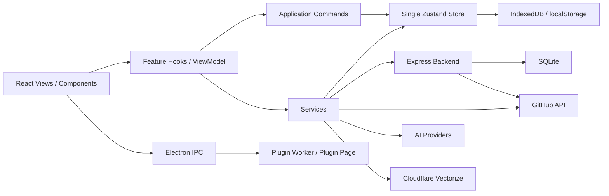

# GithubStarsManager 项目深度分析与个性化开发基线

> 分析日期：2026-09-27  
> 项目目录：`/folder/GSM`  
> 当前应用版本：`0.8.3`  
> 文档定位：用于后续个性化优化、功能开发、上游同步与架构决策的长期基线。

---

## 1. 项目结论

当前项目已经不是单一的 GitHub Stars 管理前端，而是一套多运行时的个人 GitHub 工作台，主要由以下部分组成：

- React + Vite Web 前端；
- Zustand 单一持久化状态；
- Express + SQLite 可选后端；
- Electron 桌面端与 IPC 能力；
- 本地插件系统与 Plugin Page；
- Cloudflare Vectorize 向量检索；
- AI 分析、仓库问答、Agent Tool Loop；
- Release、Fork、Gist、Discovery、MCP、代理与同步体系。

项目已经具备良好的个性化扩展基础，但后续开发不适合继续直接向大型核心文件叠加业务逻辑。更可持续的方向是建立稳定的“个人扩展层”，让上游核心保持可升级，同时把个人功能、个人数据和个人 UI 定制放到冲突更低的边界中。

仓库已有的《GithubStarsManager_上游兼容与AI协同升级需求说明书.md》方向正确，并且部分规则比当前实现更严格。后续个性化开发应把它当作架构约束，而不仅是参考文档。

### 1.1 当前风险矩阵

| 优先级 | 问题 | 当前影响 | 建议动作 |
|---|---|---|---|
| P0 | Git 历史 / upstream 基线不可验证 | 无法可靠区分上游代码与个人修改 | 恢复完整 Git history 并确定 base commit |
| P0 | 旧 Docker compose 默认允许空 API_SECRET | 非可信网络暴露时可能使后端 API 无认证 | 部署统一采用强制 secret 的 fullstack 行为 |
| P1 | GitHubApiService 直接实例化仍较多 | Browser Direct / Backend Proxy 路由语义可能不一致 | 做专项 Factory 审计并增加约束 |
| P1 | Node 25 下根 Vitest 失败 | 本地验证基线不稳定 | 固定 Node 24，并修复 Storage 能力检测 |
| P1 | Personal Governance 尚未完整建立 | 后续个人修改难追踪、升级冲突难管理 | 补齐 Protected Areas / Feature Records / Upgrade Records |
| P2 | RepositoryList 无真正虚拟化 | 大型 Stars 库最终积累大量 DOM | 引入虚拟列表 |
| P2 | autoSync 固定 5 秒多 shard 轮询 | 长期运行产生持续网络与后端开销 | 引入 revision / ETag / 自适应轮询 |
| P2 | Electron proxy credential 明文落盘 | 本机配置文件泄漏时暴露代理凭据 | 使用 safeStorage |
| P2 | Cloudflare Worker 双实现漂移 | 手工部署版与 TS 构建版行为不一致 | 建立单一 source of truth |
| P3 | 社区插件 Registry 自动审核未按文档完整实现 | 真正开放社区分发后供应链检查不足 | 在首个社区插件前补齐 ZIP/Hash/静态扫描 |

---

## 2. 当前架构概览



前端已有正式 ADR：`docs/adr/0001-frontend-layering.md`，核心方向是：

```text
View
  ↓
Feature Hook
  ↓
Application Command
  ↓
Service
  ↓
Store
```

这套分层值得继续保持，并应作为后续个人功能的默认实现方式。

---

## 3. 前端架构

### 3.1 应用入口

入口为：

- `src/main.tsx`
- `src/App.tsx`

`main.tsx` 负责：

- polyfill；
- Theme Style 初始化；
- 首屏语言包加载；
- React Root；
- ErrorBoundary；
- DialogProvider；
- TooltipProvider。

`App.tsx` 负责：

- 登录态；
- 当前视图；
- Theme / ThemePreset / ThemeTokens；
- Language；
- Backend 生命周期；
- Electron X Auth 恢复；
- 主页面切换。

目前没有 React Router，页面通过 Zustand 中持久化的 `currentView` 切换。

这使应用更接近桌面工作台，而不是 URL 驱动的网站。

如果未来需要以下能力：

- 深链；
- 可分享 URL；
- 浏览器前进 / 后退；
- 直接打开特定仓库；
- 直接打开特定 AI 会话；

则需要单独规划 Router 改造，不应混入普通个人功能迭代。

---

## 4. 状态管理与持久化

### 4.1 单一 Zustand Store 是核心承重墙

当前 `src/store/useAppStore.ts` 组合多个 slice，包括：

- auth；
- repositories；
- gists；
- configuration；
- timeline；
- category；
- preference；
- discovery。

持久化逻辑集中在：

- `src/store/persistence/options.ts`
- `src/store/persistence/storage.ts`
- `src/store/persistence/authStorage.ts`
- `src/store/schema.ts`

当前 persistence version 已达到 **v16**。

这是项目最需要保护的区域之一。

### 4.2 不建议建立第二套持久化根 Store

后续个人功能如果有大量独立数据，应优先采用：

- 独立 metadata storage；
- 独立 IndexedDB 表；
- 独立 SQLite 表；
- 插件 storage；
- 以 `repository.id` 或 `full_name` 与核心仓库数据关联。

不建议继续把大量个人字段添加到核心 `Repository` 类型。

原因是 Repository 字段一旦进入核心状态，会同时影响：

- Store schema；
- persistence partialize；
- migration；
- backend schema；
- backend sync；
- hash fingerprint；
- merge；
- backup；
- restore；
- tests。

当前 `src/utils/repositoryMerge.ts` 已经维护：

- `LOCAL_REPOSITORY_FIELDS`
- `CLIENT_ONLY_REPOSITORY_FIELDS`

这说明 Repository 已经承担了较多 GitHub 原始模型之外的职责。

未来个人数据最好开始解耦。

---

## 5. Backend 与自动同步

应用启动后的主要流程位于：

`src/features/lifecycle/hooks/useBackendLifecycle.ts`

当前顺序为：

```text
Store hydration
  ↓
backend.init()
  ↓
tryRestoreAuthFromBackend()
  ↓
syncLocalGitHubTokenToBackend()
  ↓
syncFromBackend()
  ↓
startAutoSync()
```

同步核心位于：

`src/services/autoSync.ts`

该文件约 750 行，目前已经包含：

- pull / push；
- 5 秒轮询；
- push debounce；
- 防同步回环；
- pending local changes；
- fingerprint；
- decrypt failure repair；
- local-only 字段保护；
- forced restore；
- auth recovery。

整体实现成熟，但已经属于高风险状态机。

### 建议

普通个人功能不应修改 `autoSync` 核心流程。

需要新增个人同步数据时，应优先：

1. 在同步前后增加扩展边界；
2. 建立独立同步 endpoint；
3. 建立独立表；
4. 避免侵入 repositories/settings 主同步状态机。

### 性能观察

当前 backend mode 每 5 秒会并行拉取约 7 类数据：

- repositories；
- releases；
- AI configs；
- WebDAV；
- embedding；
- vector search；
- settings。

虽然 fingerprint 可以避免无效 Store 更新，但网络请求仍然发生。

长期可考虑：

- server revision；
- ETag；
- lastChangedVersion；
- 页面不可见时降低轮询频率；
- Electron 后台状态自适应轮询；
- WebSocket / SSE 事件驱动更新。

这类优化应独立实施。

---

## 6. GitHub API 路由

核心边界：

- `src/services/githubApi.ts`
- `src/services/githubApiFactory.ts`
- `src/services/routeMode.ts`
- `src/services/backendAdapter.ts`

目标设计是统一支持：

- Browser Direct；
- Backend Proxy。

个人升级规范也明确要求：

> 新增 GitHub 请求必须继续遵循 GitHub API Factory 和 Route Mode。

### 当前架构漂移

实际生产代码中仍存在多个：

```ts
new GitHubApiService(token)
```

例如分布在：

- `useSearchActions`
- `useDiscoveryActions`
- Release；
- Fork；
- README；
- Vector/Search；
- autoSync 认证恢复等。

其中部分直接实例化是合理的，例如认证恢复后强制向 GitHub 校验 token。

但业务请求存在明显不一致。

### 后续建议

单独进行一次：

**GitHub Transport Normalization**

目标：

1. 枚举所有直接实例化点；
2. 区分“必须直连”和“历史遗留”；
3. 将普通业务请求收敛到 Factory；
4. 对允许直连的路径明确注释原因；
5. 增加 ESLint / boundary 规则避免再次漂移。

不建议进行无脑全局替换。

---

## 7. Feature 分层

项目已经逐步把业务逻辑从大型 View 迁入：

- `src/features/*/hooks`
- `src/features/*/application`

这是正确方向。

### 当前一个明显的 sibling feature 依赖

`src/features/discovery/hooks/useDiscoveryRepoActions.ts`

引用：

`src/features/repositories/application/discoveryRepoPatches.ts`

这意味着 Discovery 直接依赖 Repository Feature 的 application 层。

当前 boundary checker 没有阻止这一行为。

长期更合适的处理方式有两种：

- 把共享逻辑移动到 shared/domain/application；
- 或让 Discovery 自己拥有对应 patch。

后续新 Feature 应避免形成 Feature 间网状依赖。

---

## 8. AI 架构

AI 已经是当前项目最大的业务复杂度中心。

主要大型文件包括：

- `src/services/aiService.ts`
- `src/services/repositoryChatService.ts`
- `src/services/githubApi.ts`

这些文件已经非常大。

因此后续 AI 个性化功能，例如：

- 仓库价值评分；
- 技术栈关系图；
- 自动学习路径；
- 个人知识库；
- 项目比较；
- 自动周报；
- 自动维护建议；

不建议继续直接扩展 `aiService.ts`。

### 推荐模式

```text
Personal Feature
  ↓
Task Orchestrator / Agent Profile
  ↓
Existing AIService / RepositoryChat Tools
  ↓
Provider
```

新增能力应优先复用：

- AI provider；
- Repository Chat；
- Agent Tool Loop；
- tool budget；
- web tools；
- repository evidence；
- read-file tools。

当前 Repository Chat 已经拥有：

- task depth；
- max turns；
- max tool calls；
- max read files；
- max code reads；
- no-progress protection；
- max duration；
- streaming；
- Web Tools；
- Agent Loop。

因此很多未来 AI 功能本质上可以是新的 Agent Profile，而不是新的 AI 基础设施。

---

## 9. Electron 与插件系统

Electron 是非常重要的低冲突扩展入口。

当前插件能力包括：

- repository actions；
- repository processors；
- release processors；
- exporters；
- plugin pages；
- AI page capability；
- Web Search page capability。

相关位置：

- `electron/plugins/`
- `src/plugins/`
- `docs/plugins/v1-development.md`

### 插件适合承担的个性化能力

例如：

- 个人仓库评分；
- 自定义导出；
- Release 自动推荐；
- 私人 Dashboard；
- 本地数据处理；
- 独立 AI 工具页；
- 与宿主低耦合的实验功能。

### 安全边界

Plugin Page 使用 sandbox iframe 和受限 Bridge，安全边界相对清晰。

带 `manifest.main` 的插件使用：

`worker_threads.Worker`

并最终执行：

```js
require(workerData.entryPath)
```

因此 Worker 主要提供：

- 生命周期隔离；
- 崩溃隔离；
- timeout；
- Host capability API。

它不是 Node 安全沙箱。

本地自用插件可以接受这一模型。

社区插件不能仅依赖 Manifest Permission 作为完整安全边界。

---

## 10. UI 个性化扩展点

目前最适合个人 UI 定制的入口：

- `src/lib/themePresets.ts`
- `src/utils/themeTokens.ts`

已有 token 可控制：

- palette；
- font；
- radius；
- accent；
- shadow；
- motion。

后续如果只是：

- 颜色；
- 字体；
- 圆角；
- 卡片风格；
- 页面密度；
- 动效；
- 深浅色风格；

应优先走 Theme Token，而不是散落修改大量组件 className。

这是最低冲突的个性化路线。

---

## 11. 前端性能观察

### 11.1 RepositoryList 没有真正虚拟化

`src/components/RepositoryList.tsx` 使用：

```text
LOAD_BATCH = 50
```

通过 IntersectionObserver 逐批增加可见数量。

但已加载卡片不会被卸载。

因此 Star 数量较大时，最终仍会把全部 RepositoryCard 留在 DOM。

如果实际仓库达到几千条，建议后续引入真正的 virtualization，例如：

- react-window；
- @tanstack/react-virtual；
- 自定义 virtual grid。

这比继续增加 `React.memo` 更有效。

### 11.2 Settings 只做了页面级 Lazy Load

`SettingsPanel.tsx` 本身是 lazy loaded。

但进入 Settings 后，它会静态 import 全部设置 Tab。

适合继续做：

**Tab-level lazy loading**

尤其是：

- Data Management；
- AI；
- Vector Search；
- Plugins；
- MCP；
- Logs。

### 11.3 字体资源

`src/main.tsx` 当前顶层加载约 15 套 Fontsource。

代码注释称“families load on demand”，但实际构建仍包含大量字体资源。

可以考虑：

- Theme preset → 动态 font import；
- 默认字体只载入一套；
- 代码字体单独 lazy；
- Electron 与 Web 使用不同策略。

### 11.4 App Shell 订阅范围偏大

`selectAppShellState` 包含：

- repositories；
- searchResults；
- searchFilters。

意味着这些数据变化可能导致 App Shell 重新执行 render 路径，即使当前不在 repositories view。

后续可以拆：

- shell selector；
- repository view selector。

---

## 12. Bundle 观察

当前生产构建成功，bundle gate 通过。

监控到的最大 legacy entry 约：

**1070 KiB**

预算：

**3000 KiB**

说明当前没有触发 bundle budget。

但几个依赖明显偏重：

- MarkdownRenderer；
- Mermaid；
- syntax highlighting；
- Cytoscape；
- KaTeX。

构建中可见大致体积：

- MarkdownRenderer：约 400 KiB；
- Mermaid core：约 700 KiB；
- GitHub syntax bundle：接近 1 MiB；
- Cytoscape：约 440 KiB。

这些目前已经存在一定 chunk 拆分，因此不属于紧急问题。

如果以后个人版主要运行于 Electron / Chromium，可进一步优化：

- 只面向现代浏览器；
- 延迟 Mermaid；
- 延迟 syntax theme；
- Markdown 高级能力按需加载；
- Settings Tab lazy load。

---

## 13. 大文件热点

当前较明显的维护热点包括：

- `src/services/aiService.ts`
- `src/services/githubApi.ts`
- `src/services/repositoryChatService.ts`
- `src/components/settings/DataManagementPanel.tsx`
- `src/components/RepositoryCard.tsx`
- `src/components/SearchBar.tsx`
- `src/components/DiscoveryView.tsx`

这些文件不建议一次性大重构。

推荐采用：

> 当后续需求第一次修改某个区域时，再顺手抽离该区域的 Hook / Application / Component。

这样可以避免大规模结构重写与上游冲突。

---

## 14. 安全与部署

### 14.1 Docker API_SECRET

旧版：

`docker-compose.yml`

包含：

```yaml
API_SECRET: ${API_SECRET:-}
```

后端：

`server/src/middleware/auth.ts`

在 `API_SECRET` 为空时会直接关闭 API 认证。

与此同时 nginx 会把 `8080` 暴露到宿主。

因此旧 compose 只适合可信环境。

新的：

`docker-compose.fullstack.yml`

已经要求：

```yaml
API_SECRET: ${API_SECRET:?Set API_SECRET in .env before starting the full-stack deployment}
```

后续应以 fullstack 行为作为部署标准。

---

## 15. SSRF 与 Proxy

后端通用 Proxy 已经包含一套 URL 安全检查：

- 禁止非 HTTP/HTTPS；
- 禁止 URL credentials；
- localhost；
- private IPv4；
- private/local IPv6；
- IMDS。

但当前检查主要基于 URL 中的 hostname 文本。

实际连接由 axios 完成 DNS 解析。

因此仍存在后续加固空间：

- DNS resolve；
- resolved IP validation；
- address pinning；
- redirect target revalidation。

当前不能据此直接断言存在可利用漏洞，但如果未来扩大“任意 URL 代理”能力，这一层应该优先增强。

---

## 16. Electron 本地敏感信息

X Auth 已经使用 Electron：

`safeStorage`

进行加密。

但：

`electron/main.js`

中的：

`proxy-config.json`

目前通过：

```js
fs.writeFileSync(PROXY_CONFIG_PATH, JSON.stringify(config, null, 2));
```

直接落盘。

如果配置包含：

- proxy username；
- proxy password；

则属于明文保存。

建议后续复用 `xAuthStorage.js` 的 safeStorage 模式，对代理凭据进行加密。

另外：

`setWindowOpenHandler`

目前直接：

```js
shell.openExternal(url)
```

后续 Desktop Hardening 时建议限制允许的 URL scheme。

---

## 17. Markdown 安全

`MarkdownRenderer.tsx` 使用：

- `rehypeRaw`
- `rehypeSanitize`
- 自定义 `githubMarkdownSchema`

因此允许部分 Raw HTML 后会继续进行 sanitize。

后续如果修改 Markdown：

- HTML；
- iframe；
- image；
- link；
- Mermaid；
- code block；

必须保持 sanitize 在最终渲染链中。

不应为了支持个人 Markdown 功能绕过该层。

---

## 18. Cloudflare Vectorize

目前存在两个 Worker 实现：

- `cloudflare-worker/src/index.ts`
- `cloudflare-worker/worker.js`

TypeScript 实现更完整。

两者已经发生轻微漂移。

例如：

`src/index.ts`

包含：

- metadata compact；
- topK validation；
- 默认 threshold 0.35。

而 `worker.js`：

- 默认 threshold 0.3；
- 部分校验逻辑较旧。

长期应确定一个唯一 source of truth。

### cleanup 限制

`/cleanup` 当前通过 zero-vector query 模拟枚举。

最多：

- 每轮 100 条；
- 10 轮；
- 理论覆盖约 1000 条。

Vectorize 本身没有直接提供 `listVectors`。

因此该 cleanup 是 best-effort，而不是严格的全量 stale vector 清理。

如果后续 Star 规模较大，应考虑维护自己的 indexed ID registry。

---

## 19. Community Plugin Registry

当前：

- `registry/README.md`
- `docs/proposals/community-plugin-registry.md`

设计了较完整的社区插件审核流程，包括：

- 下载 ZIP；
- SHA-256；
- commit/release 绑定；
- zip slip；
- symlink；
- eval；
- shell；
- network；
- telemetry；
- self update；
- remote resources；
- manifest.main 禁止等。

但当前真正运行的：

`scripts/check-plugin-registry.cjs`

主要检查：

- JSON Schema；
- `(id, version)` 唯一；
- network 声明一致；
- removed plugin overlap。

也就是说设计文档领先于 CI 实现。

由于当前 registry 尚未形成实际社区插件生态，这属于潜在问题。

在真正开放 Community Plugin Store 前，应先补齐自动审核链。

---

## 20. 跨运行时语义重复

当前 Web、Server、Electron 三个运行时存在一部分相同业务语义的重复实现，例如：

- repository search / filter；
- license / health 判定；
- vector / discovery 相关规则；
- MCP 暴露的数据语义。

部分位置已经通过 parity test 保证行为一致，但仍需要人工同步实现。

长期更稳妥的方向是：

1. 提取纯数据规则到可共享模块；
2. 或建立生成式 contract；
3. 对必须保留的多语言 / 多运行时实现增加固定 parity fixtures。

这类优化不应为了“消灭重复代码”一次性重写，而应在某项规则下一次发生业务变化时顺手收敛。

### Electron MCP 边界

Electron 本地 MCP 当前正确限制为 loopback，并有 token 校验。

但从长期 hardening 角度仍可补充：

- 请求 body 大小上限；
- SSE session 数量 / 生命周期上限；
- 更明确的并发限制；
- 与 Server MCP 共用请求 schema / contract。

这些属于加固项，不影响当前个人功能开发。

---

## 21. 本地敏感数据模型

当前浏览器 persistence 会保存多种敏感配置，包括：

- GitHub token；
- AI API configs；
- WebDAV configs；
- MCP token；
- Proxy credentials；
- RPC secret；
- Vector Search token。

IndexedDB 是主要持久化介质，localStorage 是 fallback。

GitHub auth 还额外存在 localStorage auth mirror。

这是 local-first 应用可以接受的设计，但意味着：

> XSS、恶意插件、浏览器 Profile 泄漏的影响范围较大。

因此未来涉及：

- Raw HTML；
- Remote Markdown；
- Plugin Page；
- Web content；
- external URL；

时，应把 CSP、sanitize、Host Bridge 和 permission boundary 当作高优先级约束。

---

## 22. 当前验证结果

本次实际执行了以下工程验证。

### 通过

- `npm run check:boundaries`
- `npm run lint`
- `npm run typecheck`
- Server tests
- Electron MCP tests
- Electron Plugin tests
- Version updater tests
- CI gate tests
- i18n check
- Plugin registry check
- Frontend build
- Server build
- Bundle size gate

具体结果：

| 检查 | 结果 |
|---|---|
| Boundary | 通过 |
| ESLint | 通过 |
| TypeScript | 通过 |
| Server tests | 120 / 120 |
| Electron MCP | 32 / 32 |
| Electron Plugins | 103 通过，1 个因 Windows symlink 权限跳过 |
| Version updater | 10 / 10 |
| CI gate tests | 27 / 27 |
| i18n | 通过 |
| Plugin registry | 通过 |
| Frontend build | 通过 |
| Server build | 通过 |

---

## 23. 根 Vitest 当前问题

根项目：

`npm run test:run`

出现：

- 126 个 test files；
- 121 个通过；
- 5 个失败；
- 1358 个 tests；
- 1325 个通过；
- 33 个失败。

失败高度集中于：

```text
localStorage.getItem is not a function
localStorage.removeItem is not a function
localStorage.clear is not a function
```

当前本地 Node：

```text
v25.8.2
```

CI：

```text
Node 24
```

Node 25 当前暴露一个 truthy 的 `globalThis.localStorage`，但该对象没有标准 Storage 方法，并出现：

```text
--localstorage-file was provided without a valid path
```

项目 `src/test/setup.ts` 已经有 Node >=22 的兼容逻辑，但只判断：

```ts
if (!window.localStorage)
```

所以没有覆盖“对象存在但不是标准 Storage”的 Node 25 情况。

### 推荐处理

短期：

- 本地开发使用 Node 24，与 CI 对齐。

中期：

把判断改成能力检测，例如：

```ts
const hasUsableStorage = (
  storage: unknown
): storage is Storage =>
  !!storage &&
  typeof (storage as Storage).getItem === 'function' &&
  typeof (storage as Storage).setItem === 'function' &&
  typeof (storage as Storage).removeItem === 'function' &&
  typeof (storage as Storage).clear === 'function';
```

然后在能力缺失时安装 shim。

当前这 33 个失败更符合测试运行环境兼容问题，而不是 33 个独立业务回归。

---

## 24. Git 基线是当前最高优先级基础问题

当前 `/folder/GSM` 没有可识别的 `.git` 元数据。

因此目前无法可靠判断：

- 当前 branch；
- 当前 commit；
- upstream base；
- 本地修改；
- 与 upstream/main 的差异；
- 哪些代码属于个人补丁；
- 是否已经偏离上游。

`docs/personal/upstream-base.json` 也已经标记：

`pending-local-history-verification`

package version `0.8.3` 只能证明声明版本，不能证明源码准确基线。

如果目标是长期维护个人分支并持续吸收上游更新，那么 Git 历史恢复属于最优先基础设施。

---

## 25. Personal Governance 现状

当前：

`docs/personal/`

主要只有：

- `README.md`
- `upstream-base.json`

而规划中的以下内容尚未真正建立：

- `ARCHITECTURE.md`
- `UPGRADE_RULES.md`
- `PROTECTED_AREAS.md`
- `features/`
- `upgrades/`

这些文档对于当前项目体量并不是形式工作。

它们应该用于记录：

- 什么可以自由修改；
- 什么只能扩展；
- 哪些文件跟上游冲突概率高；
- 每个个人功能修改了哪些边界；
- 数据如何迁移；
- 下一次 upstream merge 如何验证。

---

## 26. 建议的 Protected Areas

以下位置默认视为高风险保护区：

### P0：核心状态与数据

- `src/store/persistence/*`
- `src/store/schema.ts`
- Repository 核心模型
- persistence migration
- backend core schema

### P0：网络与认证

- `src/services/githubApi.ts`
- `src/services/githubApiFactory.ts`
- `src/services/routeMode.ts`
- `src/services/backendAdapter.ts`
- `server/src/middleware/auth.ts`

### P0：同步状态机

- `src/services/autoSync.ts`

### P1：Desktop Runtime

- Electron IPC
- preload
- plugin manager
- MCP bridge

### P1：Backend Data

- core repository tables
- settings
- encryption
- migrations

这些位置不是不能修改，而是每次修改都应该：

1. 单独评估；
2. 查看历史 migration；
3. 查看上游实现；
4. 运行相关测试；
5. 留下 feature / upgrade record。

---

## 27. 推荐的个性化扩展层

| 需求 | 推荐落点 | 风险 |
|---|---|---|
| 主题颜色 / 字体 / 圆角 / 动效 | Theme Token / Theme Preset | 低 |
| 卡片动作 | Electron Plugin | 低 |
| 自定义导出 | Plugin Exporter | 低 |
| Release 推荐 | Release Processor | 低 |
| 独立工具页 | Plugin Page / New Feature | 低 |
| 个人仓库属性 | Personal Metadata | 低 |
| 个人笔记 | Personal Metadata | 低 |
| 仓库评分 | Personal Metadata + Feature | 低 |
| AI 新工作流 | Feature Orchestrator | 中低 |
| 新业务页面 | `src/features/<feature>` | 中低 |
| 新 GitHub 操作 | GitHub Factory | 中 |
| 新后端个人数据 | 独立表 / 独立 route | 中 |
| 修改 Repository 核心字段 | 尽量避免 | 高 |
| 修改 autoSync | 专项处理 | 很高 |
| 修改 persistence migration | 专项处理 | 很高 |
| 修改认证 / Route Mode | 专项处理 | 很高 |

---

## 28. 后续开发默认规则

后续个性化开发建议统一执行以下原则。

### 28.1 UI

优先：

```text
Theme Token
→ shared UI primitive
→ feature component
→ core component
```

尽量减少直接修改大型核心 View。

### 28.2 业务功能

优先：

```text
Feature
  ├─ components
  ├─ hooks
  ├─ application
  └─ types
```

核心 View 只负责组合。

### 28.3 GitHub 网络

统一：

```text
Feature Hook
  ↓
githubApiFactory
  ↓
Route Mode
  ↓
Browser Direct / Backend Proxy
```

特殊直连必须明确原因。

### 28.4 个人数据

优先：

```text
Personal Metadata
   ↕
repository.id / full_name
```

而不是继续扩展 Repository 核心对象。

### 28.5 AI

优先：

```text
Feature Orchestrator
  ↓
Agent / Repository Chat
  ↓
AI Service
```

避免在 AIService 中直接堆业务功能。

### 28.6 Desktop

只在 Electron 有意义的能力优先使用：

- Plugin；
- IPC；
- safeStorage；
- native dialog；
- local filesystem。

---

## 29. 建议优化优先级

### P0：先建立可靠开发基线

1. 恢复 Git history；
2. 配置 origin / upstream；
3. 确定真实 upstream base；
4. 补齐 Personal Governance；
5. 固定 Node 24 开发环境；
6. 修复 Node 25 localStorage test shim。

### P1：治理架构漂移

1. GitHub API Factory 审计；
2. 标记允许强制直连的场景；
3. 修复 sibling feature import；
4. 扩展 boundary rule；
5. 建立 Feature Record 模板。

### P2：建立个人扩展基础

1. Personal Metadata；
2. Personal Feature Namespace；
3. Personal backend table / storage；
4. AI Agent Profile / Task Orchestrator；
5. 插件式个人工具页。

### P3：性能优化

1. Repository virtualization；
2. Settings Tab lazy load；
3. Font lazy load；
4. App Store selector 拆分；
5. Markdown / Mermaid 进一步按需加载；
6. Backend adaptive polling。

### P4：安全加固

1. 旧 Docker compose 强制 API_SECRET；
2. Electron proxy credential safeStorage；
3. openExternal scheme allowlist；
4. Proxy DNS resolve-and-pin；
5. Community Plugin Registry CI 完整实现；
6. Worker source-of-truth 统一。

---

## 30. 推荐的第一阶段开发顺序

建议后续真正开始个人功能开发前，依次处理：

```text
Git / upstream 基线
        ↓
Personal Governance
        ↓
Node / Test 基线
        ↓
GitHub Factory 治理
        ↓
Personal Metadata
        ↓
具体个人功能
        ↓
按需求渐进性能优化
```

这个顺序的核心目标是：

> 先降低未来升级成本，再扩大个人功能规模。

---

## 31. 最终开发策略

后续本项目默认采用以下策略：

- 保持单一核心 Zustand Store；
- Personal Data 与核心 Repository 解耦；
- 新 Feature 优先新增文件而不是修改核心大文件；
- GitHub 请求统一走 Factory；
- 后端个人数据优先独立表；
- Electron 专属个人能力优先插件化；
- AI 个性化优先 Agent / Orchestrator；
- UI 个性化优先 Theme Token；
- 修改 persistence / autoSync / auth / route mode 前先做专项影响分析；
- 每个个人功能建立 Feature Record；
- 每次 upstream 升级记录 Upgrade Record；
- 优先渐进重构，不进行无业务收益的大型一次性重写。

这套规则可以让 GithubStarsManager 从“个人修改版”逐步发展成：

> **可持续同步上游、可持续增加个人能力、可持续由 AI 协作维护的长期个人 GitHub 工作台。**
